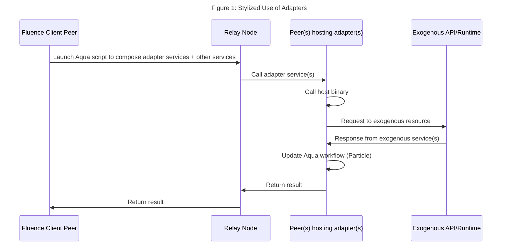

```mermaid
    sequenceDiagram
    title: Figure 1: Stylized Use of Adapters

    participant C as Fluence Client Peer
    participant F as Relay Node
    participant S as Peer(s) hosting adapter(s)
    participant O as Exogenous API/Runtime

    C ->> F: Launch Aqua script to compose adapter services + other services
    F ->> S: Call adapter service(s)
    S ->> S: Call host binary
    S ->> O: Request to exogenous resource
    O ->> S: Response from exogenous service(s)
    S ->> S: Update Aqua workflow (Particle)
    S ->> F: Return result
    F ->> C: Return result
```