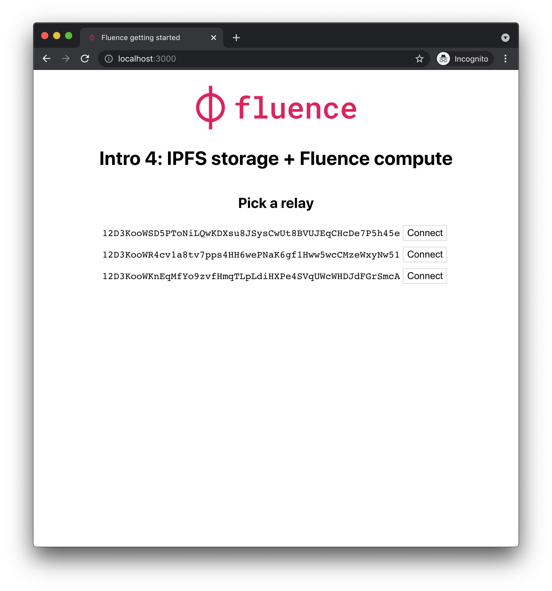
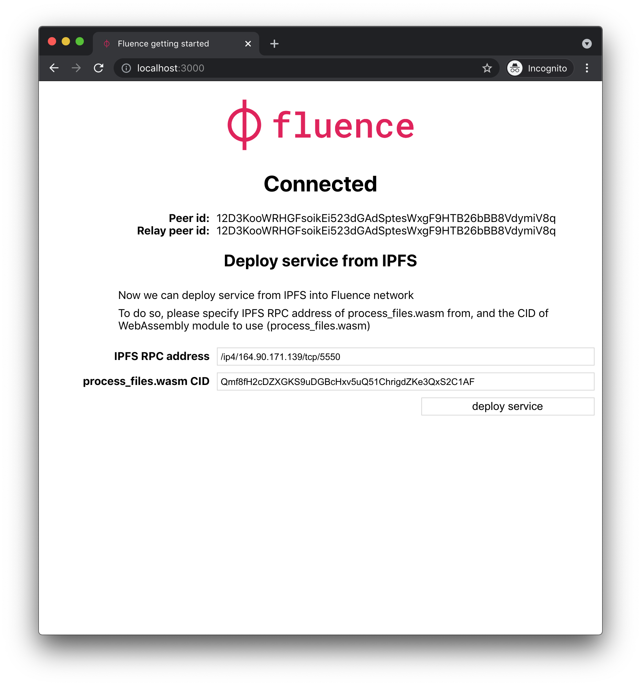
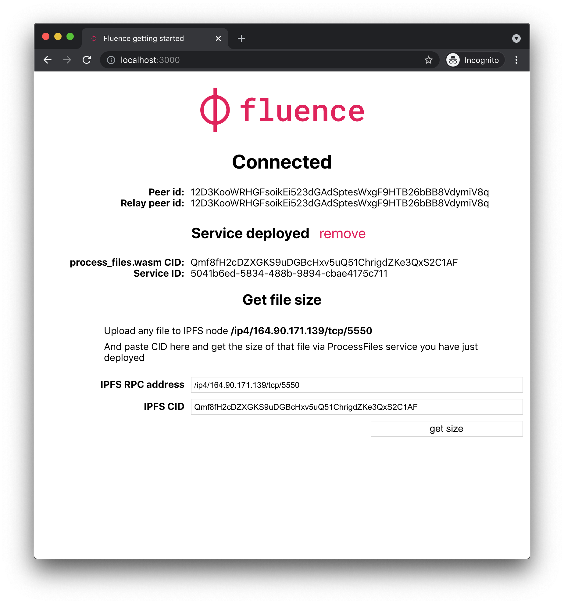
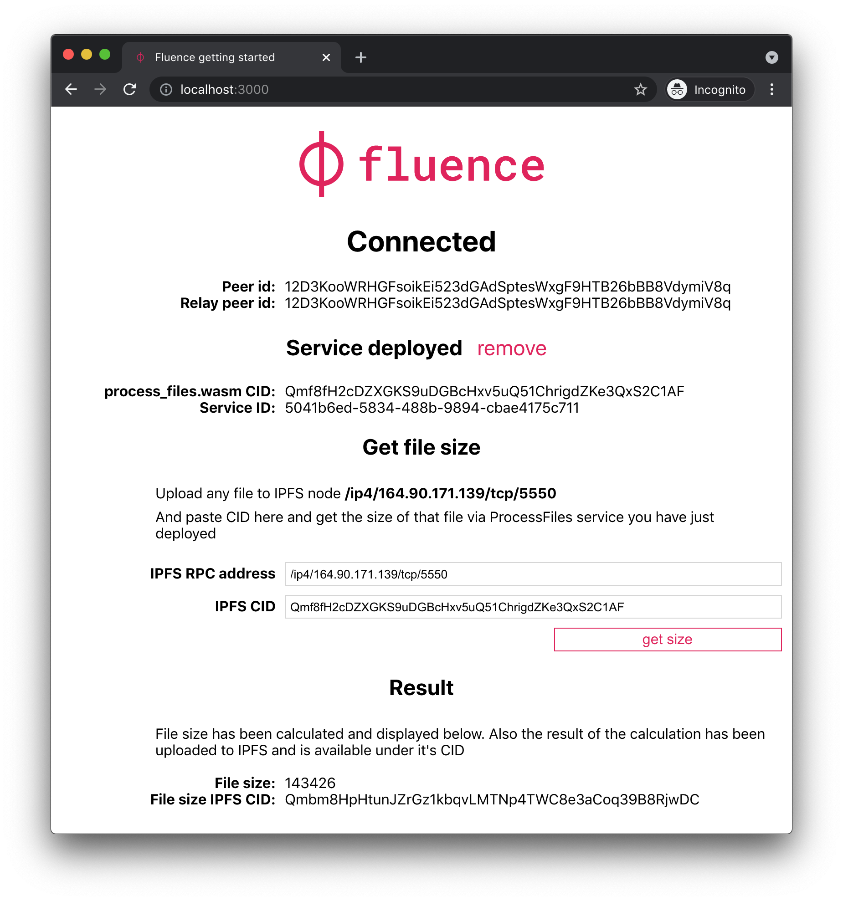

# IPFS Compute Web Demo

It's possible to implement any kind of computations on top of IPFS with Fluence. In this demo, we use a simple example that calculates size of a file. It's easily extendable to any kind of file processing or manipulation.

## Connect to the Fluence Network

You're presented with 3 random relays, connect to any of them.

## Deploy a service from IPFS
You will download `process_files.wasm` from IPFS network to a Fluence node, and deploy it.

## Call a function on the deployed service

You've just deployed [ProcessFiles](/aqua/src/process_files.aqua) service. It allows you to query file size of a file downloaded from IPFS. Enter IPFS CID, and press `get size` button.

## Observe the result

File size has been calculated, you can see it at the bottom of the web page.

