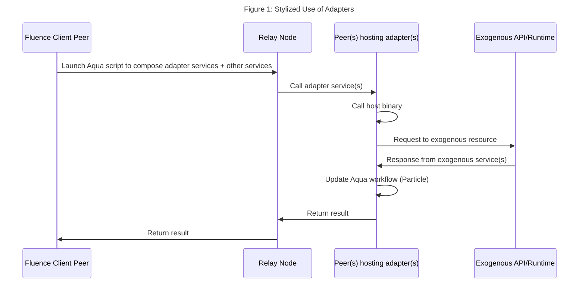

# Ceramic Adapter For Fluence And Aqua

**WIP -- Tread with care.**

## Overview

In order to use services available outside the Fluence network, such as [IPFS](https://ipfs.io/) or [Ceramic](https://ceramic.network/), we need to create adapters, which are generally implemented with Wasm modules, that allow us to bridge the Fluence network with many other networks and protocols. Once our adapter services are in place, we can use Aqua to seamlessly integrate such resources into our distributed, peer-to-peer application composition.



In this example, we develop an adapter for the Ceramic [CLI API](https://developers.ceramic.network/build/cli/api/) with the goal of seamlessly integrating Ceramic services into Fluence peer-to-peer applications composed with Aqua. See Figure 1.

Our adapter service mounts the Ceramic CLI with the [MountedBinaryResult](https://doc.fluence.dev/docs/knowledge_aquamarine/marine/marine-rs-sdk#mountedbinaryresult) interface requiring the availability of [Ceramic tools](https://developers.ceramic.network/build/cli/installation/) as a sidecar. In addition, a limited Ceramic HTTP API implementation is also available using the Marine [curl adapter](https://doc.fluence.dev/docs/tutorials_tutorials/curl-as-a-service). Since the HTTP API is limited and won't let users create streams, it is offered primarily for educational purposes, although it may be useful in scenarios where a ceramic daemon deployment is not feasible.

**Please note that Ceramic binary access is currently only available at Fluence's `stage` network environment (`--env stage`) with path `/usr/bin/ceramic`.**

ToDos:

- [ ] Refactor CLI adapter for optional built-in deployment
- [ ] Separate HTTP from CLI code
- [ ] Add multimodule tests
- [ ] Add use of Aqua demo

For another, comprehensive, end-to-end implementation of an adapter, see [Aqua IPFS Library](https://doc.fluence.dev/aqua-book/libraries/aqua-ipfs) and [Aqua IPFS demo](https://github.com/fluencelabs/examples/tree/main/aqua-examples/aqua-ipfs-integration).

## Ceramic CLI Adapter Module

You can find the code in the `services/ceramic-adapter-custom/src` directory. Let's have a look at the `ceramic_cli.rs` file. In order for the adapter to work, we need to have the binary, i.e. `ceramic daemon`, available at the host node level, which, in the case of the `stage` network, is at `/usr/bin/ceramic`.

We start with the general Marine setup of our project and at the end of the file we have our linked binary code using Rust's (FFI) [`extern`](https://doc.rust-lang.org/std/keyword.extern.html):

```rust
use marine_rs_sdk::{marine, MountedBinaryResult};

//<snip>

// mount binary with `extern`
#[marine]
#[link(wasm_import_module = "host")]
extern "C" {
    pub fn ceramic(cmd: Vec<String>) -> MountedBinaryResult;
}
```

We now can call the ceramic cli binary at the node level with a simple `ceramic(args)` call. The return of the extern `ceramic` call is [MountedBinaryResult](https://github.com/fluencelabs/marine-rs-sdk/blob/2bd0c63a932756f32423a4815fb2dce485abe67a/src/mounted_binary.rs#L27), which we can use as is or map into a more suitable return type. See the `services/ceramic-adapter` directory for an implementation utilizing the `MountedBinaryResult` struct making it suitable for a lower level library or (optional) built-in use.

For the purpose of ur example, we map the `MountedBinaryResult` into a custom `CeramicResult` with both a `new` and `crate` implementation where the former takes a `MountedBinaryResult` and maps it into `CeramicResult` and the latter creates `CeramicResult` from individual args.

Let's have a look at `create_stream`:

```rust
use marine_rs_sdk::{marine, MountedBinaryResult};

#[marine]
pub struct CeramicResult {
    pub ret_code: i32,
    pub stderr: String,
    pub stdout: String,
}

impl CeramicResult {
    fn new(mb: MountedBinaryResult) -> Self {
        CeramicResult {
            ret_code: mb.ret_code,
            stderr: String::from_utf8(mb.stderr).unwrap(),
            stdout: String::from_utf8(mb.stdout).unwrap(),
        }
    }

    fn create(ret_code: i32, stdout: String, stderr: String) -> Self {
        CeramicResult {
            ret_code,
            stderr,
            stdout,
        }
    }
}

//<snip>

#[marine]
pub fn create_stream(payload: String) -> CeramicResult {
    let args = vec![
        "create".to_string(),
        "tile".to_string(),
        "--content".to_string(),
        payload,
    ];
    let response: MountedBinaryResult = ceramic(args);
    if response.stderr.len() > 0 {
        return CeramicResult::new(response);
    }
    let stdout_str: String = String::from_utf8(response.stdout).unwrap();

    if stdout_str.contains("StreamID") {
        let res: Vec<&str> = stdout_str.split("\n").collect();
        let stream_id = res[0].replace("StreamID(", "").replace(")", "");
        return CeramicResult::create(response.ret_code, stream_id.to_string(), "".to_string());
    } else {
        return CeramicResult::create(
            response.ret_code,
            "Missing StreamId".to_string(),
            "".to_string(),
        );
    }
}

//<snip>
```

[Creating a stream](https://developers.ceramic.network/build/cli/quick-start/#2-create-a-stream) with the cli, requires the args `ceramic create tile --content` plus some content, e.g., `'{ "Foo": "Bar" }'`, which returns the StreamId and echoes back the formatted content:

```bash
StreamID(kjzl6cwe1jw147ww5d8pswh1hjh686mut8v1br10dar8l9a3n1wf8z38l0bg8qa)
{
    "Foo": "Bar"
}
```

If we just want to return the StreamId as our `CeramicResult.stdout` value so we can easily access and use it in Aqua, we can clean up the raw response string and extract just the StreamId, which we are doing in the code example above. A more generalized solution would use another service to do that extraction as part of the Aqua workflow. Regardless, in this example, the `create_stream` function returns a `CeramicResult` where `stdout` is the StreamId string, if available. See `ceramic_cli.rs` for the remaining cli wrappers *show*, *state*, *update*, and *create_schema*.

To build the adapter, run:

```bash
./scripts/build.sh
```

Once the Wasm modules are compiled, we can inspect them with `mrepl`. Make sure you have a local version of Ceramic installed and running:

```bash
mrepl Config.toml
```

## Interacting With Adapter Locally


## Using the Adapter With Aqua

...

