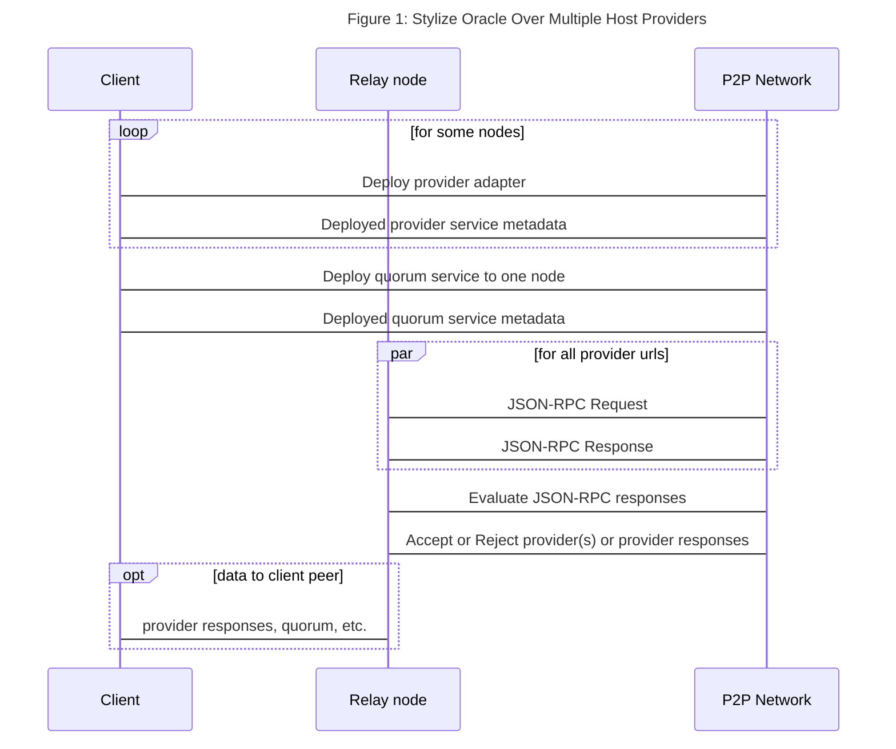

# EVM Integration Examples

## Overview

The [Ethereum virtual machine](https://ethereum.org/en/developers/docs/evm/) (EVM) is available across a variety of L1, L2 and sidechains with implementations ranging from straight clones to [compatible or equivalent](https://metisdao.medium.com/evm-equivalence-vs-evm-compatibility-199bd66f455d) incarnations. [Ethereum JSON RPC](https://ethereum.github.io/execution-apis/api-documentation/) is the base API to access EVM functionality and the underlying request model for the various web3 libraries such as [ethers](https://docs.ethers.io/v5/) or [ethers-rs](https://docs.rs/ethers/0.1.3/ethers/). In theory, and sometimes even practice, this allows developers to reuse their contracts and Web3 code across different chains with no changes but a few parameters.

While many of the various EVM chains provide the Web3 benefits desired, running (blockchain) clients tends to be a resource intensive adventure. Not surprisingly, a myriad of hosted node providers, such as [Infura](https://infura.io/), [Alchemy](https://www.alchemy.com/) and many more, provide relatively cheap access to a variety of chains. Alas, the benefits of convenience and low-to-no cost, the typical siren call of Web2 SaaS, comes at the price of introducing a single point of failure, trust in not finding your (personal) data on some blackhat site right beside the data from all the other "secure" SaaS vendors, and high exit barriers when adopting a hosting provider's specific API, thereby introducing a nontrivial chokepoint in your DApp. Morallis has a very strong [PoV](https://moralis.io/ethereum-rpc-nodes-what-they-are-and-why-you-shouldnt-use-them/) trying to convince developers to abandon open and common standards and lock into their custom APIs with high exit barriers. Of course, we'll ignore this rather self-serving piece of advice and embark on a journey in line with our Web3 ethos.

In this tutorial, we illustrate how Fluence and Aqua can help DApp developers minimize and even eliminate centralized points of failure undermining the Web3 benefits of their DApp.


## Setting Up

If you haven't set up your Fluence and Aqua development environment, head over to the [setup docs](https://doc.fluence.dev/docs/tutorials_tutorials/recipes_setting_up); if you're not familiar with Fluence and Aqua, give the [developer docs](https://doc.fluence.dev) a gander.

In addition to the Fluence setup, you ought to sign up for a few hosted (EVM) node providers with JSON-RPC access as discussed below.

### Selecting Providers

A large number of EVM nodes are hosted by centralized providers such as [Alchemy](https://www.alchemy.com/), which isn't all that surprising how resource intensive it is to self-host nodes. In addition to hosting nodes, many hosters provide their custom API, REST, GraphQL, etc., to provide a Web2 experience and don't even offer native EVM JSON-RPC access. But with a bit of searching, you ought to be able to find a few vendors that suit our needs. For our tutorial purposes, we choose the following three hosting providers for the hosted Ethereum mainnet clients but feel free to substitute as you see fit:

* [Infura](https://infura.io/)
  * need to sign up for a free account and get API lkey
  * for Ethereum mainnet, our uri is: 

* [Alchemy](https://www.alchemy.com/)
  * need to sign up for a free account and get API lkey
  * for Ethereum mainnet, our uri is: 

* [Linkpool](https://linkpool.io/)
  * no need to sign up or need for an API key
  * is a light client limiting historic queries
  * for Ethereum mainnet, our uri is: https://main-light.eth.linkpool.io
  * does not work with "Accept: application/json"  but only  "Content-Type: application/json" header 

## Oracleizing Hosting Provider Responses

Centralized hosted nodes introduce at best a single point of failure and at worst, a nefarious actor creating havoc in your DApp. Regardless, a centralized source of truth easily negates the benefits of a decentralized backend. Without giving up all of the convenience and cost savings, who wants to run a 3 TB node on AWS anyway, we can route identical requests to multiple hosted providers and determine, against some subjective metric, the acceptability of the responses. That is, we [oracleize](https://en.wikipedia.org/wiki/Blockchain_oracle) hosted provider responses. See Figure 1.



### Provider Adapter

In order to interact with the hosted EVMs, we choose the lowest common but open and interoperable API denominator, i.e., Ethereum JSON-RPC, which provides us with flexibility and great reusability.

For illustrative purposes, let's say we want to make sure the provider is returning the `latest` block, which, while simple, is a pretty good indicator of provider "liveness." The method we want to call is [`eth_blockNumber`](https://ethereum.github.io/execution-apis/api-documentation/) which formats to the following request:

```json
{
    "jsonrpc": "2.0",
    "method": "eth_blockNumber",
    "params": [],
    "id": 0
}
```

where `id` is the nonce. If we were to use `curl` on the command line:

```bash
curl --data '{"method":"eth_blockNumber","params":[],"id":1,"jsonrpc":"2.0"}' -H "Content-Type: application/json" -X POST <node or provider url>
```

we expect the following result:

```json
{
  "id": 1,
  "jsonrpc": "2.0",
  "result": "0x4b7" // hex encoded latest block
}
```

Ok, let's create an Wasm service we can use to query multiple providers. Keep the curl command in mind as we'll need to use curl from our Wasm to make the provider call.

`cd` into the `multi-provider-query` directory and have a look at `src/main.rs`:

```rust
// src/main.rs
#[marine]
// see https://eth.wiki/json-rpc/API#eth_blocknumbers
fn get_block_number(provider: ProviderInfo) -> EVMResult {
    let method = "eth_blockNumber";
    let params: Vec<String> = vec![];
    let url = provider.url;

    let data = RpcData::new(method.to_owned(), params);
    let data = serde_json::to_string(&data).unwrap();

    let curl_cmd = curl_cmd_builder(url, data);
    let response = get_curl_response(curl_cmd);

    if response.error.is_none() {
        let raw_response = response.result.unwrap();
        let block_height = u64::from_str_radix(raw_response.trim_start_matches("0x"), 16);

        let result = match block_height {
            Ok(r) => {
                let j_res = serde_json::json!({ "block-heigh": r });
                EVMResult {
                    stdout: j_res.to_string(),
                    stderr: "".to_owned(),
                }
            }
            Err(e) => {
                let err = format!("unable to convert {} to u64 with error {}", raw_response, e);
                EVMResult {
                    stdout: "".to_owned(),
                    stderr: err,
                }
            }
        };
        return result;
    }

    EVMResult {
        stdout: "".to_owned(),
        stderr: serde_json::to_string(&response.error).unwrap(),
    }
}
```

The `get_block_number` function implements a wrapper around the `eth_blockNumber` method and decodes the `hex` response to a json string. We could have implemented a more general function, say, `fn eth_rpc_wrapper(provider: ProviderInfo, method: String, parameters: Vec<String>) -> EVMResult` and either returned the raw json rpc result or added per-method decoding match arms, which **you are encouraged** to implement for the methods of your choosing.

Note that not all providers follow the JSON-RPC style when it comes to error handling. For example, submitting an invalid API key to Alchemy, results in an JSON-RPC error:

```json
{ jsonrpc: "2.0", error: Some(RpcResponseError { code: -32000, message: "Must be authenticated!" }), result: None }
```

Infura, on the other hand, does not follow the JSON-RPC route and instead returns a string in stdout with no other error codes or indicators provided:

```json
"invalid project id\n"
```

Infura-ating but such is life. We compensate for this idiosyncrasy with the following adjustment to an otherwise straight-forward curl response processor:

```rust
fn get_curl_response(curl_cmd: Vec<String>) -> RpcResponse {
    let response = curl_request(curl_cmd);
    let response = String::from_utf8(response.stdout).unwrap();

    let response: Result<RpcResponse, _> = serde_json::from_str(&response);
    match response {
        Ok(r) => r,
        Err(e) => RpcResponse {
            jsonrpc: "".to_owned(),
            error: Some(RpcResponseError {
                code: -1,                            // we know it's not an EVM error
                message: e.to_string(),
            }),
            result: None,
        },
    }
```

Of course, other providers may provide even other response patterns and it is up to you to make the necessary adjustments. You may think the convenience of vendor lock-in doesn't look too bad right about now but trust yourself, it is a big risk and cost. Recall that the `#[marine]` macro brings the Fluence `marine-rust-sdk` into play to compile to the Wasi target and expose the appropriate interfaces. Moreover, note that we link the [`curl` module](./curl-adapter/) to enable our http calls.

At this point we're good to go and compile our code to Wasm:

```bash
./scripts/build.sh
```

which should put `curl_adapter.wasm` and `multi_provider_query.wasm` in the `artifacts` directory. Before we deploy or service to one or more peers, let's check it out locally using the `marine` REPL:

```bash
cd ../  # assuming your are still in the multi-provider-query directory
marine repl configs/Config.toml

Welcome to the Marine REPL (version 0.16.2)
Minimal supported versions
  sdk: 0.6.0
  interface-types: 0.20.0

app service was created with service id = 2429b9fb-c04a-4ed9-9062-400c39e86f72
elapsed time 130.289671ms
```

Let's have a look at what we loaded:

```python
1> interface
Loaded modules interface:
exported data types (combined from all modules):
data ProviderInfo:
  url: string
  name: string
data EVMResult:
  provider: string
  stdout: string
  stderr: string
data MountedBinaryResult:
  ret_code: i32
  error: string
  stdout: []u8
  stderr: []u8

exported functions:
curl_adapter:
  fn curl_request(cmd: []string) -> MountedBinaryResult
multi_provider_query:
  fn get_block_number(provider: ProviderInfo) -> EVMResult

2>
```

If you go back to the source files, you'll see that all the interfaces marked up with the `#[marine]` macro are exposed and available in the REPL. Moreover, note that both the `curl_adapter` and `multi_provider_query` WASM modules are available as the eponymous namespaces with the corresponding (exposed) functions.

Without further ado, let's try to get a the latest block with a couple of the provider urls:

```python
2> call multi_provider_query get_block_number [{"name":"infura", "url":"https://mainnet.infura.io/v3/<YOUR-API_KEY>"}]
result: Object({"provider": String("infura"), "stderr": String(""), "stdout": String("{\"block-height\":15016773}")})
 elapsed time: 909.277016ms

3> call multi_provider_query get_block_number [{"url":"https://main-light.eth.linkpool.io/", "name":"linkpool"}]
result: Object({"provider": String("linkpool"), "stderr": String(""), "stdout": String("{\"block-height\":15016773}")})
 elapsed time: 621.172593ms

4>
```

Ok, so we called both Alchemy and Infura for the latest block height and got the same result, which is somewhat confidence inspiring. Let's check with a bad API key and keep in mind that we had to "coerce" the Infura response into the JSON-RPC format:

```python

4>call multi_provider_query get_block_number [{"name":"infura", "url":"https://mainnet.infura.io/v3/<YOUR-BAD-API-KEY"}]
result: Object({"provider": String("infura"), "stderr": String("{\"code\":-1,\"message\":\"expected value at line 1 column 1\"}"), "stdout": String("")})
 elapsed time: 419.089663ms
```

While we have been using hosted Ethereum mainnet endpoints, you can easily use other supported (EVM) networks such as [Polygn PoS on Alchemy](https://docs.polygon.technology/docs/develop/alchemy/) or [Polygon PoS on Infura](https://docs.infura.io/infura/networks/polygon-pos/how-to).

All looks well and we are ready to deploy!

## Multi-Provider Queries With Aqua

Now that we have our adapter and providers, let's think about how we can use a multi-provider query approach to ensure a high likelihood of truth and reliability in our query results. Keep in mind that in addition to our lack of trust in each of the providers, we may also not trust the Fluence peers hosting our services, which we'll ignore for the moment. Moreover, we need to parallelize our requests to make sure we don't inadvertently straddle different block times legitimately leading to different responses. As you may recall, Wasm modules are single threaded and concurrency of service execution is managed at the Aqua level. Parallel execution of a service may be accomplished on one or multiple nodes but either way, you need to deploy multiple service instances, e.g., for three providers, we want three service instances. 

In the "trust the Fluence nodes" case, then, we deploy our adapter service to three (3) different nodes -- one for each provider. Let's get to it, deploy our services and create our Aqua script.

### Service Deployment

We deploy our service with the `aqua cli` tool to the `stage` testnet. To see the Fluence default peers for `stage`:

```bash
aqua config default_peers stage

/dns4/stage.fluence.dev/tcp/19001/wss/p2p/12D3KooWHCJbJKGDfCgHSoCuK9q4STyRnVveqLoXAPBbXHTZx9Cv
/dns4/stage.fluence.dev/tcp/19002/wss/p2p/12D3KooWMigkP4jkVyufq5JnDJL6nXvyjeaDNpRfEZqQhsG3sYCU
/dns4/stage.fluence.dev/tcp/19003/wss/p2p/12D3KooWMMGdfVEJ1rWe1nH1nehYDzNEHhg5ogdfiGk88AupCMnf
/dns4/stage.fluence.dev/tcp/19004/wss/p2p/12D3KooWJ4bTHirdTFNZpCS72TAzwtdmavTBkkEXtzo6wHL25CtE
/dns4/stage.fluence.dev/tcp/19005/wss/p2p/12D3KooWAKNos2KogexTXhrkMZzFYpLHuWJ4PgoAhurSAv7o5CWA
/dns4/stage.fluence.dev/tcp/19990/wss/p2p/12D3KooWDcpWuyrMTDinqNgmXAuRdfd2mTdY9VoXZSAet2pDzh6r
```

Also, if you are deploying your own service instances, you need one or more keypairs to deploy, authenticate and eventually delete your service. You can use `aqua-cli to create keys:

```bash
aqua key create
{
    "peerId": "12D3KooWDAM4YDz7WdAWVzxQspeZudL4rqyGmvWUePEvuERNYfLC",
    "secretKey": "SOME-SECRET-KEY",
    "publicKey": "SOME-PUB-KEY"
}
```

For tutorial purposes, we'll just stick with one keypair but feel free to use one pair for each deployed service. 

Time to deploy:

```bash
aqua remote deploy_service \
  --addr /dns4/stage.fluence.dev/tcp/19004/wss/p2p/12D3KooWJ4bTHirdTFNZpCS72TAzwtdmavTBkkEXtzo6wHL25CtE \
  --config-path configs/deployment_cfg.json \
  --service multi-provider-query \
  --sk <SECRET KEY> \ 
  --log-level off
Going to upload a module...
Going to upload a module...
Now time to make a blueprint...
Blueprint id:
3bd81487cb43b76a5a67d5ebb417dd4afacb29f56d77492d8b21ad469acdfb8b
And your service id is:
"d9124884-3c42-43d6-9a1f-1b645d073c3f"

```

Ok, one down, two to go:

```bash
  --addr /dns4/stage.fluence.dev/tcp/19005/wss/p2p/12D3KooWAKNos2KogexTXhrkMZzFYpLHuWJ4PgoAhurSAv7o5CWA \
  --config-path configs/deployment_cfg.json \
  --service multi-provider-query \
  --sk <SECRET KEY> \ 
  --log-level off
Going to upload a module...
Going to upload a module...
Now time to make a blueprint...
Blueprint id:
3bd81487cb43b76a5a67d5ebb417dd4afacb29f56d77492d8b21ad469acdfb8b
And your service id is:
"3c321110-b069-42c6-b5e0-aed73d976a60"
```

and

```bash
 aqua remote deploy_service \
  --addr /dns4/stage.fluence.dev/tcp/19003/wss/p2p/12D3KooWMMGdfVEJ1rWe1nH1nehYDzNEHhg5ogdfiGk88AupCMnf \
  --config-path configs/deployment_cfg.json \
  --service multi-provider-query \
  --sk <SECRET KEY> \ 
  --log-level off
Going to upload a module...
Going to upload a module...
Now time to make a blueprint...
Blueprint id:
3bd81487cb43b76a5a67d5ebb417dd4afacb29f56d77492d8b21ad469acdfb8b
And your service id is:
"84d4d018-0c13-4d6d-8c11-599a3919911c"
```

Now that we have our services deployed, it's time to create our Aqua script.

### Aqua

The Fluence protocol uses function addressability, i.e., (peer id, service id) tuples, to resolve services. In our model, function addresses are input parameters just like the provider urls. So we can capture our function addresses with a struct:

```aqua
data FunctionAddress:
  peer_id: string
  service_id: string
```

which allows us to create a fairly compact function signature:

```aqua
func get_block_heights(providers: []string, addrs: []FunctionAddress):
```

However, we want to be able to track the providers' responses and it seems easier to provide the provider name with the url, which we with much foresight already used in our Wasm code:

```aqua
data ProviderInfo:
  name: string
  url: string
```

Let's put it all together:

```aqua

data FunctionAddress:
  peer_id: string
  service_id: string

data ProviderInfo:
  name: string
  url: string

-- from our WASM code
data EVMResult:
  provider: string
  stdout: string
  stderr: string

-- helper function to get length of []Provider
service MyOp("op"):
  array_length(providers: []ProviderInfo) -> i64

service MyOp2("op"):
  array_length(providers: []FunctionAddress) -> i64

-- from our WASM code
service MultiProviderQuery("service-id"):
  get_block_number(provider: ProviderInfo) -> EVMResult

-- finally, our Aqua function
func get_block_heights(providers: []ProviderInfo, addrs: []FunctionAddress) -> []EVMResult:
  result: *EVMResult
  result2: *string
  n <- MyOp.array_length(providers)
  n2 <- MyOp2.array_length(addrs)

  if n > 0:
    for addr <- addrs par:
      on addr.peer_id:
        MultiProviderQuery addr.service_id
        for provider <- providers:
          result <- MultiProviderQuery.get_block_number(provider)
          result2 <<- provider.name
        -- join result[n2-1]
    join result[n*n2-1]
  <- result
```

The script we created is going to get us halfway to where we want to go. So let's try it from the command-line with `aqua-cli`, which is a bit unwieldy and we'll see in a bit how we can create a local client with Fluence JS. For now, quick and easy:

```bash
aqua run \
  --addr /dns4/stage.fluence.dev/tcp/19004/wss/p2p/12D3KooWJ4bTHirdTFNZpCS72TAzwtdmavTBkkEXtzo6wHL25CtE \
  -i aqua \
  -f 'get_block_heights(arg1, arg2)' \
  --data '{"arg1": [{"name":"infura", "url":"https://mainnet.infura.io/v3/0cc023286cae4ab886598ecd14e256fd"},
                    {"name":"alchemy","url":"https://eth-mainnet.alchemyapi.io/v2/2FLlm9t-xOm0CbGx-ORr81li1yD_cKP6"},
                    {"name":"link", "url":"https://main-light.eth.linkpool.io"}],
          "arg2": [{"peer_id":"12D3KooWJ4bTHirdTFNZpCS72TAzwtdmavTBkkEXtzo6wHL25CtE", "service_id":"d9124884-3c42-43d6-9a1f-1b645d073c3f"},
                   {"peer_id":"12D3KooWAKNos2KogexTXhrkMZzFYpLHuWJ4PgoAhurSAv7o5CWA", "service_id":"3c321110-b069-42c6-b5e0-aed73d976a60"},
                   {"peer_id":"12D3KooWMMGdfVEJ1rWe1nH1nehYDzNEHhg5ogdfiGk88AupCMnf", "service_id":"84d4d018-0c13-4d6d-8c11-599a3919911c"}]}'
```

which results it:

```bash
[
  {
    "provider": "infura",
    "stderr": "",
    "stdout": "{\"block-height\":15016806}"
  },
  {
    "provider": "alchemy",
    "stderr": "",
    "stdout": "{\"block-height\":15016806}"
  },
  {
    "provider": "link",
    "stderr": "",
    "stdout": "{\"block-height\":15016806}"
  },
  {
    "provider": "infura",
    "stderr": "",
    "stdout": "{\"block-height\":15016806}"
  },
  {
    "provider": "alchemy",
    "stderr": "",
    "stdout": "{\"block-height\":15016806}"
  },
  {
    "provider": "link",
    "stderr": "",
    "stdout": "{\"block-height\":15016806}"
  },
  {
    "provider": "infura",
    "stderr": "",
    "stdout": "{\"block-height\":15016806}"
  },
  {
    "provider": "alchemy",
    "stderr": "",
    "stdout": "{\"block-height\":15016806}"
  },
  {
    "provider": "link",
    "stderr": "",
    "stdout": "{\"block-height\":15016806}"
  }
]
```

A quick scan suggests that all responses are equal across providers. That's a good start! However, we don't want to rely on manual inspection of our data but want to programmatically determine what a quorum. A possible quorum rule is the two-third rule but we need consider our response categories:

* blocknumber response -- "correct"
* blocknumber response -- "incorrect"
* no response

In order to be able to apply a threshold decision like the 2/3 rule, we first need to determine the frequency distribution of our result set. A naive implementation might look like this:

```rust

```

Alright, so we got results ...


### Persisting Results

aqua run -i aqua \
   --addr /dns4/stage.fluence.dev/tcp/19004/wss/p2p/12D3KooWJ4bTHirdTFNZpCS72TAzwtdmavTBkkEXtzo6wHL25CtE \
    -f'create(arg, "12D3KooWJ4bTHirdTFNZpCS72TAzwtdmavTBkkEXtzo6wHL25CtE", "e9fbfb09-c8b8-447a-b405-5de579b8db6c")' \
    -d '{"arg": [
  {
    "provider": "infura",
    "stderr": "",
    "stdout": "{\"block-height\":15016806}"
  },
  {
    "provider": "alchemy",
    "stderr": "",
    "stdout": "{\"block-height\":15016806}"
  },
  {
    "provider": "link",
    "stderr": "",
    "stdout": "{\"block-height\":15016806}"
  },
  {
    "provider": "infura",
    "stderr": "",
    "stdout": "{\"block-height\":15016806}"
  },
  {
    "provider": "alchemy",
    "stderr": "",
    "stdout": "{\"block-height\":15016806}"
  },
  {
    "provider": "link",
    "stderr": "",
    "stdout": "{\"block-height\":15016806}"
  },
  {
    "provider": "infura",
    "stderr": "",
    "stdout": "{\"block-height\":15016806}"
  },
  {
    "provider": "alchemy",
    "stderr": "",
    "stdout": "{\"block-height\":15016806}"
  },
  {
    "provider": "link",
    "stderr": "",
    "stdout": "{\"block-height\":15016806}"
  }]}'


## Summary

We developed a model to decentralize EVM hosting providers for our DApps and implemented a stylized solution with Fluence and Aqua. Specifically, we queried multiple centralized hosted EVM providers with the open Ethereum JSON-RPC API and settled on pulling the `latest` block as an indicator of reliability and "liveness", as opposed to (stale) caches, of each provider.

Along the our journey, we pretty much touched on every possible chokepoint and discussed what a feasible approach to quroum, or consensus, might look like and what ??? diviaions actually might mean. All in all, it became clear rather quickly that ... wide decisions. Hopefully making us more aware of all the decisons oracle providers, on- or off-chain, may make and how such decisions may not be in our best interest.