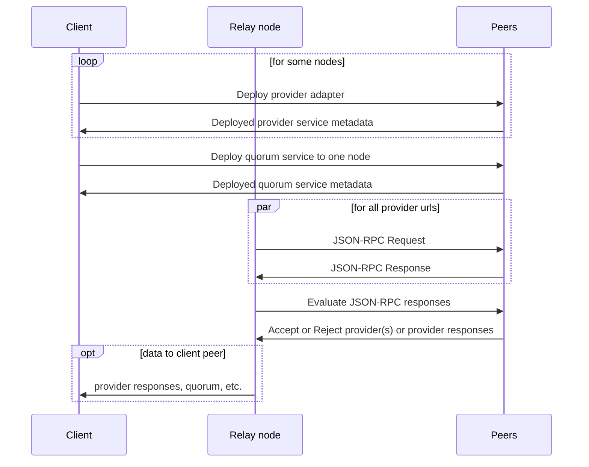
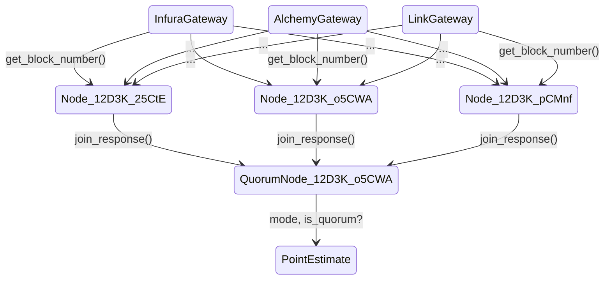

# Explorations In Decentralizing Blockchain Gateways 

## Overview

The [Ethereum virtual machine](https://ethereum.org/en/developers/docs/evm/) (EVM) is available across a variety of L1, L2 and sidechains with implementations ranging from straight clones to [compatible or equivalent](https://metisdao.medium.com/evm-equivalence-vs-evm-compatibility-199bd66f455d) incarnations. [Ethereum JSON RPC](https://ethereum.github.io/execution-apis/api-documentation/) is the base API to access EVM functionality and the underlying request model for the various web3 libraries such as [ethers](https://docs.ethers.io/v5/) or [ethers-rs](https://docs.rs/ethers/0.1.3/ethers/). In theory, and sometimes even practice, this allows developers to reuse their contracts and Web3 code across different chains with no changes but a few parameters.

While many of the various EVM chains provide the Web3 benefits desired, running (blockchain) clients tends to be a resource intensive adventure. Not surprisingly, a myriad of hosted node providers, such as [Infura](https://infura.io/), [Alchemy](https://www.alchemy.com/) and many more, provide relatively cheap access to a variety of chains. Alas, the benefits of convenience and low-to-no cost, the typical siren call of Web2 SaaS, comes at the price of introducing a single point of failure, trust in not finding your (personal) data on some blackhat site right beside the data from all the other "secure" SaaS vendors, and high exit barriers when adopting a hosting provider's specific API, thereby introducing a nontrivial chokepoint in your DApp.

In this tutorial, we illustrate how Fluence and Aqua can help DApp developers minimize and even eliminate centralized points of failure undermining the Web3 benefits of their DApp.


## Setting Up

If you haven't set up your Fluence and Aqua development environment, head over to the [setup docs](https://doc.fluence.dev/docs/tutorials_tutorials/recipes_setting_up); if you're not familiar with Fluence and Aqua, give the [developer docs](https://doc.fluence.dev) a gander.

In addition to the Fluence setup, you ought to sign up for a few hosted (EVM) node providers with JSON-RPC access as discussed below.

### Selecting Providers

A large number of EVM nodes are hosted by centralized providers such as [Alchemy](https://www.alchemy.com/), which isn't all that surprising how resource intensive it is to self-host nodes. The following hosting providers offer free JSON-RPC access but feel free to substitute as you see fit:

* [Infura](https://infura.io/)
  * need to sign up for a free account and get API lkey
  * for Ethereum mainnet, our uri is: 

* [Alchemy](https://www.alchemy.com/)
  * need to sign up for a free account and get API lkey
  * for Ethereum mainnet, our uri is: 

* [Linkpool](https://linkpool.io/)
  * no need to sign up or need for an API key
  * is a light client limiting historic queries
  * for Ethereum mainnet, our uri is: https://main-light.eth.linkpool.io
  * does not work with "Accept: application/json"  but only  "Content-Type: application/json" header

If you are looking for another multi-blockchain API provider, checkout [BEWARELAABS API](https://bwarelabs.com/blockchain-api). Sticking with the Ethereum mainnet and the [`eth_blockNumber`](https://docs.bwarelabs.com/api-docs/ethereum-api/rpc/eth_blocknumber-method) method, we get the expected result:
### Decentralizing Blockchain APIs

Centralized hosted nodes introduce at best a single point of failure and at worst, a nefarious actor creating havoc with your DApp. Hence, a centralized source of truth easily negates the benefits of the decentralized backend. Without giving up all of the convenience and cost savings of hosted blochchain nodes, we can route identical requests to multiple hosted providers and determine, against some subjective metric, the acceptability of the responses. That is, we decentralize hosted provider responses. See Figure 1.

**Figure 1: Stylize Decentralized Blockchain APIs**



### Provider Adapter

In order to interact with the hosted EVMs, we choose the lowest common but open and interoperable API denominator, i.e., Ethereum JSON-RPC, which provides us with flexibility and great reusability but also forgoes some of the conveniences available in the various web3 sdks or custom APIs.

For illustrative purposes, let's say we want to make sure the provider is returning the `latest` block, which, while simple, is a pretty good indicator of provider "liveness." The method we want to call is [`eth_blockNumber`](https://ethereum.github.io/execution-apis/api-documentation/) which formats to the following request:

```json
{
    "jsonrpc": "2.0",
    "method": "eth_blockNumber",
    "params": [],
    "id": 1
}
```

where `id` is the nonce. If we were to use `curl` on the command line:

```bash
curl --data '{"method":"eth_blockNumber","params":[],"id":1,"jsonrpc":"2.0"}' -H "Content-Type: application/json" -X POST <node or provider url>
```

we expect the following result:

```json
{
  "id": 1,
  "jsonrpc": "2.0",
  "result": "0x4b7" // hex encoded latest block
}
```

Ok, let's create a Wasm service we can use to query multiple providers. Keep the curl command in mind as we'll need to use curl from our Wasm to make the provider call.

`cd` into the `wasm-modules/multi-provider-query` directory and have a look at `src/main.rs`:

```rust
// src/main.rs
#[marine]
// see https://eth.wiki/json-rpc/API#eth_blocknumbers
fn get_block_number(provider: ProviderInfo) -> EVMResult {
    let method = "eth_blockNumber";
    let params: Vec<String> = vec![];
    let url = provider.url;

    let data = RpcData::new(method.to_owned(), params);
    let data = serde_json::to_string(&data).unwrap();

    let curl_cmd = curl_cmd_builder(url, data);
    let response = get_curl_response(curl_cmd);

    if response.error.is_none() {
        let raw_response = response.result.unwrap();
        let block_height = u64::from_str_radix(raw_response.trim_start_matches("0x"), 16);

        let result = match block_height {
            Ok(r) => {
                let j_res = serde_json::json!({ "block-height": r });
                EVMResult {
                    provider: provider.name,
                    stdout: j_res.to_string(),
                    stderr: "".to_owned(),
                }
            }
            Err(e) => {
                let err = format!("unable to convert {} to u64 with error {}", raw_response, e);
                EVMResult {
                    provider: provider.name,
                    stdout: "".to_owned(),
                    stderr: err,
                }
            }
        };
        return result;
    }

    EVMResult {
        provider: provider.name,
        stdout: "".to_owned(),
        stderr: serde_json::to_string(&response.error).unwrap(),
    }
}

```

The `get_block_number` function implements a wrapper around the `eth_blockNumber` method and decodes the `hex` response to a json string. We could have implemented a more general function, say, `fn eth_rpc_wrapper(provider: ProviderInfo, method: String, parameters: Vec<String>) -> EVMResult` and either returned the raw json rpc result or added per-method decoding match arms, which *you are encouraged* to implement for the methods of your choosing.

Recall that the `#[marine]` macro brings the Fluence `marine-rust-sdk` into play to compile to the Wasi target and expose the appropriate interfaces. Moreover, note that we link the [`curl` module](./curl-adapter/) to enable our http calls.

Note that not all providers follow the JSON-RPC style when it comes to error handling. For example, submitting an invalid API key to Alchemy, results in the error captured in the JSON-RPC response:

```json
{ jsonrpc: "2.0", error: Some(RpcResponseError { code: -32000, message: "Must be authenticated!" }), result: None }
```

Infura, on the other hand, does not follow the JSON-RPC route and instead returns a string in stdout with no other error codes or indicators provided:

```json
"invalid project id\n"
```

Infura-ating but such is life. We compensate for this idiosyncrasy with the following adjustment to an otherwise straight-forward curl response processor:

```rust
fn get_curl_response(curl_cmd: Vec<String>) -> RpcResponse {
    let response = curl_request(curl_cmd);
    let response = String::from_utf8(response.stdout).unwrap();

    let response: Result<RpcResponse, _> = serde_json::from_str(&response);
    match response {
        Ok(r) => r,
        Err(e) => RpcResponse {
            jsonrpc: "".to_owned(),
            error: Some(RpcResponseError {
                code: -1,                            // we know it's not an EVM error
                message: e.to_string(),
            }),
            result: None,
        },
    }
```

Of course, other providers may provide even other response patterns and it is up to you to make the necessary adjustments. You may think the convenience of vendor lock-in doesn't look too bad right about now but trust yourself, it is a big risk and cost.

At this point we're good to go, returning to the project root and compile our code to Wasm:

```bash
./scripts/build.sh
```

which should put `curl_adapter.wasm` and `multi_provider_query.wasm` in the `artifacts` directory. Before we deploy or service to one or more peers, let's check it out locally using the `marine` REPL:

```bash
cd ../../  # assuming your are still in the multi-provider-query directory
marine repl configs/Config.toml

Welcome to the Marine REPL (version 0.16.2)
Minimal supported versions
  sdk: 0.6.0
  interface-types: 0.20.0

app service was created with service id = 2429b9fb-c04a-4ed9-9062-400c39e86f72
elapsed time 130.289671ms
```

Let's have a look at what we loaded:

```python
1> interface
Loaded modules interface:
exported data types (combined from all modules):
data ProviderInfo:
  url: string
  name: string
data EVMResult:
  provider: string
  stdout: string
  stderr: string
data MountedBinaryResult:
  ret_code: i32
  error: string
  stdout: []u8
  stderr: []u8

exported functions:
curl_adapter:
  fn curl_request(cmd: []string) -> MountedBinaryResult
multi_provider_query:
  fn get_block_number(provider: ProviderInfo) -> EVMResult

2>
```

If you go back to the source files, you'll see that all the interfaces marked up with the `#[marine]` macro are exposed and available in the REPL. Moreover, note that both the `curl_adapter` and `multi_provider_query` WASM modules are available as the eponymous namespaces with the corresponding (exposed) functions.

Without further ado, let's try to get the latest block with a couple of the provider urls:

```python
2> call multi_provider_query get_block_number [{"name":"infura", "url":"https://mainnet.infura.io/v3/<YOUR-API_KEY>"}]
result: Object({"provider": String("infura"), "stderr": String(""), "stdout": String("{\"block-height\":15016773}")})
 elapsed time: 909.277016ms

3> call multi_provider_query get_block_number [{"url":"https://main-light.eth.linkpool.io/", "name":"linkpool"}]
result: Object({"provider": String("linkpool"), "stderr": String(""), "stdout": String("{\"block-height\":15016773}")})
 elapsed time: 621.172593ms

4>
```

Ok, so we called both Alchemy and Infura for the latest block height and got the same result, which is somewhat confidence inspiring. Let's check with a bad API key and keep in mind that we had to "coerce" the Infura response into the JSON-RPC format:

```python

4>call multi_provider_query get_block_number [{"name":"infura", "url":"https://mainnet.infura.io/v3/<YOUR-BAD-API-KEY"}]
result: Object({"provider": String("infura"), "stderr": String("{\"code\":-1,\"message\":\"expected value at line 1 column 1\"}"), "stdout": String("")})
 elapsed time: 419.089663ms
```

While we have been using hosted Ethereum mainnet endpoints, you can easily use other supported (EVM) networks such as [Polygn PoS on Alchemy](https://docs.polygon.technology/docs/develop/alchemy/) or [Polygon PoS on Infura](https://docs.infura.io/infura/networks/polygon-pos/how-to).

All looks well and we are ready to deploy!

## Multi-Provider Queries With Aqua

Now that we have our adapter and providers, let's think about how we can use a multi-provider query approach to ensure a high likelihood of truth and reliability in our query results. Keep in mind that in addition to our lack of trust in each of the providers, we may also not trust the Fluence peers hosting our services, which we'll ignore for the moment. Moreover, we need to parallelize our requests to make sure we don't inadvertently straddle different block times legitimately leading to different responses. As you may recall, Wasm modules are single threaded and concurrency of service execution is managed at the Aqua level. Parallel execution of a service may be accomplished on one or multiple nodes but either way, you need to deploy multiple service instances, e.g., for three providers, we want three service instances. 

In the "trust the Fluence nodes" case, then, we deploy our adapter service to three (3) different nodes -- one for each provider. Let's get to it, deploy our services and create our Aqua script.

### Service Deployment

We deploy our service with the `aqua cli` tool to the `stage` testnet. To see the Fluence default peers for `stage`:

```bash
aqua config default_peers stage

/dns4/stage.fluence.dev/tcp/19001/wss/p2p/12D3KooWHCJbJKGDfCgHSoCuK9q4STyRnVveqLoXAPBbXHTZx9Cv
/dns4/stage.fluence.dev/tcp/19002/wss/p2p/12D3KooWMigkP4jkVyufq5JnDJL6nXvyjeaDNpRfEZqQhsG3sYCU
/dns4/stage.fluence.dev/tcp/19003/wss/p2p/12D3KooWMMGdfVEJ1rWe1nH1nehYDzNEHhg5ogdfiGk88AupCMnf
/dns4/stage.fluence.dev/tcp/19004/wss/p2p/12D3KooWJ4bTHirdTFNZpCS72TAzwtdmavTBkkEXtzo6wHL25CtE
/dns4/stage.fluence.dev/tcp/19005/wss/p2p/12D3KooWAKNos2KogexTXhrkMZzFYpLHuWJ4PgoAhurSAv7o5CWA
/dns4/stage.fluence.dev/tcp/19990/wss/p2p/12D3KooWDcpWuyrMTDinqNgmXAuRdfd2mTdY9VoXZSAet2pDzh6r
```

Also, if you are deploying your own service instances, you need one or more keypairs to deploy, authenticate and eventually delete your service. You can use `aqua-cli` to create keys and make sure you store them in a safe place:

```bash
aqua key create
{
    "peerId": "12D3KooWDAM4YDz7WdAWVzxQspeZudL4rqyGmvWUePEvuERNYfLC",
    "secretKey": "SOME-SECRET-KEY",
    "publicKey": "SOME-PUB-KEY"
}
```

For tutorial purposes, we'll just stick with one keypair but feel free to use one pair for each deployed service. 

Time to deploy:

```bash
aqua remote deploy_service \
  --addr /dns4/stage.fluence.dev/tcp/19004/wss/p2p/12D3KooWJ4bTHirdTFNZpCS72TAzwtdmavTBkkEXtzo6wHL25CtE \
  --config-path configs/deployment_cfg.json \
  --service multi-provider-query \
  --sk <SECRET KEY> \
  --log-level off

Going to upload a module...
Going to upload a module...
Now time to make a blueprint...
Blueprint id:
3bd81487cb43b76a5a67d5ebb417dd4afacb29f56d77492d8b21ad469acdfb8b
And your service id is:
"d9124884-3c42-43d6-9a1f-1b645d073c3f"

```

Ok, one down, two to go:

```bash
aqua remote deploy_service \
  --addr /dns4/stage.fluence.dev/tcp/19005/wss/p2p/12D3KooWAKNos2KogexTXhrkMZzFYpLHuWJ4PgoAhurSAv7o5CWA \
  --config-path configs/deployment_cfg.json \
  --service multi-provider-query \
  --sk <SECRET KEY> \
  --log-level off
Going to upload a module...
Going to upload a module...
Now time to make a blueprint...
Blueprint id:
3bd81487cb43b76a5a67d5ebb417dd4afacb29f56d77492d8b21ad469acdfb8b
And your service id is:
"3c321110-b069-42c6-b5e0-aed73d976a60"
```

and

```bash
 aqua remote deploy_service \
  --addr /dns4/stage.fluence.dev/tcp/19003/wss/p2p/12D3KooWMMGdfVEJ1rWe1nH1nehYDzNEHhg5ogdfiGk88AupCMnf \
  --config-path configs/deployment_cfg.json \
  --service multi-provider-query \
  --sk <SECRET KEY> \
  --log-level off
Going to upload a module...
Going to upload a module...
Now time to make a blueprint...
Blueprint id:
3bd81487cb43b76a5a67d5ebb417dd4afacb29f56d77492d8b21ad469acdfb8b
And your service id is:
"84d4d018-0c13-4d6d-8c11-599a3919911c"
```

If you deploy the services, your service ids are different, of course. Also, feel free to use different peers. Just as with your keys, make sure you keep the (peer id, service id) in a safe place for future use. Now that we have our services deployed, it's time to create our Aqua script.

### Aqua

The Fluence protocol uses function addressability, i.e., (peer id, service id) tuples, to resolve services. In our model, function addresses are input parameters just like the provider urls. So we can capture our function addresses with a struct:

```aqua
data FunctionAddress:
  peer_id: string
  service_id: string
```

Let's put it all together:

```aqua

data FunctionAddress:
  peer_id: string
  service_id: string

-- from our WASM code
data ProviderInfo:
  name: string
  url: string

-- from our WASM code
data EVMResult:
  provider: string
  stdout: string
  stderr: string

-- helper function to get length of []Provider
service MyOp("op"):
  array_length(providers: []ProviderInfo) -> i64

service MyOp2("op"):
  array_length(providers: []FunctionAddress) -> i64

-- from our WASM code
service MultiProviderQuery("service-id"):
  get_block_number(provider: ProviderInfo) -> EVMResult

-- finally, our Aqua function
func get_block_heights(providers: []ProviderInfo, addrs: []FunctionAddress) -> []EVMResult:
  result: *EVMResult
  result2: *string
  
  n <- MyOp.array_length(providers) -- get number of provider urls
  n2 <- MyOp2.array_length(addrs) -- get number of services

  if n > 0:
    for addr <- addrs par:
      on addr.peer_id:
        MultiProviderQuery addr.service_id
        for provider <- providers:
          result <- MultiProviderQuery.get_block_number(provider)
          result2 <<- provider.name
        -- join result[n2-1]
    join result[n*n2-1]
  <- result
```

The script we created is going to get us halfway to where we want to go. So let's try it from the command-line with `aqua-cli`, which is a bit unwieldy and we'll see in a bit how we can create a local client with Fluence JS. For now, quick and easy:

```bash
aqua run \
  --addr /dns4/stage.fluence.dev/tcp/19004/wss/p2p/12D3KooWJ4bTHirdTFNZpCS72TAzwtdmavTBkkEXtzo6wHL25CtE \
  -i aqua \
  -f 'get_block_heights(arg1, arg2)' \
  --data '{"arg1": [{"name":"infura", "url":"https://mainnet.infura.io/v3/<YOUR API  KEY>"},
                    {"name":"alchemy","url":"https://eth-mainnet.alchemyapi.io/v2/<YOUR API KEY>"},
                    {"name":"link", "url":"https://main-light.eth.linkpool.io"}],
          "arg2": [{"peer_id":"12D3KooWJ4bTHirdTFNZpCS72TAzwtdmavTBkkEXtzo6wHL25CtE", "service_id":"d9124884-3c42-43d6-9a1f-1b645d073c3f"},
                   {"peer_id":"12D3KooWAKNos2KogexTXhrkMZzFYpLHuWJ4PgoAhurSAv7o5CWA", "service_id":"3c321110-b069-42c6-b5e0-aed73d976a60"},
                   {"peer_id":"12D3KooWMMGdfVEJ1rWe1nH1nehYDzNEHhg5ogdfiGk88AupCMnf", "service_id":"84d4d018-0c13-4d6d-8c11-599a3919911c"}]}'
```

which results in:

```bash
[
  {
    "provider": "infura",
    "stderr": "",
    "stdout": "{\"block-height\":15016806}"
  },
  {
    "provider": "alchemy",
    "stderr": "",
    "stdout": "{\"block-height\":15016806}"
  },
  {
    "provider": "link",
    "stderr": "",
    "stdout": "{\"block-height\":15016806}"
  },
  {
    "provider": "infura",
    "stderr": "",
    "stdout": "{\"block-height\":15016806}"
  },
  {
    "provider": "alchemy",
    "stderr": "",
    "stdout": "{\"block-height\":15016806}"
  },
  {
    "provider": "link",
    "stderr": "",
    "stdout": "{\"block-height\":15016806}"
  },
  {
    "provider": "infura",
    "stderr": "",
    "stdout": "{\"block-height\":15016806}"
  },
  {
    "provider": "alchemy",
    "stderr": "",
    "stdout": "{\"block-height\":15016806}"
  },
  {
    "provider": "link",
    "stderr": "",
    "stdout": "{\"block-height\":15016806}"
  }
]
```

A quick scan suggests that all responses are equal across providers. That's a good start! However, we don't want to rely on manual inspection of our data but want to programmatically determine some sort of quorum. A possible quorum rule is the two-third rule but we need consider our response categories. For example:

* blocknumber response -- "correct"
* blocknumber response -- "incorrect"
* no response

In order to be able to apply a threshold decision like the 2/3 rule, we first need to determine the frequency distribution of our result set. `cd` into the `simple-quorum` directory to see a naive implementation:

```rust
// simple-quorum/sar/main.rs
pub struct EVMResult {
    pub provider: String,
    pub stdout: String,
    pub stderr: String,
}

#[marine]
#[derive(Default, Debug)]
pub struct Quorum {
    pub n: u32,
    pub mode: u64,
    pub freq: u32,
    pub err_str: String,
}

#[marine]
pub fn point_estimate(data: Vec<EVMResult>, min_points: u32) -> Quorum {
    if data.len() < min_points as usize {
        return Quorum {
            err_str: format!(
                "Expected at least {} points but only got {}.",
                min_points,
                data.len()
            ),
            ..<_>::default()
        };
    }

    if data.len() < 1 {
        return Quorum {
            err_str: format!("Expected at least one timestamp."),
            ..<_>::default()
        };
    }

    let (freq, mode) = mode(data.iter());

    Quorum {
        n: data.len() as u32,
        mode,
        freq,
        ..<_>::default()
    }
}
```

Basically, our decentralized blockchain API service returns the block height with the most frequencies, which we can then compare to our quorum threshold. See Figure 2.

**Figure 2: Stylized Topology Overview**




Let's deploy our service:

```bash
aqua remote deploy_service \
  --addr /dns4/stage.fluence.dev/tcp/19005/wss/p2p/12D3KooWAKNos2KogexTXhrkMZzFYpLHuWJ4PgoAhurSAv7o5CWA \
  --config-path configs/deployment_cfg.json \
  --service simple-quorum \
  --sk <Your Secret Key> \
  --log-level off

Going to upload a module...
Now time to make a blueprint...
Blueprint id:
c0fef4419f43f9d552a9405e16363bc3feb59f0effedd3ff2733cbb855db05f0
And your service id is:
"366e3fdd-0d8d-4f8f-bae6-e2e541a17550"
```

Next, we update our Aqua script and run the new workflow:

```aqua
-- aqua/multi_provider.aqua
func get_block_height_raw_quorum(providers: []ProviderInfo, addrs: []FunctionAddress, q_addr: QuorumService) -> Oracle:
  result: *EVMResult
  result2: *string
  oracle: *Oracle
  
  n <- MyOp.array_length(providers)
  n2 <- MyOp2.array_length(addrs)

  if n > 0:
    for addr <- addrs par:
      on addr.peer_id:
        MultiProviderQuery addr.service_id
        for provider <- providers:
          result <- MultiProviderQuery.get_block_number(provider)
          result2 <<- provider.name
        -- join result[n2-1]
    join result[n*n2-1]
  
    on q_addr.peer_id:
      SimpleQuorum q_addr.service_id
      oracle <-SimpleQuorum.point_estimate(result, 3)

  <- oracle[0]
```

In essence, we are building on our prior work and piping the array of EVMResults in the SimpleQuorum service to arrive at the quorum. Again, with `aqua cli`:

```bash
aqua run \
  --addr /dns4/stage.fluence.dev/tcp/19004/wss/p2p/12D3KooWJ4bTHirdTFNZpCS72TAzwtdmavTBkkEXtzo6wHL25CtE \
  -i aqua \
  -f 'get_block_height_raw_quorum(arg1, arg2, arg3)' \
  --data-path aqua/quorum_params.json
```

Before we turn to the result, note that we replaced an increasingly hard to maintain inline `--data` representation with a much more manageable json file for our function parameters:

```json
// aqua/quorum_params.json
{
  "arg1": [
    {
      "name": "infura",
      "url": "https://mainnet.infura.io/v3/0cc023286cae4ab886598ecd14e256fd"
    },
    {
      "name": "alchemy",
      "url": "https://eth-mainnet.alchemyapi.io/v2/2FLlm9t-xOm0CbGx-ORr81li1yD_cKP6"
    },
    { "name": "link", "url": "https://main-light.eth.linkpool.io" }
  ],
  "arg2": [
    {
      "peer_id": "12D3KooWJ4bTHirdTFNZpCS72TAzwtdmavTBkkEXtzo6wHL25CtE",
      "service_id": "d9124884-3c42-43d6-9a1f-1b645d073c3f"
    },
    {
      "peer_id": "12D3KooWAKNos2KogexTXhrkMZzFYpLHuWJ4PgoAhurSAv7o5CWA",
      "service_id": "3c321110-b069-42c6-b5e0-aed73d976a60"
    },
    {
      "peer_id": "12D3KooWMMGdfVEJ1rWe1nH1nehYDzNEHhg5ogdfiGk88AupCMnf",
      "service_id": "84d4d018-0c13-4d6d-8c11-599a3919911c"
    }
  ],
  "arg3": {
    "peer_id": "12D3KooWAKNos2KogexTXhrkMZzFYpLHuWJ4PgoAhurSAv7o5CWA",
    "service_id": "366e3fdd-0d8d-4f8f-bae6-e2e541a17550"
  }
}
```

which returns our Quorum struct:

```bash
{
  "err_str": "",
  "freq": 9,
  "mode": 15030597,
  "n": 9
}
```

So we have three (3) providers called from three (3) service instances, leaving us to reasonably expect nine responses and not necessarily all the same. One possible way to handle the overall confidence in a result is to add a threshold value to our Aqua script to determine an *acceptable* quorum level for a point value. For example:

```aqua
func get_block_height_quorum(providers: []ProviderInfo, addrs: []FunctionAddress, q_addr: QuorumService, t_quorum: f64) -> Quorum, bool:
  result: *EVMResult
  result2: *string
  quorum: *Quorum
  is_quorum: *bool

  min_points = 3  -- minimum points we want in order to calculate an oracle 

  n <- MyOp.array_length(providers)
  n2 <- MyOp2.array_length(addrs)

  if n > 0:
    for addr <- addrs par:
      on addr.peer_id:
        MultiProviderQuery addr.service_id
        for provider <- providers:
          result <- MultiProviderQuery.get_block_number(provider)
          result2 <<- provider.name
        -- join result[n2-1]
    join result[n*n2-1]
  
    on q_addr.peer_id:
      SimpleQuorum q_addr.service_id
      quorum <-SimpleQuorum.point_estimate(result, min_points)
      is_quorum <- SimpleQuorum.is_quorum(quorum[0].freq, quorum[0].n, t_quorum)

  <- quorum[0], is_quorum[0]
```

The updated Aqua workflow now returns the highest frequency response and a boolean comparing the relative frequency ratio to some threshold value -- 0.66 in our example below:

```bash
aqua run \
  --addr /dns4/stage.fluence.dev/tcp/19004/wss/p2p/12D3KooWJ4bTHirdTFNZpCS72TAzwtdmavTBkkEXtzo6wHL25CtE \
  -i aqua \
  -f 'get_block_height_quorum(arg1, arg2, arg3, 0.66)' \
  --data-path aqua/quorum_params.json

[
{
  "err_str": "",
  "freq": 9,
  "mode": 15031112,
  "n": 9
},
true
]
```

In this case, all response values are of the same magnitude, which is encouraging, and we have a quorum against the 0.66 threshold value.

Of course, this may not always be the case but if it is, we probably want more information than just the summary stats. In order to do that, we can expand on or Aqua script:

```aqua
-- aqua/multi_provider_quorum.aqua
func get_block_height_quorum_with_mapper(providers: []ProviderInfo, addrs: []FunctionAddress, q_addr: QuorumService, u_addr: FunctionAddress, t_quorum: f64) -> Quorum, bool:
  result: *EVMResult
  quorum: *Quorum
  is_quorum: *bool

  min_points = 3  -- minimum points we want in order to calculate an oracle 
 
  n <- MyOp.array_length(providers)
  n2 <- MyOp2.array_length(addrs)

  if n > 0:
    for addr <- addrs par:
      on addr.peer_id:
        MultiProviderQuery addr.service_id
        for provider <- providers:
          result <- MultiProviderQuery.get_block_number(provider)
          -- result2 <<- provider.name
        -- join result[n2-1]
    -- join result[n-1]
    join result[n*n2-2]

    on q_addr.peer_id:
      SimpleQuorum q_addr.service_id
      quorum <-SimpleQuorum.point_estimate(result, min_points)
      if quorum[0].mode == 0:
        is_quorum <<- false
      else:
        is_quorum <- SimpleQuorum.is_quorum(quorum[0].freq, quorum[0].n, t_quorum)
    
    --< new section to deal with quroum deviations
    deviations: *EVMResult
    n_dev = 1
    if quorum[0].freq != quorum[0].n:
      on u_addr.peer_id:
        Utilities u_addr.service_id
        for res <- result:
          v <- Utilities.kv_to_u64(res.stdout, "block-height")     --< (1) this is a new service, see wasm-modules/utilities
          if v != quorum[0].mode:                                  --  (2)
            deviations <<- res                                     --  (3)
            on %init_peer_id% via u_addr.peer_id:
              co ConsoleEVMResult.print(res)                       --< (4) placeholder for future processing of divergent responses
          Math.add(n_dev, 1)
    -- ConsoleEVMResults.print(deviations)                         --  (5)
  <- quorum[0], is_quorum[0]
```

We introduce a new post-quorum section, see above, which kicks in if the "point estimate" count (mode) doesn't equal the number of (expected) responses, n. We

* introduce a [utility service](./wasm-modules/utilities/), to extract the block-height from the response string (1)
* cycle through the responses to find the deviants (2) (note: this could be more efficiently accomplished with a service especially when n gets large)
* collect the deviants (3)
* print the collection (4)

There a few things that warrant additional explanations:

```aqua
on %init_peer_id% via u_addr.peer_id:
  co ConsoleEVMResult.print(res)
```

In order to use print, it is imperative to know that this method only works on the initiating peer. Since we are on a different peer, `u_addr.peer_id`, we need to affect a topological change to the initiating peer `init_peer_id` by topological moving via the current peer, `u_addr.peer_id`. However, we don't want to leave the primary peer, so we implement the print method as a `co`routine. Using the co-routine allows us to proceed without having to create a global variable `deviations`. Alternatively, we can use the method in (5) instead of the co print, which may be more useful for the actual processing of results.

So, we're going to deploy our utility service first:

```
aqua remote deploy_service \
  --addr /dns4/stage.fluence.dev/tcp/19005/wss/p2p/12D3KooWAKNos2KogexTXhrkMZzFYpLHuWJ4PgoAhurSAv7o5CWA \
  --config-path configs/deployment_cfg.json \
  --service utilities \
  --sk BvsS6Ch9eH3VNhHS8HzC4HT0Hz0VJCN7wxI+5mPjaQ0= \
  --log-level off

Going to upload a module...
Now time to make a blueprint...
Blueprint id:
e9c93f4040ae1cf3c5c8a7aa2914e4a00cc3c9c446ca765392630f2738e3a4ad
And your service id is:
"ea75efe8-52da-4741-9228-605ab78c7092"
```

Let's have look what running our new Aqua function looks like:

```aqua
 aqua run \
  --addr /dns4/stage.fluence.dev/tcp/19004/wss/p2p/12D3KooWJ4bTHirdTFNZpCS72TAzwtdmavTBkkEXtzo6wHL25CtE \
  -i aqua \
  -f 'get_block_height_quorum_with_mapper(arg1, arg2, arg3, arg4, 0.66)' \
  --data-path parameters/quorum_params_with_api.json \
  --log-level "aquavm=off"
{
  "provider": "link",
  "stderr": "",
  "stdout": "{\"block-height\":15123421}"
}
{
  "provider": "link",
  "stderr": "",
  "stdout": "{\"block-height\":15123424}"
}
{
  "provider": "link",
  "stderr": "",
  "stdout": "{\"block-height\":15123421}"
}
[
{
  "err_str": "",
  "freq": 6,
  "mode": 15123431,
  "n": 9
},
true
]
```

In this case, three of the nine responses differed from the rest. With our new sub-routine, we print out the deviant responses. Of course, printing the deviants is only a placeholder for "real" processing, e.g., updating a reference count of responses.


### CIDs As Aqua Function Arguments

So far, we used function parameters in Aqua as you probably have done a million times. However, that's not the only way. In fact, we can use (IPFS) CIDs as function arguments. Such an approach opens up a lot of opportunities when it comes to safely preserving or sharing parameter sets, passing more complex data models with a single string, etc.

For example, we can change:

```aqua
func get_block_height_quorum(providers: []ProviderInfo, addrs: []FunctionAddress, q_addr: QuorumService, u_addr: FunctionAddress, t_quorum: f64) -> Quorum, bool:
```

to something like this:

```aqua
alias CID: string
func get_block_height_quorum(providers: []ProviderInfo, addrs: CID, q_addr: CID, u_addr: CID, t_quorum: CID, multiaddr: string) -> Quorum, bool:
```

Since IPFS makes all data public and actually encrypting and eventually decrypting data seems like a lot of overhead, we may keep the providers (arg1) in our *quorum_params.json* as is but upload the remaining params to IPFS. So our IPFS candidates as:

* [service addresses](./parameters/service_addrs.json)
* [quorum service address](./parameters/quorum_addrs.json)
* [utility service address](./parameters/utility_addrs.json) 

Matching service granularity to IPFS document content may make sense if we want to minimize updates due to service changes. However, we could have as easily put all the function addresses into one IPFS file. Regardless, let push our content to IPFS.

how to get the IPFS sidecar multiaddr:

```aqua
-- aqua snippet to get multiaddr for IPFS sidecar to specified peer id 
import "@fluencelabs/aqua-ipfs/ipfs.aqua"

func get_maddr(node: string) -> string:
    on node:
        res <- Ipfs.get_external_api_multiaddr()
    <- res.multiaddr

```

We can use Aqua to upload our files or *ipfs cli*. Using the cli:

```bash
ipfs --api "/ip4/161.35.222.178/tcp/5001/p2p/12D3KooWApmdAtFJaeybnXtf1mBz1TukxyrwXTMuYPJ3cotbM1Ae" add parameters/quorum_addrs.json
added QmYBmsXK3wXePw2kdByZR93tuD5JubpMo6VciHcRcZQVhq quorum_addrs.json


ipfs --api "/ip4/161.35.222.178/tcp/5001/p2p/12D3KooWApmdAtFJaeybnXtf1mBz1TukxyrwXTMuYPJ3cotbM1Ae" add parameters/service_addrs.json
added QmeTdUt3QXiaz9S3LAesUUKfKRZEG5K6uxTKgmFsaEYfCj service_addrs.json

ipfs --api "/ip4/161.35.222.178/tcp/5001/p2p/12D3KooWApmdAtFJaeybnXtf1mBz1TukxyrwXTMuYPJ3cotbM1Ae" add parameters/utility_addrs.json
added QmcTkpEa9Ff9eWJxf4nAKJeCF9ufvUKD6E2jotB1QwhQhk utility_addrs.json
```

Let's do a quick spot check:

```bash
ipfs --api "/ip4/161.35.222.178/tcp/5001/p2p/12D3KooWApmdAtFJaeybnXtf1mBz1TukxyrwXTMuYPJ3cotbM1Ae" cat QmcTkpEa9Ff9eWJxf4nAKJeCF9ufvUKD6E2jotB1QwhQhk

[
  {
    "peer_id": "12D3KooWAKNos2KogexTXhrkMZzFYpLHuWJ4PgoAhurSAv7o5CWA",
    "service_id": "ea75efe8-52da-4741-9228-605ab78c7092"
  }
]
```

Woo hoo!! All dressed up and nowhere to go ... just yet. Let's change that. In order to be able to deal with IPFS documents, we need to be able to interact with IPFS from Aqua. We could write a [custom IPFS adapter](./wasm-module/ipfs-adapter) and [custom IPFS processing module](./wasm-module/ipfs-cli) or use Fluence's builtin [IPFS integration with Aqua](https://doc.fluence.dev/aqua-book/libraries/aqua-ipfs) library. If we use the latter, we don't have to implement and deploy our own ipfs adapter service(s) and don't have to manage the associated function addresses. However, the Fluence IPFS library is geared toward file management, which means that we need to write and maintain a file processing service, which still leaves us with service management chores. So let's write and deploy a super-light ipfs adapter based on the ipfs cli[cat](https://docs.ipfs.io/reference/cli/#ipfs-cat) command.

Our Ipfs adapter mirrors the [curl adapter](./wasm-modules/curl-adapter/) since it also uses a host-provided binary: `ipfs`.

```rust
// wasm-modules/ipfs-adapter/src/main.rs
use marine_rs_sdk::{marine, module_manifest, MountedBinaryResult};

module_manifest!();

fn main() {}

#[marine]
pub fn ipfs_request(cmd: Vec<String>) -> MountedBinaryResult {
    ipfs(cmd)
}

#[marine]
#[link(wasm_import_module = "host")]
extern "C" {
    pub fn ipfs(cmd: Vec<String>) -> MountedBinaryResult;
}
```

Nothing new here, we link to the host's binary and wrap the command into an exposed (wasm) function `ipfs_request` which any other linked modules can use. In order to get the real lifting done, [we need a bit more](./wasm-modules/ipfs-cli/):

```rust
// wasm-module/ipfs-cli
use marine_rs_sdk::{marine, module_manifest, MountedBinaryResult};
use serde::{Deserialize, Serialize};
use serde_json;

module_manifest!();

fn main() {}

#[marine]
pub struct ProviderInfo {
    pub url: String,
}

#[marine]
pub struct IpfsResult {
    pub stdout: String,
    pub stderr: String,
}

#[marine]
#[derive(Deserialize, Serialize, Debug)]
pub struct FuncAddr {
    peer_id: String,
    service_id: String,
}

impl FuncAddr {
    pub fn new(peer_id: &str, service_id: &str) -> Self {
        FuncAddr {
            peer_id: peer_id.to_string(),
            service_id: service_id.to_string(),
        }
    }
}

#[marine]
pub fn params_from_cid(multiaddr: String, cid: String) -> Vec<FuncAddr> {
    let ipfs_cmd = vec!["--api".to_string(), multiaddr, "cat".to_string(), cid];

    let ipfs_response = ipfs_request(ipfs_cmd);
    let stdout = String::from_utf8(ipfs_response.stdout).unwrap();
    let stderr = String::from_utf8(ipfs_response.stderr).unwrap();

    if stderr.len() > 0 {
        return vec![FuncAddr::new("", "")];
    }

    match serde_json::from_str(&stdout) {
        Ok(r) => r,
        Err(e) => {
            vec![FuncAddr::new("", "")]
        }
    }
}

#[marine]
#[link(wasm_import_module = "ipfs_adapter")]
extern "C" {
    pub fn ipfs_request(cmd: Vec<String>) -> MountedBinaryResult;
}
```

`params_from_cid` takes the multiaddr and cid to execute the `ipfs cat` command using our ipfs adapter. Once we get have our IPFS document, we turn it into an array of `FuncAddr`s with some minimal error management -- feel free to improve on that. Let's test it in the Marine Repl before we deploy it:

```bash
2> call ipfs_cli params_from_cid ["/ip4/161.35.222.178/tcp/5001/p2p/12D3KooWApmdAtFJaeybnXtf1mBz1TukxyrwXTMuYPJ3cotbM1Ae", "QmeTdUt3QXiaz9S3LAesUUKfKRZEG5K6uxTKgmFsaEYfCj"]
result: Array([Object({"peer_id": String("12D3KooWJ4bTHirdTFNZpCS72TAzwtdmavTBkkEXtzo6wHL25CtE"), "service_id": String("d9124884-3c42-43d6-9a1f-1b645d073c3f")}), Object({"peer_id": String("12D3KooWAKNos2KogexTXhrkMZzFYpLHuWJ4PgoAhurSAv7o5CWA"), "service_id": String("3c321110-b069-42c6-b5e0-aed73d976a60")}), Object({"peer_id": String("12D3KooWMMGdfVEJ1rWe1nH1nehYDzNEHhg5ogdfiGk88AupCMnf"), "service_id": String("84d4d018-0c13-4d6d-8c11-599a3919911c")})])
 elapsed time: 461.663758ms
```

Looks like all works as intendend and we're ready to deploy (to one host):

```bash
aqua remote deploy_service \
  --addr /dns4/stage.fluence.dev/tcp/19005/wss/p2p/12D3KooWAKNos2KogexTXhrkMZzFYpLHuWJ4PgoAhurSAv7o5CWA \
  --config-path configs/deployment_cfg.json \
  --service ipfs-package \
  --sk <YOUR SECRET KEY> \
  --log-level off
Going to upload a module...
Going to upload a module...
Now time to make a blueprint...
Blueprint id:
d5af120f9290d705065836431a23dbb15dfd32ebbc7e46cfaa0610f2913a7466
And your service id is:
"c679e0f1-3159-41d7-a317-e7495ca9c3f5"
```

Let's do a quick test to see things work as planned with Aqua:

```aqua
-- aqua/ipfs_test.aqua
data FunctionAddress:
  peer_id: string
  service_id: string

service IpfsCli("service-is"):
  params_from_cid(multiaddr: string, cid: string) -> []FunctionAddress

func check_utility_addrs(cid: CID, multiaddr: string, ipfs_node: string, ipfs_service_id: string) []FunctionAddress:
  on ipfs_node:
    IpfsCli ipfs_service_id
    func_addrs <- IpfsCli.params_from_cid(multiaddr, cid)
  <- func_addrs
```

Ready to run:

```bash
aqua run \
  --addr /dns4/stage.fluence.dev/tcp/19004/wss/p2p/12D3KooWJ4bTHirdTFNZpCS72TAzwtdmavTBkkEXtzo6wHL25CtE \
  -i aqua/ipfs_test.aqua \
  -f 'check_utility_addrs("QmcTkpEa9Ff9eWJxf4nAKJeCF9ufvUKD6E2jotB1QwhQhk", "/ip4/161.35.222.178/tcp/5001/p2p/12D3KooWApmdAtFJaeybnXtf1mBz1TukxyrwXTMuYPJ3cotbM1Ae", "12D3KooWAKNos2KogexTXhrkMZzFYpLHuWJ4PgoAhurSAv7o5CWA", "c679e0f1-3159-41d7-a317-e7495ca9c3f5")' \
  --log-level "aquavm=off"
[
  {
    "peer_id": "12D3KooWAKNos2KogexTXhrkMZzFYpLHuWJ4PgoAhurSAv7o5CWA",
    "service_id": "ea75efe8-52da-4741-9228-605ab78c7092"
  }
]
```

Ok, so all works as intended and, as previosuly discussed, the function address parameters for the ipfs service stick out like a sore thumb. Of course we can still use a parameter file to keep things neat and managable, we update our (parameter) [data file](./parameters/quorum_mixed_params.json) and include the IPFS document references:

```json
{
  "provider_args": [
    {
      "name": "infura",
      "url": "https://mainnet.infura.io/v3/<YOUR API KEY>"
    },
    {
      "name": "alchemy",
      "url": "https://eth-mainnet.g.alchemy.com/v2/<YOUR API KEY>"
    },
    { "name": "link", "url": "https://main-light.eth.linkpool.io" }
  ],
  "quorum_cid": {
    "cid": "QmYBmsXK3wXePw2kdByZR93tuD5JubpMo6VciHcRcZQVhq",
    "multiaddr": "/ip4/161.35.222.178/tcp/5001/p2p/12D3KooWApmdAtFJaeybnXtf1mBz1TukxyrwXTMuYPJ3cotbM1Ae"
  },
  "services_cid": {
    "cid": "QmeTdUt3QXiaz9S3LAesUUKfKRZEG5K6uxTKgmFsaEYfCj",
    "multiaddr": "/ip4/161.35.222.178/tcp/5001/p2p/12D3KooWApmdAtFJaeybnXtf1mBz1TukxyrwXTMuYPJ3cotbM1Ae"
  },
  "utility_cid": {
    "cid": "QmcTkpEa9Ff9eWJxf4nAKJeCF9ufvUKD6E2jotB1QwhQhk",
    "multiaddr": "/ip4/161.35.222.178/tcp/5001/p2p/12D3KooWApmdAtFJaeybnXtf1mBz1TukxyrwXTMuYPJ3cotbM1Ae"
  },
  "ipfs_args": {
    "peer_id": "12D3KooWAKNos2KogexTXhrkMZzFYpLHuWJ4PgoAhurSAv7o5CWA",
    "service_id": "c679e0f1-3159-41d7-a317-e7495ca9c3f5"
  }
}
```

 Let's update our Aqua multi-provider function with a mix of "raw" parameters and IPFS parameter documents:

 ```aqua
func get_block_height_quorum_with_cid(providers: []ProviderInfo, services_cid: IpfsObj, quorum_cid: IpfsObj, utility_cid: IpfsObj, ipfs_service: FunctionAddress, t_quorum: f64) -> Quorum, bool:
--func get_block_height_quorum_with_cid(providers: []ProviderInfo, services_cid: IpfsObj, quorum_cid: IpfsObj, utility_cid: IpfsObj, ipfs_service: FunctionAddress, t_quorum: f64) -> []FunctionAddress,[]FunctionAddress,[]FunctionAddress:
  result: *EVMResult
  quorum: *Quorum
  is_quorum: *bool

  min_points = 3  -- minimum points we want in order to calculate an oracle 

  on ipfs_service.peer_id:                                                             --< IPFS document conversion to []FunctionAddress
    IpfsCli ipfs_service.service_id
    addrs <- IpfsCli.params_from_cid(services_cid.multiaddr, services_cid.cid)
    q_addrs <- IpfsCli.params_from_cid(quorum_cid.multiaddr, quorum_cid.cid)
    u_addrs <- IpfsCli.params_from_cid(utility_cid.multiaddr, utility_cid.cid)

   n <- MyOp.array_length(providers)
  n2 <- MyOp2.array_length(addrs)

  if n > 0:
    for addr <- addrs par:
      on addr.peer_id:
        MultiProviderQuery addr.service_id
        for provider <- providers:
          result <- MultiProviderQuery.get_block_number(provider)
    join result[n*n2-2]

    on q_addrs[0].peer_id:
      SimpleQuorum q_addrs[0].service_id
      quorum <-SimpleQuorum.point_estimate(result, min_points)
      if quorum[0].mode == 0:
        is_quorum <<- false
      else:
        is_quorum <- SimpleQuorum.is_quorum(quorum[0].freq, quorum[0].n, t_quorum)
    
    deviations: *EVMResult
    n_dev = 1
    if quorum[0].freq != quorum[0].n:
      on u_addrs[0].peer_id:
        Utilities u_addrs[0].service_id
        for res <- result:
          v <- Utilities.kv_to_u64(res.stdout, "block-height")
          if v != quorum[0].mode:
            deviations <<- res
            on %init_peer_id% via u_addrs[0].peer_id:
              co ConsoleEVMResult.print(res)
          Math.add(n_dev, 1)
  <- quorum[0], is_quorum[0]

 ```

 Aside from updating our function signature, we add the subroutine processing the various IPFS documents into the necessary `FunctionAddress` structs and, where needed, index the resulting arrays through out the rest of the code. And now we are ready to run it:

```bash
 aqua run \
  --addr /dns4/stage.fluence.dev/tcp/19004/wss/p2p/12D3KooWJ4bTHirdTFNZpCS72TAzwtdmavTBkkEXtzo6wHL25CtE \
  -i aqua/multi_provider_quorum.aqua \
  -f 'get_block_height_quorum_with_cid(provider_args, services_cid, quorum_cid, utility_cid, ipfs_args, 0.66)' \
  --data-path parameters/quorum_mixed_params.json \
  --log-level "aquavm=off"
```

With the expected quroum and deviant report:

```bash
{
  "provider": "link",
  "stderr": "",
  "stdout": "{\"block-height\":15124490}"
}
{
  "provider": "link",
  "stderr": "",
  "stdout": "{\"block-height\":15124490}"
}
[
{
  "err_str": "",
  "freq": 7,
  "mode": 15124491,
  "n": 9
},
true
]
``

In this section we rather explicitly illustrated how to use IPFS documents via CIDs to provide function arguments. The motivation to do so arises from a) the immutability of CIDs bringing realiable resussability and provability to paramters for a variety of use cases, including Marine service "pinning" and b) lay a foundation to pipe much more complex (linked) data models as succint, immutable function arguemnts. We'll need another tutorial for that!

## Summary

We developed a model to decentralize blockchain APIs for our DApps and implemented a stylized solution with Fluence and Aqua. Specifically, we queried multiple centralized hosted EVM providers using the open Ethereum JSON-RPC API and settled on pulling the `latest` block as an indicator of reliability and "liveness" as opposed to, say, (stale) caches, unreachability or nefarious behavior.

Along our journey, we pretty much touched on every possible chokepoint and discussed what a feasible approach to a quorum might look like. However, we made a couple significant omissions:

* we trusted the Fluence nodes, which is not necessarily the right course of action. If you don't trust the Fluence nodes, you can expand on this tutorial by running each providers set across multiple nodes and then compare the results sets across nodes, for example. We are very much looking forward to your PR!
* we are satisfied with a probabilistic true-false quorum, which may be enough for a lot of use cases. However, we can expand our analysis to introduce learning over response (failure) attributes to the process to develop trust weights for each provider. That might allow us to use smaller subsets of providers for each call and run "test" requests outside of our workflow to update provider trust weights and then just pick the most trusted providers at "run time." Ditto for Fluence providers. Again, we are looking forward to your PRs.
* we only used the Ethereum mainnet options for the provider requests. Please run it with other hosted blockchain solutions, such as Polygon PoS. If things don't work out, let us know in Issues.

Thank you for making it all the way to end and we hope that this little tutorial not only helped you learn a bit more about Fluence and Aqua but also provided a reminder on just how vigilant DApp developers need to be to use the *D* in their Apps.
