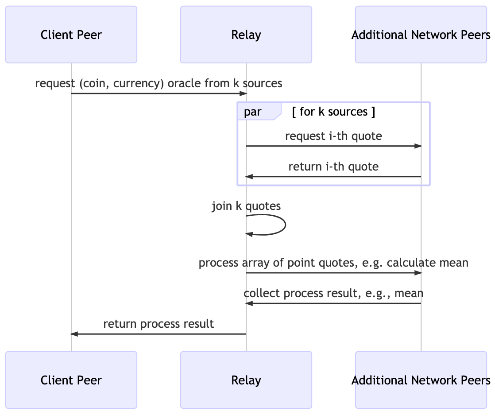

# Price Oracle With Fluence And Aqua


## About Fluence

Fluence provides an open Web3 protocol, framework and associated tooling to develop and host applications, interfaces and backends on permissionless peer-to-peer networks. An integral part of the Fluence solution is the Aquamarine stack comprised of Aqua and Marine. Aqua is a new programming language and paradigm purpose-built to program distributed networks and compose applications from distributed services. Marine is a general purpose Wasm runtime and toolkit, allows developers to build distributed services that can be composed into distributed applications by Aqua.

Fluence Developer Resources:

* [Developer Documentation](https://doc.fluence.dev/docs/)

Aqua Developer Resources:

* [Aqua Book](https://app.gitbook.com/@fluence/s/aqua-book/)
* [Aqua Playground](https://github.com/fluencelabs/aqua-playground)
* [Aqua repo](https://github.com/fluencelabs/aqua)

 Marine Developer Resources:

* [Marine repo](https://github.com/fluencelabs/marine)
* [Marine SDK](https://github.com/fluencelabs/marine-rs-sdk)


## Overview

Price (feed) oracles are probably the most used and in-demand oracle type and tend to have a significant impact on the success and profitability of DeFi and related on- and off-chain operations. In this example, we demonstrate how to create a decentralized, off-chain price (feed) oracle on the Fluence peer-to-peer network from a set of distributed, re-usable Marine services composed by Aqua.

Figure 1: Stylized Price Oracle Network And Service Process
<p>
    
<p>

As outlined in Figure 1, we use one or more services distributed across the Fluence peer-to-peer network to obtain price quotes from sources. For example, we could have one service capable of querying one or more sources such as DEX contracts deployed on multiple network peers allowing us to poll price sources in parallel. We then join these results and submit them to a processing service also deployed on the peer-to-peer network to establish, for example, an oracle point-estimate. Once we've obtained our oracle, we return it to the peer-client, e.g., a browser.

## Quick Start

Let's get right to it:

```text
% cd web
% npm install
% npm start
```

opens a browser tab allowing you to enter the coin name and currency to price it in. In return, you get the oracle from the processed individual price quotes. See Figure 2.

Figure 2: Browser Peer Client For Price Oracle Application


Please note that the coin name must the full name, e.g., ethereum or bitcoin instead of eth or btc, whereas currency is specified in the traditional ISO 4217 Alpha-3 codes.

If you like things a little closer to metal, see the [client-peer](./client-peer) directory for a peer-client based on the Fluence JS-SDK. To run the headless client:

```text
% cd client-peer
% npm instal
% npm start run 
```

which gives us:

```text
# <snip>
created a fluence client 12D3KooWJr9dgmW7jRxRqzjugedGBCVXVxDHhNkyY88aZzN1rmgh with relay 12D3KooWKnEqMfYo9zvfHmqTLpLdiHXPe4SVqUWcWHDJdFGrSmcA
seq result:  { error_msg: '', result: 2005.65, success: true }
par result:  { error_msg: '', result: 1867.33, success: true }
```

As evident from our results, we are executing two different workflows to get our price oracle: the first approach uses one price getter service twice in sequence and the second approach uses two price getter services deployed on different hosts in parallel. See the code example below.

```typescript
// client-peer/index.ts
import { createClient, setLogLevel, FluenceClient } from "@fluencelabs/fluence";
import { krasnodar, Node } from "@fluencelabs/fluence-network-environment";
import { get_price, get_price_par } from "./get_crypto_prices";

interface NodeServicePair {
    node: string;
    service_id: string;
}

// (node, service) tuples, json-style, for price getter services
let getter_topo: Array<NodeServicePair>;

// and a mean service
let mean_topo: NodeServicePair;

getter_topo = Array({ "node": "12D3KooWCMr9mU894i8JXAFqpgoFtx6qnV1LFPSfVc3Y34N4h4LS", "service_id": "c315073d-4311-4db3-be57-8f154f032d28" }, { "node": "12D3KooWFEwNWcHqi9rtsmDhsYcDbRUCDXH84RC4FW6UfsFWaoHi", "service_id": "25f9123a-f386-4cb2-9c1e-bb7c247c9c09" });
mean_topo = { "node": "12D3KooWCMr9mU894i8JXAFqpgoFtx6qnV1LFPSfVc3Y34N4h4LS", "service_id": "dd47389f-25d9-4870-a2a9-909359e73580" };

async function main() {

    // create the Fluence client for the Krasnodar testnet
    const fluence = await createClient(krasnodar[2]);
    console.log("created a fluence client %s with relay %s", fluence.selfPeerId, fluence.relayPeerId);

    // call the get_price function -- sequential processing
    const network_result = await get_price(fluence, "ethereum", "usd", "12D3KooWFEwNWcHqi9rtsmDhsYcDbRUCDXH84RC4FW6UfsFWaoHi", "25f9123a-f386-4cb2-9c1e-bb7c247c9c09", "b2790307-055e-41ca-9640-3c41856d464b");
    console.log("seq result: ", network_result);

    // call the get_price_par function -- parallel processing
    const network_result_par = await get_price_par(fluence, "ethereum", "usd", getter_topo, mean_topo);
    console.log("par result: ", network_result_par);

    return;
}

main()
    .then(() => process.exit(0))
    .catch(error => {
        console.error(error);
        process.exit(1);
    });

```

where the Aqua script can be found in the `aqua-scripts` dirctory and the compiled Aqua code is found in the `get_crypto_prices.ts` file. For more on the Aqua script, see below.

## Service Development And Deployment

**Prerequisites:** If you want to follow along, compile Wasm modules, create services and deploy service, you need Rust, Node and a few Fluence tools installed. Please see follow the [Setup](https://doc.fluence.dev/docs/tutorials_tutorials/recipes_setting_up) instructions.

Applications are composed from one or more services available on one or more Fluence peer-to-peer nodes. Services are comprised of one or more Wasm modules providing a wide range of compute functionality and access to persistance, e.g. IPFS and SQLite. For the purpose of our objective, we need a service that can call on some API to source price quotes. In an ideal, production world, this would be calling on a large set of DEX contacts to obtain price pairs and, say, lquidity, over a particular window of time. For our purposes, we simplify the process and call on the [Coingecko API](https://www.coingecko.com/api/documentations/v3) and add a random jitter to each quote retrieved to give us some variance.

For implementation details, see [price_getter_service]("./../price_getter_service/src/main.rs), which compiles to our desired wasm32-wasi target. Since Wasm modules don't have sockets but we need to use cUrl, which is provided by the host node. In order to do that, we fist need to write an adapter that allows us to access the cUrl service from a Wasm module and then link that service to our price_getter service. See [cUrl adapter example](./marine-scripts/curl_adapter) for more details on the implementation of our [curl adapter service](./curl_adapter/src/main.rs). 

Figure 3: Stylized Service Creation By Marine Module Linking


As seen in Figure 3, we link the price_getter module and curl adapter module into a price_getter service ready for deployment to the Fluence peer-to-peer network. Before we proceed, we have one more service to consider: the price quote processing service which yields the oracle. Again, we simplified what could be an extensive processing algorithm into a simple mean calculation, see [mean_service]("./../mean_service/src/main.rs") for implementation details.  Unlike the price getter service, mean service is a simple, FaaS compute module that deploys on any number of network peers.

We now have our code in place and area ready to compile and our compilation instructions are contain in the `scripts/build.sh` script, which basically instructs the the code is compiled with `marine` and that the resulting Wasm modules are copied to the `artifacts` directory. In the project directory:

```text
./scripts/build.sh
```

which gives you the updated Wasm modules in the `artifacts` directory. 

The next step is to deploy the two services to one or more peers and we use the `fldist` tool to get this done. First, we need to now what peers are available and we can get an enumeration from:

```text
fldist env
```

*Please note that multiple service instances have been already deployed and the (peer id, service id) tuples can be found in [data]("./data/deployed_services.json) json file. While your more than welcome to deploy your services, you don't have to in order to use them.*

Pick any of the peer ids from the listed peers to deploy your services. Let's say we use peer id `12D3KooWFEwNWcHqi9rtsmDhsYcDbRUCDXH84RC4FW6UfsFWaoHi`:

```text
fldist --node-id 12D3KooWFEwNWcHqi9rtsmDhsYcDbRUCDXH84RC4FW6UfsFWaoHi new_service --ms artifacts/curl_adapter.wasm:configs/curl_adapter_cfg.json artifacts/price_getter_service.wasm:configs/price_getter_service_cfg.json --name price-getter-service-0
```

to deploy a price-getter service and

```text
fldist --node-id 12D3KooWFEwNWcHqi9rtsmDhsYcDbRUCDXH84RC4FW6UfsFWaoHi  new_service --ms artifacts/mean_service.wasm:configs/mean_service_cfg.json  --name mean-service-0
```

to deploy a mean service. Please take note of the service-id you get back for each fo the deployments, which are needed to locate the service in the future. For example

```text
fldist --node-id 12D3KooWFEwNWcHqi9rtsmDhsYcDbRUCDXH84RC4FW6UfsFWaoHi  new_service --ms artifacts/mean_service.wasm:configs/mean_service_cfg.json  --name mean-service-0
service id: b2790307-055e-41ca-9640-3c41856d464b    <-- REMEMBER ME !!
service created successfully
```

That's it for service development and deployment!

## Application Composition with Aqua

Aqua allows us to compose distributed services into decentralized applications such as our price oracle app. However, Aqua permits a great degree of freedom of *how* to compose services. As Aqua combines [Layer 3 and Layer 7](https://en.wikipedia.org/wiki/OSI_model) programming, i.e., network  and application programming, respectively, Aqua allows us to specify parallel or sequential workflows in response to service availability and deployment.

For example, the `get_price` function in `aqua-scripts/get_crypto_prices.aqua` makes two sequential calls to the price_getter service on one node before calling the mean service and finally, return the result to the peer client. 

```aqua
-- aqua-scripts/get_crypto_prices.aqua
func get_price(coin: string, currency: string, node: string, pg_sid: string, mean_sid: string) -> Result:
    prices: *f64
    on node:                                                             --< On this peer
        k <- Op.string_to_b58(node)
        
        PriceGetterService pg_sid                                        --< Init service binding with service_id
        MeanService mean_sid                                             --< Init service binding with mean service_id

        ts_ms0 <- Peer.timestamp_ms()
        res0 <- PriceGetterService.price_getter(coin, currency, ts_ms0)  --< First call to service
        prices <- F64Op.identity(res0.result)

        ts_ms1 <- Peer.timestamp_ms()
        res1 <- PriceGetterService.price_getter(coin, currency, ts_ms1)  --< Second call to service, in sequence
        prices <- F64Op.identity(res1.result)

        result <- MeanService.mean(prices)                               --< Process price quotes with mean service

    <- result                                                            --< Return result to client peer
```

With just a few lines of code, we can program the network and application layers to compose hose peer-topeer services into powerful decentralized applications. However, with a little more preparation, i.e., more deployed services, we can vastly improve and scale our solution. How? By parallelizing our workflow. In the file, `aqua-scripts/get_crypto_prices.aqua`, look at the `get_price_par` function:

```aqua
-- aqua-scripts/get_crypto_prices.aqua

data NodeServicePair:
    node: string
    service_id: string

func get_price_par(coin: string, currency: string, getter_topo: []NodeServicePair, mean_topo: NodeServicePair) -> Result:
  prices: *f64
  for topo <- getter_topo par:                                          --< For each instance of the getter topology in parallel
    on topo.node:                                                       --< On each specified node
      k <- Op.string_to_b58(topo.node)
        
      PriceGetterService topo.service_id                                --< And service id
      ts_ms <- Peer.timestamp_ms()
      res <- PriceGetterService.price_getter(coin, currency, ts_ms)     --< Run the price getter service to obtain a quote
      prices <- F64Op.identity(res.result)

  on mean_topo.node:                                                    --< After the parallel loop, create the Mean service binding on the specified node
    MeanService mean_topo.service_id                                    
    result <- MeanService.mean(prices)                                  --< Process the price quote array 
  <- result                                                             --<  Return the result to the client peer

```

In this invocation of our application workflow, we process price quote acquisition in parallel over price_getter services deployed to many nodes. This allows us to scale our workflow and take sull advantage of the network size and service deployment commitments.

To compile our Aqua script, we use the `aqua` tool and either compile our code to raw Air:

```text
% aqua -i aqua-scripts -o air-scripts -a
```

or to a ready-made typescript stub:

```text
% aqua -i aqua-scripts -o air-scripts
```

## Summary

We illustrated different ways to create decentralized price oracle applications with Aqua and the Fluence stack by reusing existing services hosted on network peers. While the implementations for both price getter and oracle, i.e., mean, services are stylized, it should be quite apparent that the Fluence stack is well suited for a broad range of Web3 off-chain applications including price (feed) oracles.
