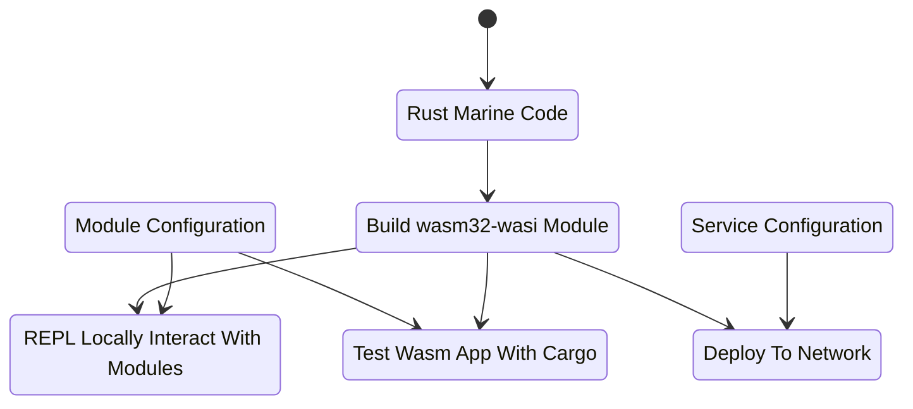

# Marine Examples

## Overview

Fluence services are composed from Wasm modules written in Rust and configuration files. The examples in this directory illustrate how to construct a variety of modules and services. See the [Setup Environment](https://fluence.dev/docs/build/tutorials/setting-up-your-environment) section of the Fluence documentation to get.

**Services** are logical constructs derived from Wasm modules and the associated linking and configuration data, which describe how modules are linked with each other and how they interact, if at all, with the outside world. The instantiation of a service from Wasm modules takes place on the peer-to-peer network, i.e. at the node level. More specifically, **blueprints** are json documents that provide the necessary information to build, i.e. link, a service from Wasm modules. See Figure 1 for a stylized representation of module and service creation.

Figure 1: Module And Service Creation With The Marine Toolchain



Wasm modules can also be accessed locally through the Marine REPL and tested with `cargo test`.

## Greeting Example

This is a very simple service comprised of a single Wasam module, where the module only has one function, `greeting`. Fundamentally, this example illustrates how to build a function as a service (FaaS) for peer-to-peer deployment, with the exciting purpose of providing a *hello world* experience.

The Rust code for our greeting function is straight forward with the exception of the `#[marine]` macro (1). This macro, among other things, ensures for Wasm Interface Type checking and compilation and is critical for Rust code to compile to the desired wasm32-wasi target.

```rust
use marine_rs_sdk::marine;
use marine_rs_sdk::module_manifest;

module_manifest!();

pub fn main() {}

#[marine]  // <- 1
pub fn greeting(name: String) -> String {
    format!("Hi, {}", name)
}

#[cfg(test)]
mod tests {
    use marine_rs_sdk_test::marine_test;

    #[marine_test(config_path = "../Config.toml", modules_dir = "../artifacts")] // <- 2
    fn empty_string(greeting: marine_test_env::greeting::ModuleInterface) {  // <- 3
        let actual = greeting.greeting(String::new());   // <- 4 
        assert_eq!(actual, "Hi, ");
    }

    #[marine_test(config_path = "../Config.toml", modules_dir = "../artifacts")]
    fn non_empty_string(greeting: marine_test_env::greeting::ModuleInterface) {
        let actual = greeting.greeting("name".to_string());
        assert_eq!(actual, "Hi, name");
    }
}
```

The test section is also pretty standard except for the macro (2). But looks can be deceiving. While the tests are run with the familiar `cargo test`, the actual code tested is **not** the Rust code from the body but from the Wasm module. The macro facilitates the import and execution of the Wasm module in the artifacts directory and the Config.toml file and then accesses the test function through the module namespace (3), which allows the prefixing of the Wasm function with the namespace (4). Hence, the code needs to be compiled to the Wasm module **before** running the test.

Let's have a look at the Config.toml file, which describes that only one module is linked by specifying the location of the module (1), the name (2), the desired memory allocation (#) and the logging (4) preference.

```toml
modules_dir = "artifacts/"  # <- 1

[[module]]
    name = "greeting"       # <- 2 
    max_heap_size = "10 KiB"     # <- 3
    logger_enabled = false  # <- 4
```

In order to compile the example, which copies the Wasm module to the artifacts directory.

```bash
cd greeting
./build.sh
```

Now that we have a module and a config file, we can locally inspect and test:

```bash
 mrepl Config.toml
Welcome to the Marine REPL (version 0.8.0)
Minimal supported versions
  sdk: 0.6.0
  interface-types: 0.20.0

app service was created with service id = 05af8670-7168-4ecd-b3e4-9579e0c66a25
elapsed time 59.013893ms

1> interface
Loaded modules interface:

greeting:
  fn greeting(name: string) -> string
```

Which allows us to call our greeting function:

```bash
2> call greeting greeting ["Mundo"]
result: String("Hi, Mundo")
 elapsed time: 827.042µs
```

Of course, we can also run `cargo test`:

```bash
cargo +nightly test --release
   Compiling proc-macro2 v1.0.27
   <snip>
    Finished test [unoptimized + debuginfo] target(s) in 48.67s
     Running unittests (target/debug/deps/greeting-52daae689012e571)

running 2 tests
test tests::non_empty_string ... ok
test tests::empty_string ... ok

test result: ok. 2 passed; 0 failed; 0 ignored; 0 measured; 0 filtered out; finished in 3.89
```

Now that we have a function service, we can deploy it to the network.

For a detailed introduction to and review of Fluence, see the [documentation](https://fluence.dev/docs/build/introduction).

## Records Example

This example illustrates the use of the [records type](https://github.com/fluencelabs/interface-types/blob/master/crates/it-types/src/types.rs) both as a pure and an effector module. Pure modules are comprised of functions without side-effects, whereas effector modules contain at least one function with side-effect. The TestRecord struct imported by both the pure and effector code is defined in the `test-record`.

Since we have multiple modules comprising the service, the config file needs to reflect the multi module dependency:

```toml
# Config.toml
modules_dir = "artifacts/"

[[module]]
    name = "records_effector"
    max_heap_size = "10 KiB"
    logger_enabled = true

[[module]]
    name = "records_pure"
    max_heap_size = "10 KiB"
    logger_enabled = true
```

Please note that since the `TestRecord` struct is imported by both the pure and effector module there is no need to include it directly in the config specification.

Our linking scheme defined in Config.toml is fully reflected when we run the modules in the REPL:

```bash
mrepl Config.toml
Welcome to the Marine REPL (version 0.8.0)
Minimal supported versions
  sdk: 0.6.0
  interface-types: 0.20.0

app service was created with service id = 502d7df7-24fd-43ad-a2ba-204b9506376b
elapsed time 97.129666ms

1> i
Loaded modules interface:
data TestRecord:
  field_0: bool
  field_1: i8
  field_2: i16
  field_3: i32
  field_4: i64
  field_5: u8
  field_6: u16
  field_7: u32
  field_8: u64
  field_9: f32
  field_10: f64
  field_11: string
  field_12: []u8

records_pure:
  fn invoke() -> TestRecord
records_effector:
  fn mutate_struct(test_record: TestRecord) -> TestRecord

2>
```

You can build, inspect and test the project as outlined in the [Greeting Example](#Greeting-Example).

## SQLite Example

[SQLite](https://www.sqlite.org/index.html) is an ubiquitous persistence solution also available on the Fluence stack. Unlike basic compute modules, using SQLite in a service is a little more intricate. In order to create the service, we need two dependencies: An SQLite Wasm module and an SQLite adapter, where the adapter is a [WASM IT compliant](https://crates.io/crates/marine-sqlite-connector) [sqlite](https://github.com/stainless-steel/sqlite) package implementation. The SQLite Wasm module can be obtain from the repo as a [release](https://github.com/fluencelabs/sqlite/releases/tag/v0.15.0_w) or compiled from [code](https://github.com/fluencelabs/sqlite).  For the purpose of this example, we use the release version -- see `build.sh`.

As a result, our service is comprised of two modules: the SQLite Wasm module and our sqlite module. The Rust code, see `src/main.rs` is pretty standard fare but our config file changes signficiantly:

```toml
# Config.toml
modules_dir = "artifacts/"

[[module]]                       <- 1
    name = "sqlite3"
    max_heap_size = "100 KiB"
    logger_enabled = false

    [module.wasi]
    preopened_files = ["/tmp"]
    mapped_dirs = { "tmp" = "/tmp" }

[[module]]                       <- 2
    name = "sqlite_test"
    max_heap_size = "10 KiB"
    logger_enabled = false

    [module.wasi]
    preopened_files = ["/tmp"]
    mapped_dirs = { "tmp" = "/tmp" }
```

1. The first module specification is the SQLIte Wasm module we downloaded from the repo. We allocate sizable mem-pages and disable our logger. We furst specify the wasi submodule that allows the Wasm module to write outside the sandbox, i.e., to the host node, for the SQLite db file. We also map our host directory to the Wasm module
2. We list our `sqlite_test` Wasm module and here too add the wasi submodule with parameters identical to the ones user in the prior SQLite Wasm module specification.

The local file access is critical if we want to use SQLite for or ethan just an in-memory solution and the mapped directory `tmp` needs to be used in our code module, `sqlite_test`. For example,

```rust
// src/main.rs
// <snip>
#[marine]
pub fn test3() {
    let db_path = "/tmp/users.sqlite";   // <- Note that the path dir needs to match the mapped dir from Config.toml
    let connection = marine_sqlite_connector::open(db_path).expect("db should be opened");

    connection
        .execute(
            "
            CREATE TABLE IF NOT EXISTS users (name TEXT, age INTEGER);
            INSERT INTO users VALUES ('Alice', 42);
            INSERT INTO users VALUES ('Bob', 69);
        ",
        )
        .expect("table should be created successfully");

    let connection = marine_sqlite_connector::open(db_path).expect("db should be opened");
    let cursor = connection.prepare("SELECT * FROM users").unwrap().cursor();

    println!("table size is: {:?}", cursor.count());
}
// <snip>
```

You can build, inspect and test the project as outlined in the [Greeting Example](#Greeting-Example).

## URL Downloader Example

Our service makes a url call and persists the response to a file. Pretty straight forward, right? Due to the limitations of Wasm, sockets are not available and storage is also not part of the Wasm sandbox per se. In this example, we illustrate the necessary steps required to achieve our goal. For this we need a

* Facade module
* cUrl module
* Storage module

A facade module is the main module 

### cUrl Module

While we don't have a socket available, we can use a wrapper to access the node's cUrl binary:

```rust
// curl_adapter
// main.rs
use marine_rs_sdk::marine;
use marine_rs_sdk::module_manifest;

use marine_rs_sdk::MountedBinaryResult;
use marine_rs_sdk::WasmLoggerBuilder;

module_manifest!();

/// Log level can be changed by `RUST_LOG` env as well.
pub fn main() {
    WasmLoggerBuilder::new().build().unwrap();
}

#[marine]
pub fn download(url: String) -> String {    // <- 2
    log::info!("download called with url {}\n", url);

    let result = curl(vec![url]);

    String::from_utf8(result.stdout).unwrap()
}

/// Permissions in `Config.toml` should exist to use host functions.
#[marine]
#[link(wasm_import_module = "host")]    // <- 1
extern "C" {
    fn curl(cmd: Vec<String>) -> MountedBinaryResult;
}
```

By

1. linking an external binary, cUrl, c-style into a marine interface
2. using the `download` function to wrap curl binary and expose it as a public function

Compiling this crate gives us a `curl_adapter.wasm` module exposing the `download` function we can use either directly or as part of a multi-module service. For the `download` function to actually work, we need to reflect the unique structure of our solution in the config file as well:

```toml
# Config.toml
# <snip>

[[module]] # <- 1
    name = "curl_adapter"
    logger_enabled = true

    [module.mounted_binaries]  # <- 2
    curl = "/usr/bin/curl"

# <snip>
```

In our config file we

1. specify our basic module information including module name and logging preferences and
2. add a sub module referencing the mounted binary and command line call for cUrl, which specifies the Wasm module has access to the named host binary.

You can build, inspect and test the project as outlined in the [Greeting Example](#Greeting-Example).

### Local Storage

Sometimes in-memory storage is not enough, a database solution too much and file storage just right. Since we're again have to use the Wasm sandbox to write to the node, we need to again have that reflected in our Rust code and configuration. Unlike the cUrl example, we don't need to rely on an external binary to write to file but need to rely on an available read/write directory (1).

```rust
// local-storage dir
// main.rs
use marine_rs_sdk::marine;
use marine_rs_sdk::module_manifest;
use marine_rs_sdk::WasmLoggerBuilder;

use std::fs;
use std::path::PathBuf;

module_manifest!();

const SITES_DIR: &str = "/sites/";  // <- 1

/// Log level can be changed by `RUST_LOG` env as well.
pub fn main() {
    WasmLoggerBuilder::new().build().unwrap();
}

/// You can read or write files from the file system if there is permission to use directories described in `Config.toml`.
#[marine]
pub fn put(name: String, file_content: Vec<u8>) -> String {
    log::info!("put called with file name {}\n", name);
    let rpc_tmp_filepath = format!("{}{}", SITES_DIR, name);

    let result = fs::write(PathBuf::from(rpc_tmp_filepath.clone()), file_content);
    if let Err(e) = result {
        return format!("file can't be written: {}", e);
    }

    String::from("Ok")
}

#[marine]
pub fn get(file_name: String) -> Vec<u8> {
    log::info!("get called with file name: {}\n", file_name);

    let tmp_filepath = format!("{}{}", SITES_DIR, file_name);

    fs::read(tmp_filepath).unwrap_or_else(|_| b"error while reading file".to_vec())
}
```

The majority of the heavy lifting for read-write operations is happening in the configuration file:

```toml
# Config.toml
# <snip>
[[module]]  # <- 1
    name = "local_storage"
    logger_enabled = true

    [module.wasi] # <- 2
    preopened_files = ["./sites"]
    # this is where files will be stored
    mapped_dirs = { "sites" = "./sites" }
#<snip>
```

As always, we declare our module name and logging preference but then add the Wasi submodule not only  specifying the directory mapping for the node's file system to the Wasm module, remember `const SITES_DIR: &str = "/sites/";` ?, but also permissioning the Wasm module to access host storage.

### Facade Module

The facade module is our entry to our download-n-save feature, thus being the main entry point to our  

```rust
use marine_rs_sdk::marine;
use marine_rs_sdk::module_manifest;
use marine_rs_sdk::WasmLoggerBuilder;

module_manifest!();

pub fn main() {
    WasmLoggerBuilder::new().build().unwrap();
}

/// Combining of modules: `curl` and `local_storage`.
/// Calls `curl` and stores returned result into a file.
#[marine]
pub fn get_n_save(url: String, file_name: String) -> String {
    log::info!("get_n_save called with {} {}\n", url, file_name);

    let result = download(url);
    file_put(file_name, result.into_bytes());

    String::from("Ok")
}

/// Importing `curl` module
#[marine]                                           // <- 1
#[link(wasm_import_module = "curl_adapter")]
extern "C" {
    pub fn download(url: String) -> String;
}

/// Importing `local_storage` module
#[marine]
#[link(wasm_import_module = "local_storage")]       // <- 1
extern "C" {
    #[link_name = "get"]
    pub fn file_get(file_name: String) -> Vec<u8>;

    #[link_name = "put"]
    pub fn file_put(name: String, file_content: Vec<u8>) -> String;
}
```

Basically, `get_n_save` uses the `download` function from the `curl_adapter` module and the `get` and `put` functions from the `local_storage` module to accomplish our goal. Since our Wasm modules [share nothing'](https://en.wikipedia.org/wiki/Shared-nothing_architecture), we need to somehow make available what's needed. Since we are dealing with Wasm modules, the usual Rust import process clearly won't work. Instead, we link public functions from other Wasm modules with the `#[link(wasm_import_module = "???")]` macro. Please note the (1) and (2) are not (directly) dealing with the facade module's access to host functionality. That is, we specify explicitly what's shared from one module to another.

Of course, that makes for a simple config specification for the facade module:

```toml
# Config.toml
# <snip>
[[module]]
    name = "facade"
    logger_enabled = true
```

With our facade module in place, we can explore the fully linked solution in the REPL:

```bash
mrepl Config.toml
Welcome to the Marine REPL (version 0.8.0)
Minimal supported versions
  sdk: 0.6.0
  interface-types: 0.20.0

app service was created with service id = 4d8ff671-a4da-4ff6-b757-0498aa0b14ce
elapsed time 129.739488ms

1> interface
Loaded modules interface:

local_storage:                                              <- 1
  fn get(file_name: string) -> []u8
  fn put(name: string, file_content: []u8) -> string
curl_adapter:                                               <- 2
  fn download(url: string) -> string
facade:                                                     <- 3
  fn get_n_save(url: string, file_name: string) -> string

2>
```

We see our three modules (1, 2, 3) and their respective public functions, which we can test on a per module basis and as the facade service aggregate. For example:

```bash
2> call curl_adapter download ["https://fluence.network"]
result: String("<!DOCTYPE html>\n<html lang=\"en\">\n\n<head>\n\n  <meta charset=\"utf-8\">\n  <!-- <base 
<snip>
body>\n\n</html>")
 elapsed time: 414.505533ms

3> call facade get_n_save ["https://fluence.netork", "fluence_landing_page.html"]
result: String("Ok")
 elapsed time: 125.866058ms
```

You can build, inspect and test the project as outlined in the [Greeting Example](#Greeting-Example).

## Multiservice Marine Test example
In the examples above we used the `marine_test` macro to test a service. This example illustrates another ability of the `marine_test` macro: testing several services at once. To show that we will create couple of services:
a producer service which will create some data, and a consumer service which will process the data. Then write a test that ensures that the consumer properly processed data from the producer.

Let's look at the services and test now:

Producer:
```rust
use marine_rs_sdk::marine;
use marine_rs_sdk::module_manifest;

module_manifest!();

pub fn main() {}

#[marine]
pub struct Data {
    pub name: String,
}

#[marine]
pub struct Input {
    pub first_name: String,
    pub last_name: String,
}

#[marine]
pub fn produce(data: Input) -> Data {
    Data {
        name: format!("{} {}", data.first_name, data.last_name),
    }
}
```

The only new thing here is `#[marine]` on a struct. This adds the structure into module interface and requires all the fields to be supported by default or be another `#[marine]` structure. There is more information about it in [docs](https://fluence.dev/docs/marine-book/marine-rust-sdk/developing/export-functions). 

Consumer:
```rust
use marine_rs_sdk::marine;
use marine_rs_sdk::module_manifest;

module_manifest!();

pub fn main() {}

#[marine]
pub struct Data {
    pub name: String,
}

#[marine]
pub fn consume(data: Data) -> String {
    data.name
}
```

There is nothing special.

The test will show what we can do with them:
```rust
fn main() {}

#[cfg(test)]
mod tests {
    use marine_rs_sdk_test::marine_test;
    #[marine_test(
        producer(
            config_path = "../producer/Config.toml",                           // <- 1
            modules_dir = "../producer/artifacts"
        ),
        consumer(
            config_path = "../consumer/Config.toml",
            modules_dir = "../consumer/artifacts"
        )
    )]
    fn test() {
        let mut producer = marine_test_env::producer::ServiceInterface::new(); // <- 2
        let mut consumer = marine_test_env::consumer::ServiceInterface::new();
        let input = marine_test_env::producer::Input {                         // <- 3
            first_name: String::from("John"),
            last_name: String::from("Doe"),
        };
        let data = producer.produce(input);                                    // <- 4
        let result = consumer.consume(data);                                   // <- 5
        assert_eq!(result, "John Doe")
    }
}
```
As the `marine_test` needs only compiled .wasm files and not the code, the test can be in any project. In this case the test is in a separate crate.

We describe the services as named pairs of config file and directory with .wasm files(1), then in test function we create services(2). Please note, that each service creates its own `marine` runtime. Then, we create a structure(3) to pass it to a function from interface of producer service(4) and finally pass its result to the consumer service. The `ServiceInterface` and interface structures are accessed through `marine_test_env` — the module defined by the `marine_test` macro. The functions in turn are accessed through the `ServiceInterace` instance.

Also we can rewrite tests by applying `marine_test` to a `mod`:
```rust
#[cfg(test)]
#[marine_rs_sdk_test::marine_test(
    producer(
        config_path = "../producer/Config.toml",
        modules_dir = "../producer/artifacts"
    ),
    consumer(
        config_path = "../consumer/Config.toml",
        modules_dir = "../consumer/artifacts"
    )
)]
mod tests_on_mod {
    #[test]
    fn test() {
        let mut producer = marine_test_env::producer::ServiceInterface::new();
        let mut consumer = marine_test_env::consumer::ServiceInterface::new();
        let input = marine_test_env::producer::Input {
            first_name: String::from("John"),
            last_name: String::from("Doe"),
        };
        let data = producer.produce(input);
        let result = consumer.consume(data);
        assert_eq!(result, "John Doe")
    }
}
```
It defines one `marine_test_env` for the whole `mod`, so we can write utility functions that use types from `marine_test_env`, and we do not have to wrap each function in the macro.

Now we can build services:
```shell
cd multiservice_marine_test
./build.sh
```

And run the test:
```shell
$ cargo test
    Finished test [unoptimized + debuginfo] target(s) in 0.25s
     Running unittests (target/debug/deps/multiservice_marine_test-533b3dcdcf22d98d)

running 1 test
test tests::test ... ok

test result: ok. 1 passed; 0 failed; 0 ignored; 0 measured; 0 filtered out; finished in 9.59s

```

We can do the same in the `mrepl`. But doing it to test services during the development will be a huge pain.
First, pass data to the producer:
```shell
$ cd producer
$ mrepl Config.toml
Welcome to the Marine REPL (version 0.9.1)
Minimal supported versions
  sdk: 0.6.0
  interface-types: 0.20.0

app service was created with service id = 8032487e-3348-406d-8fc7-02b927acb932
elapsed time 85.863792ms


1> call producer produce [{"first_name": "John", "last_name": "Doe"}]
result: Object({"name": String("John Doe")})
 elapsed time: 16.718ms
```

Second, pass the result to the consumer:
```shell
$ cd ../consumer
$ mrepl Config.toml
Welcome to the Marine REPL (version 0.9.1)
Minimal supported versions
  sdk: 0.6.0
  interface-types: 0.20.0

app service was created with service id = f4a1e021-07e3-42e0-8dcb-66cfc69e3ee7
elapsed time 78.382834ms

1> call consumer consume [{"name": "John Doe"}]
result: String("John Doe")
 elapsed time: 4.946209ms
```

## build.rs test example
There is another way to generate `marine_test_env` and use in tests: [cargo build scripts](https://doc.rust-lang.org/cargo/reference/build-scripts.html). In this example we will show how to use `marine-rs-sdk-test` to generate test environment and how to enable IDE support for generated files.

Assume that we have Greeting example compiled, and we want to write tests for it using build.rs. Firstly, we need to write a build.rs file:
```rust
use marine_rs_sdk_test::generate_marine_test_env;
use marine_rs_sdk_test::ServiceDescription;
fn main() {
    let services = vec![ // <- 1
                         ("greeting".to_string(), ServiceDescription {
                             config_path: "Config.toml".to_string(),
                             modules_dir: Some("artifacts".to_string()),
                         })
    ];

    let target = std::env::var("CARGO_CFG_TARGET_ARCH").unwrap();
    if target != "wasm32" { // <- 2
        generate_marine_test_env(services, "marine_test_env.rs", file!()); // <- 3
    }

    println!("cargo:rerun-if-changed=src/main.rs"); // <- 4
}
```
and add `marine-rs-sdk-test` to build-dependencies section of `Cargo.toml`:
```toml
[build-dependencies]
marine-rs-sdk-test = "0.4.0"
```
So, what do we see here:
1. We created pairs (name, description) for services
2. We checked if we are compiling to wasm32 target. It is needed when service and tests are in one crate: `build.rs` runs before the crate compilation, and it depends on compilation result. So, we work around this issue using that service is compiled to wasm32 and tests are compiled to the native target: we generate `marine_test_env` only when we are compiling to non-wasm target. This will not work great if you need to compile service to non-wasm target not only for tests. Another option is to use a separate crate for tests.
3. We pass services, generated file name, and path to the build.rs file to the generator. The last argument will always be `file!()`.
4. We signal when to re-run `build.rs`. This part must be customized for every project: for the projects where tests are in a separate crate, `build.rs` must be re-run when wasm files or `Config.toml` are changed.

Then we need to actually write a test in the `src/main.rs`:
```rust
#[cfg(test)]
mod built_tests {
    marine_rs_sdk_test::include_test_env!("/marine_test_env.rs"); // <- 1
    #[test]
    fn non_empty_string() {
        let mut greeting = marine_test_env::greeting::ServiceInterface::new(); // <- 2
        let actual = greeting.greeting("name".to_string());
        assert_eq!(actual, "Hi, name");
    }
}
```

1. We include generated file to out module with tests. `include_test_env!` is just a wrapper over `include!(concat!(env!("OUT_DIR"), $filename))`.
2. We use `marine_test_env` as usual.

And the last thing to do: setting up IDE, as the main advantage of `build.rs` approach is the IDE support.

### CLion:
* in the `Help -> Actions -> Experimental Futures` enable `org.rust.cargo.evaluate.build.scripts`
* refresh cargo project in order to update generated code: change `Cargo.toml` and build from IDE or press `Refresh Cargo Project` in `Cargo` tab.

### VS Code:
* install `rust-analyzer` plugin
* change `Cargo.toml` to let plugin update code from generated files

After that IDEs will provide code completion for `marine_test_env`. In order to update the env you should build service to wasm, then build tests (with `build.rs` re-run).

## Deploying Services

In each of the examples we created modules and services configurations and tested and inspected them with the Marine REPL. In this section we briefly discuss how to deploy our modules and configurations to the network as services using the *Greeting* example.

Before we begin, you need to have the `aqua` tool installed. See the [Tools documentation](https://fluence.dev/docs/build/tools) for more information.

We use the `aqua remote deploy_service` command to do our bidding:

```zsh
aqua remote deploy_service --help

Usage: aqua remote deploy_service [--timeout <integer>] [--log-level <string>] --addr <string> [--on <string>] [--print-air] [--sk <string>] --config-path <string> --service <string>

Deploy a service onto a remote peer

Options and flags:
    --help
        Display this help text.
    --timeout <integer>, -t <integer>
        Request timeout in milliseconds
    --log-level <string>
        Set log level
    --addr <string>, -a <string>
        Relay multiaddress
    --on <string>, -o <string>
        Where function will be run. Default: host_peer_id
    --print-air
        Prints generated AIR code before function execution
    --sk <string>, -s <string>
        Ed25519 32-byte secret key in base64
    --config-path <string>, -p <string>
        Path to file with arguments map in JSON format
    --service <string>, -s <string>
        What service from the config file to deploy
```

Aside from our modules and configuration, we also want to supply the peer id of the node we want to host our service. You can find all available nodes on the [Fluence Dashboard](https://dash.fluence.dev/nodes). Please note that for all of our examples we will use peer `12D3KooWKnEqMfYo9zvfHmqTLpLdiHXPe4SVqUWcWHDJdFGrSmcA`. Alternatively, we can deploy to a local node -- see  [Deploy A Local Node](https://fluence.dev/docs/build/tutorials/deploy-a-local-fluence-node) for instructions.

To create our greeting service on peer `12D3KooWKnEqMfYo9zvfHmqTLpLdiHXPe4SVqUWcWHDJdFGrSmcA`:

```zsh
aqua remote deploy_service \
     --addr /dns4/kras-01.fluence.dev/tcp/19001/wss/p2p/12D3KooWKnEqMfYo9zvfHmqTLpLdiHXPe4SVqUWcWHDJdFGrSmcA
     --config-path configs/greeting_deploy_cfg.json \
     --service my-greeting-service
```

To recap the `aqua remote deploy_service` command: We specify the

1. Peer id with the `addr` flag
2. Config file location with the `config-path` flag
3. Service name with the `service` flag

Which results in a success message and more importantly, the unique id for the deployed service:

```bash
Your peerId: 12D3KooWBVzSqoQqFycENVhw7W5RY1UHwPCn6U9iHG2mbwuCuLq3
"Going to upload a module..."
2022.02.11 18:57:48 [INFO] created ipfs client to /ip4/178.128.194.190/tcp/5001
2022.02.11 18:57:48 [INFO] connected to ipfs
2022.02.11 18:57:50 [INFO] file uploaded
"Now time to make a blueprint..."
"Blueprint id:"
"8d210ec2b83e4c661c71820b79f02d99908794e8af8034b465762f61682bc43b"
"And your service id is:"
"ec71a1fc-66d7-41f4-bff1-f9c07d361bd4"
```

The (peer id, service id) tuple is going to be useful once you start putting the service to work with, say, [Aqua](https://fluence.dev/docs/aqua-book/introduction) and you should hold on the data for future use. Also, you can look up your service on the [Fluence Dashboard](https://dash.fluence.dev/blueprint/8d210ec2b83e4c661c71820b79f02d99908794e8af8034b465762f61682bc43b).

For more detailed information regarding Marine please refer to the [Marine Book](https://fluence.dev/docs/marine-book/introduction).

For more detailed information regarding the Fluence solution see the [Fluence documentation](https://fluence.dev/) and if you have any questions, comments or suggestions for improvements, please open an Issue or PR.
