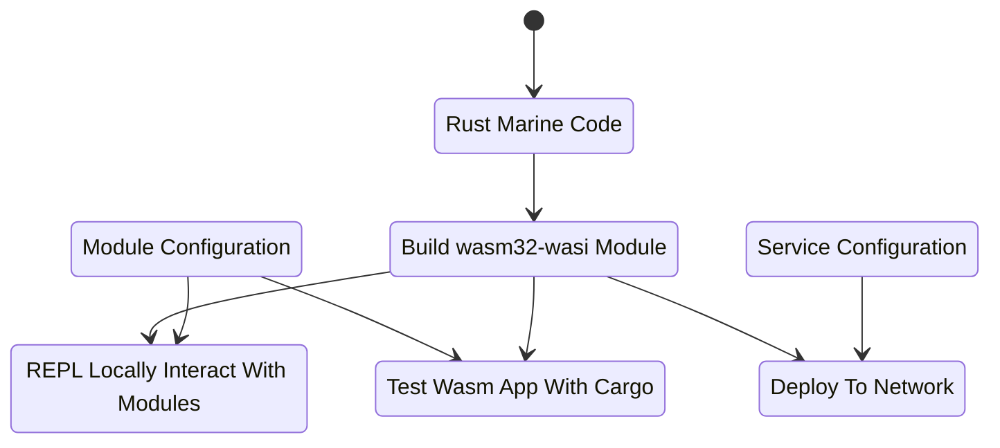

# Marine Examples

## Overview

Fluence services are composed from Wasm modules written in Rust and configuration files. The examples in this directory illustrate how to construct a variety of modules and services. If you are not accessing the examples from the Fluence devcontainer, see the [Setup Environment](https://doc.fluence.dev/docs/tutorials_tutorials/recipes_setting_up) section of the Fluence documentation.

**Services** are logical constructs derived from Wasm modules and the associated linking and configuration data, which describe how modules are linked with each other and how they interact, if at all, with the outside world. The instantiation of a service from Wasm modules takes place on the peer-to-peer network, i.e. at the node level. More specifically, **blueprints** are json documents that provide the necessary information to build, i.e. link, a service from Wasm modules. See Figure 1 for a stylized representation of module and service creation.

Figure 1: Module And Service Creation With The Marine Toolchain



Wasm modules can also be accessed locally through the Marine REPL and tested with `cargo test`.

## Greeting Example

This is a very simple service comprised of a single Wasam module, where the module only has one function, `greeting`. Fundamentally, this example illustrates how to build a function as a service (FaaS) for peer-to-peer deployment, with the exciting purpose of providing a *hello world* experience.

The Rust code for our greeting function is straight forward with the exception of the `#[marine]` macro (1). This macro, among other things, ensures for Wasm Interface Type checking and compilation and is critical for Rust code to compile to the desired wasm32-wasi target.

```rust
use marine_rs_sdk::marine;
use marine_rs_sdk::module_manifest;

module_manifest!();

pub fn main() {}

#[marine]  // <- 1
pub fn greeting(name: String) -> String {
    format!("Hi, {}", name)
}

#[cfg(test)]
mod tests {
    use marine_rs_sdk_test::marine_test;

    #[marine_test(config_path = "../Config.toml", modules_dir = "../artifacts")] // <- 2
    fn empty_string(greeting: marine_test_env::greeting::ModuleInterface) {  // <- 3
        let actual = greeting.greeting(String::new());   // <- 4 
        assert_eq!(actual, "Hi, ");
    }

    #[marine_test(config_path = "../Config.toml", modules_dir = "../artifacts")]
    fn non_empty_string(greeting: marine_test_env::greeting::ModuleInterface) {
        let actual = greeting.greeting("name".to_string());
        assert_eq!(actual, "Hi, name");
    }
}
```

The test section is also pretty standard except for the macro (2). But looks can be deceiving. While the tests are run with the familiar `cargo test`, the actual code tested is **not** the Rust code from the body but from the Wasm module. The macro facilitates the import and execution of the Wasm module in the artifacts directory and the Config.toml file and then accesses the test function through the module namespace (3), which allows the prefixing of the Wasm function with the namespace (4). Hence, the code needs to be compiled to the Wasm module **before** running the test.

Let's have a look at the Config.toml file, which describes that only one module is linked by specifying the location of the module (1), the name (2), the desired memory allocation (#) and the logging (4) preference.

```toml
modules_dir = "artifacts/"  # <- 1

[[module]]
    name = "greeting"       # <- 2 
    mem_pages_count = 1     # <- 3
    logger_enabled = false  # <- 4
```

In order to compile the example, which copies the Wasm module to the artifacts directory.

```bash
cd greeting
./build.sh
```

Now that we have a module and a config file, we can locally inspect and test:

```bash
 mrepl Config.toml
Welcome to the Marine REPL (version 0.8.0)
Minimal supported versions
  sdk: 0.6.0
  interface-types: 0.20.0

app service was created with service id = 05af8670-7168-4ecd-b3e4-9579e0c66a25
elapsed time 59.013893ms

1> interface
Loaded modules interface:

greeting:
  fn greeting(name: string) -> string
```

Which allows us to call our greeting function:

```bash
2> call greeting greeting ["Mundo"]
result: String("Hi, Mundo")
 elapsed time: 827.042µs
```

Of course, we can also run `cargo test`:

```bash
cargo +nightly test --release
   Compiling proc-macro2 v1.0.27
   <snip>
    Finished test [unoptimized + debuginfo] target(s) in 48.67s
     Running unittests (target/debug/deps/greeting-52daae689012e571)

running 2 tests
test tests::non_empty_string ... ok
test tests::empty_string ... ok

test result: ok. 2 passed; 0 failed; 0 ignored; 0 measured; 0 filtered out; finished in 3.89
```

Now that we have a function service, we can deploy it to the network.

For a detailed introduction to and review of Fluence, see the [documentation](https://doc.fluence.dev/docs/).

## Records Example

This example illustrates the use of the [records type](https://github.com/fluencelabs/interface-types/blob/master/crates/it-types/src/types.rs) both as a pure and an effector module. Pure modules are comprised of functions without side-effects, whereas effector modules contain at least one function with side-effect. The TestRecord struct imported by both the pure and effector code is defined in the `test-record`.

Since we have multiple modules comprising the service, the config file needs to reflect the multi module dependency:

```toml
# Config.toml
modules_dir = "artifacts/"

[[module]]
    name = "records_effector"
    mem_pages_count = 1
    logger_enabled = true

[[module]]
    name = "records_pure"
    mem_pages_count = 1
    logger_enabled = true
```

Please note that since the `TestRecord` struct is imported by both the pure and effector module there is no need to include it directly in the config specification.

Our linking scheme defined in Config.toml is fully reflected when we run the modules in the REPL:

```bash
mrepl Config.toml
Welcome to the Marine REPL (version 0.8.0)
Minimal supported versions
  sdk: 0.6.0
  interface-types: 0.20.0

app service was created with service id = 502d7df7-24fd-43ad-a2ba-204b9506376b
elapsed time 97.129666ms

1> i
Loaded modules interface:
data TestRecord:
  field_0: bool
  field_1: i8
  field_2: i16
  field_3: i32
  field_4: i64
  field_5: u8
  field_6: u16
  field_7: u32
  field_8: u64
  field_9: f32
  field_10: f64
  field_11: string
  field_12: []u8

records_pure:
  fn invoke() -> TestRecord
records_effector:
  fn mutate_struct(test_record: TestRecord) -> TestRecord

2>
```

You can build, inspect and test the project as outlined in the [Greeting Example](#Greeting-Example).

## SQLite Example

[SQLite](https://www.sqlite.org/index.html) is an ubiquitous persistence solution also available on the Fluence stack. Unlike basic compute modules, creating an SQLite service is a little more intricate. In order to create the service, we need two dependencies: An SQLite Wasm module and an SQLite adapter, where the adapter is a [WASM IT compliant](https://crates.io/crates/marine-sqlite-connector) [sqlite](https://github.com/stainless-steel/sqlite) package implementation. The SQLite Wasm module can be obtain from the repo as a [release](https://github.com/fluencelabs/sqlite/releases/tag/v0.15.0_w) or compiled from [code](https://github.com/fluencelabs/sqlite).  For the purpose of this example, we use the release version -- see `build.sh`.

As a result, our service is comprised of two modules: the SQLite Wasm module and our sqlite module. The Rust code, see `src/main.rs` is pretty standard fare but our config file changes signficiantly:

```toml
# Config.toml
modules_dir = "artifacts/"

[[module]]                       <- 1
    name = "sqlite3"
    mem_pages_count = 100
    logger_enabled = false

    [module.wasi]
    preopened_files = ["/tmp"]
    mapped_dirs = { "tmp" = "/tmp" }

[[module]]                       <- 2
    name = "sqlite_test"
    mem_pages_count = 1
    logger_enabled = false

    [module.wasi]
    preopened_files = ["/tmp"]
    mapped_dirs = { "tmp" = "/tmp" }
```

1. The first module specification is the SQLIte Wasm module we downloaded from the repo. We allocate sizable mem-pages and disable our logger. We furst specify the wasi submodule that allows the Wasm module to write outside the sandbox, i.e., to the host node, for the SQLite db file. We also map our host directory to the Wasm module
2. We list our `sqlite_test` Wasm module and here too add the wasi submodule with parameters identical to the ones user in the prior SQLite Wasm module specification.

The local file access is critical if we want to use SQLite for or ethan just an in-memory solution and the mapped directory `tmp` needs to be used in our code module, `sqlite_test`. For example,

```rust
// src/main.rs
// <snip>
#[marine]
pub fn test3() {
    let db_path = "/tmp/users.sqlite";   // <- Note that the path dir needs to match the mapped dir from Config.toml
    let connection = marine_sqlite_connector::open(db_path).expect("db should be opened");

    connection
        .execute(
            "
            CREATE TABLE IF NOT EXISTS users (name TEXT, age INTEGER);
            INSERT INTO users VALUES ('Alice', 42);
            INSERT INTO users VALUES ('Bob', 69);
        ",
        )
        .expect("table should be created successfully");

    let connection = marine_sqlite_connector::open(db_path).expect("db should be opened");
    let cursor = connection.prepare("SELECT * FROM users").unwrap().cursor();

    println!("table size is: {:?}", cursor.count());
}
// <snip>
```

You can build, inspect and test the project as outlined in the [Greeting Example](#Greeting-Example).

## URL Downloader Example

Our service makes a url call and persists the response to a file. Pretty straight forward, right? Due to the limitations of Wasm, sockets are not available and storage is also not part of the Wasm sandbox per se. In this example, we illustrate the necessary steps required to achieve our goal. For this we need a

* Facade module
* cUrl module
* Storage module

A facade module is the main module 

### cUrl Module

While we don't have a socket available, we can use a wrapper to access the node's cUrl binary:

```rust
// curl_adapter
// main.rs
use marine_rs_sdk::marine;
use marine_rs_sdk::module_manifest;

use marine_rs_sdk::MountedBinaryResult;
use marine_rs_sdk::WasmLoggerBuilder;

module_manifest!();

/// Log level can be changed by `RUST_LOG` env as well.
pub fn main() {
    WasmLoggerBuilder::new().build().unwrap();
}

#[marine]
pub fn download(url: String) -> String {    // <- 2
    log::info!("download called with url {}\n", url);

    let result = curl(vec![url]);

    String::from_utf8(result.stdout).unwrap()
}

/// Permissions in `Config.toml` should exist to use host functions.
#[marine]
#[link(wasm_import_module = "host")]    // <- 1
extern "C" {
    fn curl(cmd: Vec<String>) -> MountedBinaryResult;
}
```

By

1. linking an external binary, cUrl, c-style into a marine interface
2. using the `download` function to wrap curl binary and expose it as a public function

Compiling this crate gives us a `curl_adapter.wasm` module exposing the `download` function we can use either directly or as part of a multi-module service. For the `download` function to actually work, we need to reflect the unique structure of our solution in the config file as well:

```toml
# Config.toml
# <snip>

[[module]] # <- 1
    name = "curl_adapter"
    logger_enabled = true

    [module.mounted_binaries]  # <- 2
    curl = "/usr/bin/curl"

# <snip>
```

In our config file we

1. specify our basic module information including module name and logging preferences and
2. add a sub module referencing the mounted binary and command line call for cUrl, which specifies the Wasm module has access to the named host binary.

You can build, inspect and test the project as outlined in the [Greeting Example](#Greeting-Example).

### Local Storage

Sometimes in-memory storage is not enough, a database solution too much and file storage just right. Since we're again have to use the Wasm sandbox to write to the node, we need to again have that reflected in our Rust code and configuration. Unlike the cUrl example, we don't need to rely on an external binary to write to file but need to rely on an available read/write directory (1).

```rust
// local-storage dir
// main.rs
use marine_rs_sdk::marine;
use marine_rs_sdk::module_manifest;
use marine_rs_sdk::WasmLoggerBuilder;

use std::fs;
use std::path::PathBuf;

module_manifest!();

const SITES_DIR: &str = "/sites/";  // <- 1

/// Log level can be changed by `RUST_LOG` env as well.
pub fn main() {
    WasmLoggerBuilder::new().build().unwrap();
}

/// You can read or write files from the file system if there is permission to use directories described in `Config.toml`.
#[marine]
pub fn put(name: String, file_content: Vec<u8>) -> String {
    log::info!("put called with file name {}\n", name);
    let rpc_tmp_filepath = format!("{}{}", SITES_DIR, name);

    let result = fs::write(PathBuf::from(rpc_tmp_filepath.clone()), file_content);
    if let Err(e) = result {
        return format!("file can't be written: {}", e);
    }

    String::from("Ok")
}

#[marine]
pub fn get(file_name: String) -> Vec<u8> {
    log::info!("get called with file name: {}\n", file_name);

    let tmp_filepath = format!("{}{}", SITES_DIR, file_name);

    fs::read(tmp_filepath).unwrap_or_else(|_| b"error while reading file".to_vec())
}
```

The majority of the heavy lifting for read-write operations is happening in the configuration file:

```toml
# Config.toml
# <snip>
[[module]]  # <- 1
    name = "local_storage"
    logger_enabled = true

    [module.wasi] # <- 2
    preopened_files = ["./sites"]
    # this is where files will be stored
    mapped_dirs = { "sites" = "./sites" }
#<snip>
```

As always, we declare our module name and logging preference but then add the Wasi submodule not only  specifying the directory mapping for the node's file system to the Wasm module, remember `const SITES_DIR: &str = "/sites/";` ?, but also permissioning the Wasm module to access host storage.

### Facade Module

The facade module is our entry to our download-n-save feature, thus being the main entry point to our  

```rust
use marine_rs_sdk::marine;
use marine_rs_sdk::module_manifest;
use marine_rs_sdk::WasmLoggerBuilder;

module_manifest!();

pub fn main() {
    WasmLoggerBuilder::new().build().unwrap();
}

/// Combining of modules: `curl` and `local_storage`.
/// Calls `curl` and stores returned result into a file.
#[marine]
pub fn get_n_save(url: String, file_name: String) -> String {
    log::info!("get_n_save called with {} {}\n", url, file_name);

    let result = download(url);
    file_put(file_name, result.into_bytes());

    String::from("Ok")
}

/// Importing `curl` module
#[marine]                                           // <- 1
#[link(wasm_import_module = "curl_adapter")]
extern "C" {
    pub fn download(url: String) -> String;
}

/// Importing `local_storage` module
#[marine]
#[link(wasm_import_module = "local_storage")]       // <- 1
extern "C" {
    #[link_name = "get"]
    pub fn file_get(file_name: String) -> Vec<u8>;

    #[link_name = "put"]
    pub fn file_put(name: String, file_content: Vec<u8>) -> String;
}
```

Basically, `get_n_save` uses the `download` function from the `curl_adapter` module and the `get` and `put` functions from the `local_storage` module to accomplish our goal. Since our Wasm modules [share nothing'](https://en.wikipedia.org/wiki/Shared-nothing_architecture), we need to somehow make available what's needed. Since we are dealing with Wasm modules, the usual Rust import process clearly won't work. Instead, we link public functions from other Wasm modules with the `#[link(wasm_import_module = "???")]` macro. Please note the (1) and (2) are not (directly) dealing with the facade module's access to host functionality. That is, we specify explicitly what's shared from one module to another.

Of course, that makes for a simple config specification for the facade module:

```toml
# Config.toml
# <snip>
[[module]]
    name = "facade"
    logger_enabled = true
```

With our facade module in place, we can explore the fully linked solution in the REPL:

```bash
mrepl Config.toml
Welcome to the Marine REPL (version 0.8.0)
Minimal supported versions
  sdk: 0.6.0
  interface-types: 0.20.0

app service was created with service id = 4d8ff671-a4da-4ff6-b757-0498aa0b14ce
elapsed time 129.739488ms

1> interface
Loaded modules interface:

local_storage:                                              <- 1
  fn get(file_name: string) -> []u8
  fn put(name: string, file_content: []u8) -> string
curl_adapter:                                               <- 2
  fn download(url: string) -> string
facade:                                                     <- 3
  fn get_n_save(url: string, file_name: string) -> string

2>
```

We see our three modules (1, 2, 3) and their respective public functions, which we can test on a per module basis and as the facade service aggregate. For example:

```bash
2> call curl_adapter download ["https://fluence.network"]
result: String("<!DOCTYPE html>\n<html lang=\"en\">\n\n<head>\n\n  <meta charset=\"utf-8\">\n  <!-- <base 
<snip>
body>\n\n</html>")
 elapsed time: 414.505533ms

3> call facade get_n_save ["https://fluence.netork", "fluence_landing_page.html"]
result: String("Ok")
 elapsed time: 125.866058ms
```

You can build, inspect and test the project as outlined in the [Greeting Example](#Greeting-Example).


## Deploying Services

In each of the examples we created modules and services configurations and tested and inspected them with the Marine REPL. Feels like we're all dressed up and nowhere to go. In this section we briefly discuss how to deploy our modules and configurations to the network as services using the *Greeting* example.

Before we begin, you need to have the `fldist` tool installed. See the [Tools documentation](https://doc.fluence.dev/docs/knowledge_tools) for more information.

We use the `fldist new_service` command to do our bidding:

```zsh
fldist new_service --help
fldist new_service

Create service from a list of modules

Options:
      --help              Show help                                    [boolean]
      --version           Show version number                          [boolean]
  -v, --verbose           Display verbose information such as created client
                          seed + peer Id and relay peer id
                                                      [boolean] [default: false]
  -s, --seed              Client seed                                   [string]
      --sk, --secret-key  Clients ed25519 private key in base64 (32 byte)
                                                                        [string]
      --env               Environment to use
        [required] [choices: "krasnodar", "local", "testnet", "stage"] [default:
                                                                    "krasnodar"]
      --node-id, --node   PeerId of the node to use
      --node-addr         Multiaddr of the node to use
      --log               log level
       [required] [choices: "trace", "debug", "info", "warn", "error"] [default:
                                                                        "error"]
      --ttl               particle time to live in ms
                                            [number] [required] [default: 60000]
      --ms, --modules     array of path:config pairs; meaning <path to wasm
                          module>:<path to config>            [array] [required]
  -n, --name              name of the service; will be set in the blueprint
                                                             [string] [required]
```

Aside from our modules and configuration, we also want to supply the peer id of the node we want to host our service. You cna find all available nodes on the [Fluence Dashboard](https://dash.fluence.dev/nodes). Please note that for all of our examples we will use peer `12D3KooWKnEqMfYo9zvfHmqTLpLdiHXPe4SVqUWcWHDJdFGrSmcA`. Alternatively, we can deploy to a local node -- see  [Deploy A Local Node](https://doc.fluence.dev/docs/tutorials_tutorials/tutorial_run_local_node) for instructions.

To create our greeting service on peer `12D3KooWKnEqMfYo9zvfHmqTLpLdiHXPe4SVqUWcWHDJdFGrSmcA`:

```zsh
fldist --node-id 12D3KooWKnEqMfYo9zvfHmqTLpLdiHXPe4SVqUWcWHDJdFGrSmcA new_service \
       --ms artifacts/greeting.wasm:configs/greeting_cfg.json \
       --name my-greeting-service
```

To recap the `fldist` command: We specify the

1. Peer id with the `node-id` flag
2. Module and config file location with the `--ms` flag
3. Service name with the `--name` flag

Which results in a success message and more importantly, the unique id for the deployed service:

```zsh
service id: 810b8abc-6b9d-4227-a228-a53145086464
service created successfully
```

The (peer id, service id) tuple is going to be useful once you start putting the service to work with, say, [Aqua](https://doc.fluence.dev/aqua-book/) and you should hold on the data for future use. Also, you can look up your service on the [Fluence Dashboard](https://dash.fluence.dev/blueprint/d67cdb81c416bff902e0b5847a39b84e2cb42d21dde6426de14bb75d1d61236d/). For more detailed information regarding the Fluence solution see the [Fluence documentation](https://doc.fluence.dev/docs/) and if you have any questions, comments or suggestions for improvements, please open create Issue or open a PR.
