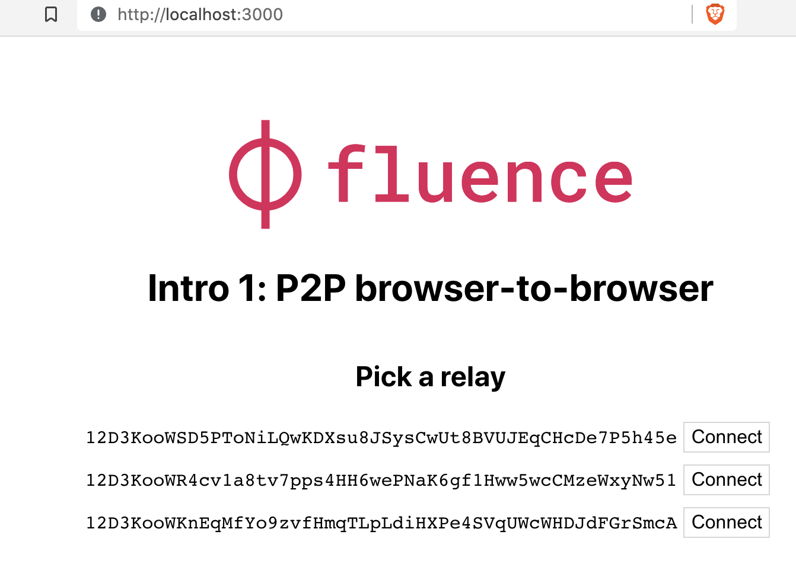
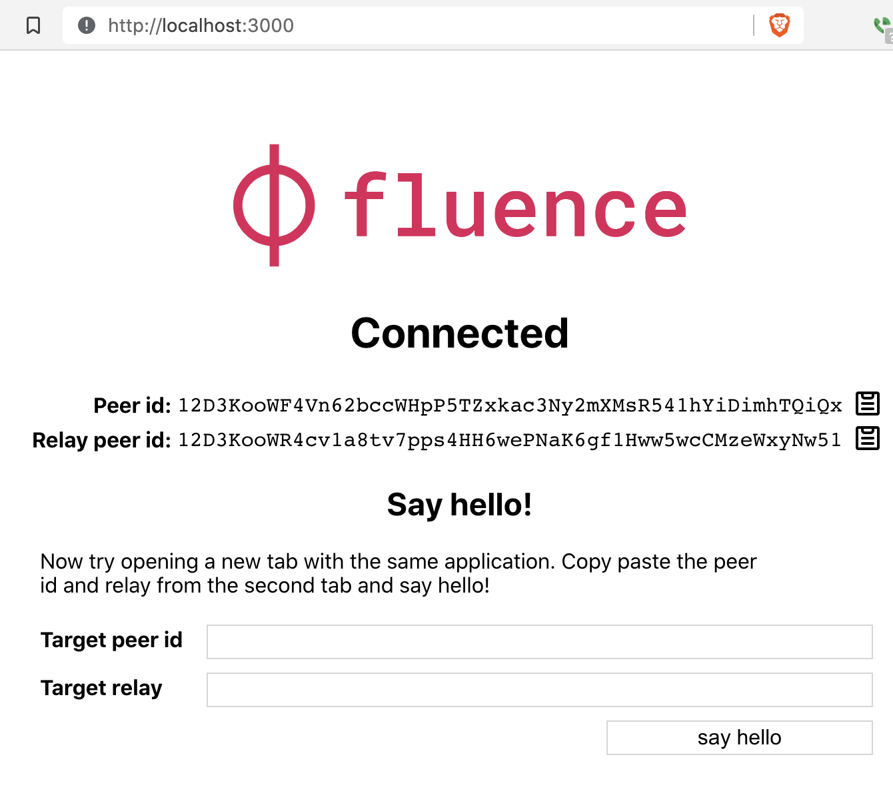
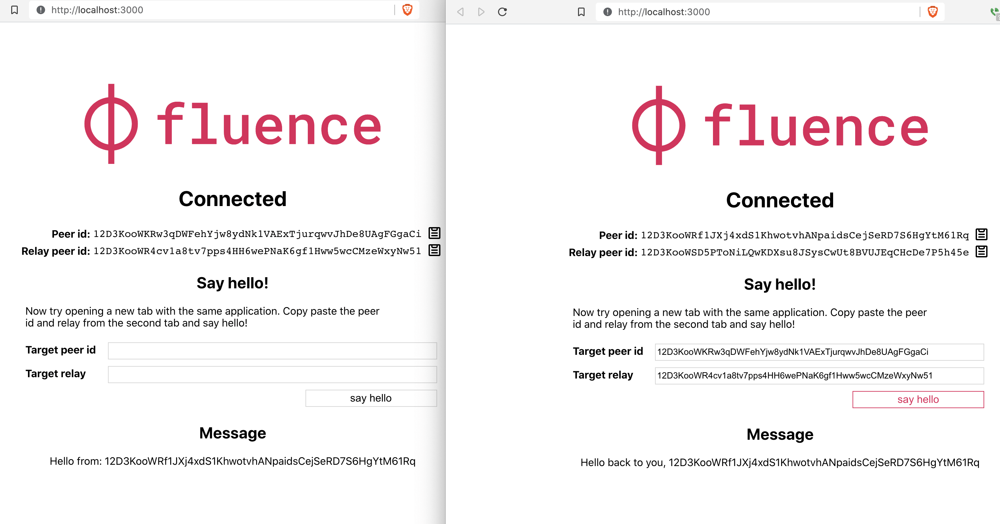

# 1. Browser-to-Browser

The first example demonstrates how to communicate between two client peers, i.e. browsers, with local services. The project is based on a create-react-app template with slight modifications to integrate Fluence. The primary focus is the integration itself and React could be swapped with any framework of your choice.

Make sure you are in the `examples/quickstart/1-browser-to-browser` directory to install the dependencies:

```sh
cd examples/quickstart/1-browser-to-browser
npm install
```

Run the app with `npm start` :

```sh
npm start
```

Which opens a new tab in your browser at `http://localhost:3000`. The browser tab, representing the client peer, wants you to pick a relay node it, i.e., the browser client, can connect to and, of course, allows the peer to respond to the browser client. Select any one of the offered relays:



The client peer is now connected to the relay and ready for business:



Let's follow the instructions, open another browser tab preferably in another browser, using `http://localhost:3000` , select any one of the relays and copying the ensuing peer id and relay peer id to the first client peer, i.e. the first browser tab, and click the `say hello` button:



Congratulations, you just sent messages between two browsers over the Fluence peer-to-peer network, which is pretty cool! Even cooler, however, is how we got here using Aqua, Fluence's distributed network and application composition language.

Navigate to the `aqua` directory and open the `aqua/getting-started.aqua` file in your IDE or terminal:

```aqua
import "@fluencelabs/aqua-lib/builtin.aqua"

-- The service runs inside browser
service HelloPeer("HelloPeer"):
    hello(from: PeerId) -> string

func sayHello(targetPeerId: PeerId, targetRelayPeerId: PeerId) -> string:
    on targetPeerId via targetRelayPeerId:
        res <- HelloPeer.hello(INIT_PEER_ID)
    <- res
```

And yes, fewer than ten lines (!) are required for a client peer, like our browser, to connect to the network and start composing the local `HelloPeer` service to send messages.

In broad strokes, the Aqua code breaks down as follows:

- Import the Aqua [standard library](https://github.com/fluencelabs/aqua-lib) into our application (1)
- Create a service interface binding to the local service (see below) with the `HelloPeer` namespace and `hello` function (4-5)
- Create the function `sayHello` that executes the `hello` call on the provided `targetPeerId` via the provided `targetRelayPeerId` and returns the result (7-10). Recall the copy and paste job you did earlier in the browser tab for the peer and relay id? That's where these parameters are interacted with.

Not only is Aqua rather succinct in allowing you to seamlessly program both network routes and distributed application workflows but also provides the ability to compile Aqua to Typescript stubs wrapping compiled Aqua, called AIR -- short for Aqua Intermediate Representation, into ready to use code blocks. Navigate to the `src/_aqua` directory and open the `aqua/getting-started.ts` file and poke around a bit.

Note that the `src/App.tsx` file relies on the generated `_aqua/getting-started.ts` file (line 7):

```typescript
import React, { useEffect, useState } from "react";
import logo from "./logo.svg";
import "./App.scss";

import { Fluence, kras } from "@fluencelabs/js-client";
import { sayHello, registerHelloPeer } from "./_aqua/getting-started";
```

We wrote a little more than a handful of lines of code in Aqua and ended up with a deployment-ready code block that includes both the network routing and compute logic to facilitate browser-to-browser messaging over a peer-to-peer network.

The local (browser) service `HelloPeer` is also implemented in the `App.tsx` file:

```typescript
const connect = async (relayPeerId: string) => {
  try {
    await Fluence.connect(relayPeerId);

    // Register handler for this call in aqua:
    // HelloPeer.hello(%init_peer_id%)
    registerHelloPeer({
      hello: (from) => {
        setHelloMessage("Hello from: \n" + from);
        return "Hello back to you, \n" + from;
      },
    });
  } catch (err) {
    console.log("Client could not connect", err);
  }
};
```

To summarize, we ran an app that facilities messaging between two browsers over a peer-to-peer network. Aqua allowed us in just a few lines of code to program both the network topology and the application workflow in barely more than a handful of lines of code. Hint: You should be excited. For more information on Aqua, see the [Aqua Book](https://fluence.dev/docs/aqua-book/introduction).

To learn how to write and deploy your own WebAssembly modules refer to [this](https://fluence.dev/docs/build/get-started) doc.
