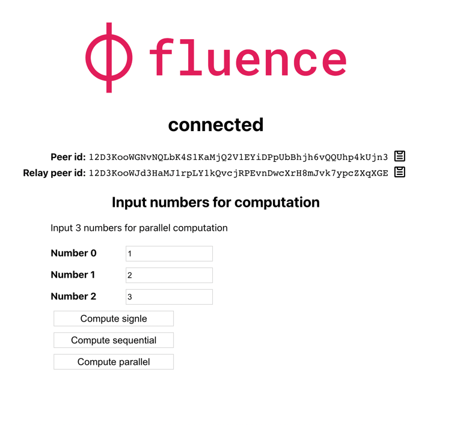

# 3. Browser-Parallel-Computation

> It's recommended to complete [CLI quickstart](https://fluence.dev/docs/build/get-started) before exploring this example as the example contains concepts build upon deployed service 

In the first section, we explored browser-to-browser messaging using local, i.e. browser-native, services and the Fluence network for message transport. Now we have already deployed a simple service `Adder` for you, and we will try to experiment with this.

The service code:

```rust
use marine_rs_sdk::marine;

pub fn main() {}

#[marine]
pub fn add_one(value: u64) -> u64 {
  value + 1
}
```

You can deploy it yourself by following [CLI quickstart](https://fluence.dev/docs/build/get-started) guide, replacing `HelloWorld` module with following code and renaming `HelloWorld` service to `Adder` service there.

First, let's have a look at the Aqua file. Navigate to the `aqua/getting_started.aqua` file in your IDE or terminal:

> If you have trouble reading aqua, feel free to refer to [aqua book](https://fluence.dev/docs/aqua-book/introduction) 

> Read carefully through comments, starting with `--`.

```aqua
import Subnet, Worker from "@fluencelabs/aqua-lib/subnet.aqua"

-- 'use' clause brings Deal service into the scope
use "deals.aqua"

-- 'import from' allows for fine-grained import, makes code easier to follow
import Adder from "services.aqua"

-- Function to get all workers from subnet
func resolveSubnet() -> []Worker:
    -- Getting deal id of deployed deal to resolve subnet
    deals <- Deals.get()
    dealId = deals.defaultWorker!.dealIdOriginal

    -- Subnets cannot be resolved on local (client) peers, e.g., the CLI client or the browser. Instead, a subnet needs to be resolved on a relay.
    on HOST_PEER_ID:
        -- Resolving subnets using Deal id of deployed service
        subnet <- Subnet.resolve(dealId)
    <- subnet.workers

-- This data structure represents the aqua function that is calling the worker via the frontend.
data ComputationRequest:
    worker_id: string
    host_id: string
    value: u64

-- Executes single computation request
func add_one_single(request: ComputationRequest) -> u64:
    -- Extracting worker and host for execution service request
    on request.worker_id via request.host_id:
        -- Service execution
        res <- Adder.add_one(request.value)
    -- Returning result from function
    <- res

func add_one_sequential(requests: []ComputationRequest) -> *u64:
    -- Stream for keeping all computation results
    results: *u64

    -- Iterating over every computation request, one by one
    for request <- requests:
        on request.worker_id via request.host_id:
            res <- Adder.add_one(request.value)
            results <<- res

    <- results

func add_one_parallel(requests: []ComputationRequest) -> *u64:
    results: *u64

    -- Starting a parallel computation. Cycle body called in parallel
    for request <- requests par:
        on request.worker_id via request.host_id:
            res <- Adder.add_one(request.value)
            results <<- res

    -- waiting for all parallel calls to finish
    join results[requests.length - 1]

    <- results
```

Let's navigate to the `2-browser-parallel-computation` directory in the VSCode terminal and install the dependencies:

```sh
npm install
```

And run the application with:

```sh
npm start
```

Which will open a new browser tab at `http://localhost:3000` . Following the instructions, we connect to any one of the displayed relay ids.



First, try to input some numbers there. They're args for aqua functions.

After this you can try to click on the buttons below

> **Compute Single** - Takes only first number and adds 1 to the number. Returns the result of computation below.

> **Compute Sequential** - Each of the numbers provided is incremented one after the other. That is, we have three sequential function calls.

> **Compute Parallel** - Each of the three numbers provide is increment in parallel. That is, we fork the call into three arms, execute the Adder function for each arm, join the the arms and present the result, which may be either the value for each arm or a timeout.


> Note: the joined results vary in order, which is determined by the latency of each of the Adder calls; fastest responses fill the array first.

A little more involved than our first example, but we are again getting a lot done with very little code. Of course, there could be more than one hosted service in play and we could implement, for example, hosted spell checking, text formatting and so much more without much extra effort to express additional workflow logic in our Aqua script.

This brings us to the end of this quick start tutorial. We hope you are as excited as we are to put Aqua and the Fluence stack to work. To continue your Fluence journey, have a look at the remainder of this book, take a deep dive into Aqua with the [Aqua book](https://fluence.dev/docs/aqua-book/introduction) or dig into Marine and Aqua examples in the [repo](https://github.com/fluencelabs/examples).
