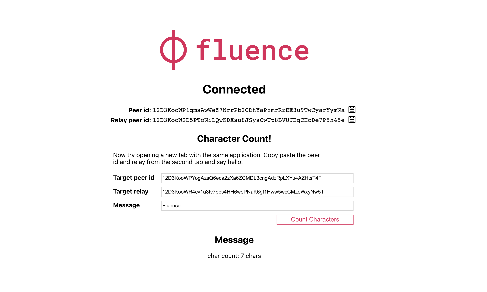
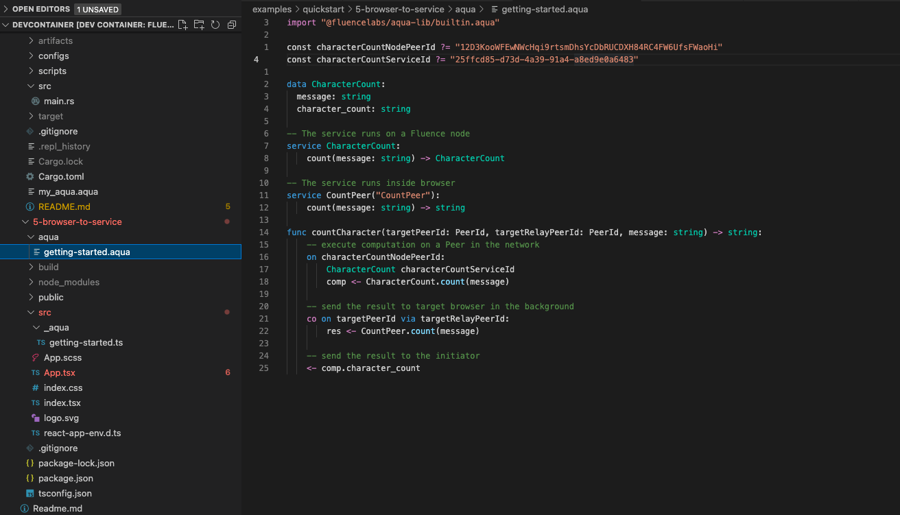

# 5. Browser-to-Service (Character Count)

In the first section, we explored browser-to-browser messaging using local, i.e. browser-native, services and the Fluence network for message transport. In the second section, we developed a `HelloWorld` Wasm module and deployed it as a hosted service on the testnet peer `12D3KooWFEwNWcHqi9rtsmDhsYcDbRUCDXH84RC4FW6UfsFWaoHi` with service id `1e740ce4-81f6-4dd4-9bed-8d86e9c2fa50` . We can now extend our browser-to-browser messaging application with our hosted service.

Let's navigate to the `5-browser-to-service` directory in the VSCode terminal and install the dependencies:

```text
npm install
```

And run the application with:

```text
npm start
```

Which will open a new browser tab at `http://localhost:3000`. Following the instructions, we connect to any one of the displayed relay ids, open another browser tab also at `http://localhost:3000`, select a relay and copy and paste the client peer id and relay id into corresponding fields in the first tab and enter a message then press the `Count Characters` button.



The result looks familiar, so what's different? Let's have a look at the Aqua file. Navigate to the `aqua/getting_started.aqua` file in your IDE:



And let's work it from the top:

* Import the Aqua standard library \(1\)
* Provide the hosted service peer id \(3\) and service id \(4\)
* Specify the `CharacterCount` struct interface binding \(6-8\) for the hosted service from the `marine aqua` export
* Specify the `CharacterCount` interface and function binding \(11-12\) for the hosted service from the `marine aqua` export
* Specify the `CountPeer` interface and function binding \(15-16\) for the local service
* Create the Aqua workflow function `countCharacter`  \(18-29\)

Before we dive into the `countCharacter` function, let's look at why we still need a local service even though we deployed a hosted service. The reason for that lies in the need for the browser client to be able to consume the message sent from the other browser through the relay peer. With that out of the way, let's dig in:

* The function signature \(18\) takes two arguments: `targetPeerId`, which is the client peer id of the other browser and  the `targetelayPeerId`, which is the relay id -- both parameters are the values  you copy and pasted from the second browser tab into the first browser tab
* The first step is to call on the hosted service `CharacterCount` on the host peer `characterCountPeerId` , which we specified in line 1
  * We bind the `CharacterCount` interface, on the  peer `characterCountPeerId`, i.e.,`12D3KooWFEwNWcHqi9rtsmDhsYcDbRUCDXH84RC4FW6UfsFWaoHi`, to the  service id of the hosted service `characterCountServiceId` , i.e. `25ffcd85-d73d-4a39-91a4-a8ed9e0a6483`, which takes the message parameter, i.e., message submitted by the user, and pushes the result into `comp`  \(20-22\)
  * We now want to send a result back to the target browser \(peer\) \(25-26\) using the local service via the `targetRelayPeerId` in the background as a `co` routine.
  * Finally, we send the `comp` result to the initiating browser

This brings us to the end of this quick start tutorial. We hope you are as excited as we are to put Aqua and the Fluence stack to work.
