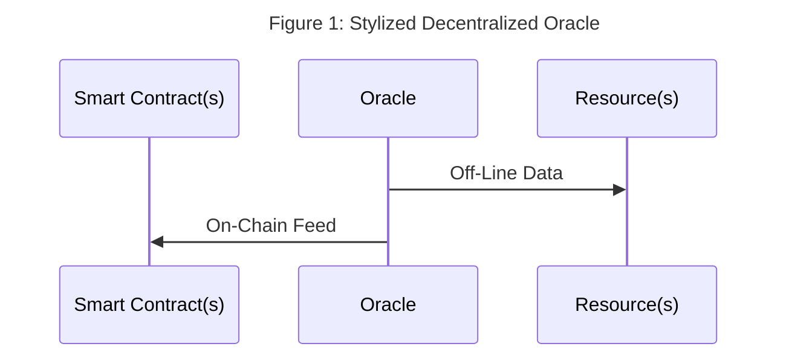
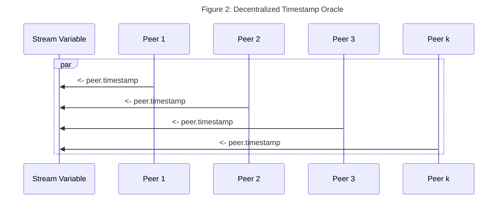

# Quickstart 5 -- Decentralized Oracles With Fluence And Aqua

## Overview

An oracle is some device that provides real-world, off-chain data to deterministic on-chain consumers such as a smart contract. A decentralized oracle draws from multiple, purportedly (roughly) equal input sources to minimize or even eliminate single source pitfalls such as [man-in-the-middle attacks](https://en.wikipedia.org/wiki/Man-in-the-middle_attack)(MITM) or provider manipulation. For example, a decentralized price oracle for, say, ETH/USD, could poll several DEXs for ETH/USD prices. Since smart contracts, especially those deployed on EVMs, can't directly call off-chain resources, oracles play a critical "middleware" role in the decentralized, trustless ecosystem.  



Unlike single source oracles, multi-source oracles require some consensus mechanism to convert multiple input sources over the same target parameter into reliable point or range data suitable for third party, e.g., smart contract, consumption. Such "consensus over inputs" may take the form of simple [summary statistics](https://en.wikipedia.org/wiki/Summary_statistics), e.g., mean, or one of many [other methods](https://en.wikipedia.org/wiki/Consensus_(computer_science)).  

Given the importance of oracles to the Web3 ecosystem, it's not surprising to see a variety of third party solutions supporting various blockchain protocols. Fluence does not provide an oracle solution *per se* but provides a peer-to-peer platform, tools and components for developers to quickly and easily program and compose reusable distributed data acquisition, processing and delivery services into decentralized oracle applications.  

For the remainder of this section, we work through the process of developing a decentralized, multi-source timestamp oracle  comprised of data acquisition, processing and delivery.  

## Creating A Decentralized Timestamp Oracle

Time, often in form of timestamps, plays a critical role in a large number of Web2 and Web3 applications including off-chain (DAO) voting applications and on-chain clocks. Our goal is to provide a consensus timestamp sourced from multiple input sources and implement an acceptable input aggregation and processing service to arrive at either a timestamp point or range values.  

### Timestamp Acquisition

Each Fluence peer, i.e. node in the Fluence peer-to-peer network, has the ability to provide a timestamp from a [builtin service](https://github.com/fluencelabs/aqua-lib/blob/b90f2dddc335c155995a74d8d97de8dbe6a029d2/builtin.aqua#L127). In Aqua, we call the [timestamp function](https://github.com/fluencelabs/fluence/blob/527e26e08f3905e53208b575792712eeaee5deca/particle-closures/src/host_closures.rs#L124) with the desired granularity, i.e., seconds or milliseconds:

```aqua
    -- aqua timestamp sourcing
    on peer:
        ts_ms_result <- peer.timestamp_ms()
        -- or
        ts_sec_result <- peer.timestamp_sec()
    -- ...
```

In order to decentralize our timestamp oracle, we poll multiple peers in the Fluence network:

```aqua
    -- multi-peer timestamp sourcing
    -- ...
    results: *u64
    for peer <- many_peers_list par:
        on peer:
            results <- peer.timestamp_ms()
    -- ...
```

In the above example, we have a list of peers and retrieve a timestamp value from each one. Note that we are polling nodes for timestamps in [parallel](https://doc.fluence.dev/aqua-book/language/flow/parallel) in order to optimize toward uniformity and to collect responses in the stream variable `results`.




The last thing to pin down concerning our timestamp acquisition is which peers to query. One possibility is to specify the peer ids of a set of desired peers to query. Alternatively, we can tap into the [Kademlia neighborhood](https://en.wikipedia.org/wiki/Kademlia), which is a set of peers that are closest to our peer based on the XOR distance of the peer ids, via a [builtin service](https://github.com/fluencelabs/aqua-lib/blob/b90f2dddc335c155995a74d8d97de8dbe6a029d2/builtin.aqua#L140) that returns up to 20 neighboring peers:

```aqua
    -- timestamps from Kademlia neighborhood
    results: *u64
    on node:
    k <- Op.string_to_b58(node)
    nodes <- Kademlia.neighborhood(k, nil, nil)
    for node <- nodes par:
      on node:
        try:
          results <- node.timestamp_ms()
    -- ...

```

### Timestamp Processing

Once we have our multiple timestamp values, we need to process them into a point or range value(s) to be useful. Whatever our processing/consensus algorithm is, we can implement it in Marine as reusable, distributed services. 

For example, we can rely on [summary statistics](https://en.wikipedia.org/wiki/Summary_statistics) and implement basic averaging to arrive at a point estimate:

```rust
    // ...

    #[marine]
    pub fn ts_avg(timestamps: Vec<u64>) -> f64 {
        timestamps.iter().sum::<u64>() as f64 / timestamps.len() as f64
}
    // ...
```

Using the average to arrive at a point-estimate is simply a stake in the ground to illustrate what's possible. Actual processing algorithms may vary and, depending on a developers target audience, different algorithms may be used for different delivery targets. And Aqua makes it easy to customize workflows while emphasizing reuse.

### Putting It All Together

Let's put it all together by sourcing timestamps from the Kademlia neighborhood and than processing the timestamps into a consensus value. Instead of one of the summary statistics, we employ a simple, consensus algorithm that randomly selects one of the provided timestams and then calculates a consensus score from the remaining n -1 timstmaps:

```rust
// src.main.rs
// 
// simple consensus from timestamps
// params:
//     timestamps, u64, [0, u64_max]
//     tolerance, u32,  [0, u32_max]
//     threshold, f64, [0.0, 1.0]
// 1. Remove a randomly selected timestamp from the array of timestamps, ts
// 2. Count the number of timestamps left in the array that are withn +/- tolerance (where tolerance may be zero)
// 3. compare the suporting number of times stamps divided by th enumber of remaining timestamps to the threshold. if >=, consensus for selected timestamp is true else false
//
[marine]
fn ts_frequency(mut timestamps: Vec<u64>, tolerance: u32, threshold: f64, err_value: u64) -> Consensus {
    timestamps.retain(|&ts| ts != err_value);
    if timestamps.len() == 0 {
        return Consensus {
            err_str: "Array must have at least one element".to_string(),
            ..<_>::default()
        };
    }

    if timestamps.len() == 1 {
        return Consensus {
            n: 1,
            consensus_ts: timestamps[0],
            consensus: true,
            support: 1,
            ..<_>::default()
        };
    }

    if threshold < 0f64 || threshold > 1f64 {
        return Consensus {
            err_str: "Threshold needs to be between [0.0,1.0]".to_string(),
            ..<_>::default()
        };
    }

    let rnd_seed: u64 = timestamps.iter().sum();
    let mut rng = WyRand::new_seed(rnd_seed);
    let rnd_idx = rng.generate_range(0..timestamps.len());
    let consensus_ts = timestamps.swap_remove(rnd_idx);
    let mut support: u32 = 0;
    for ts in timestamps.iter() {
        if ts <= &(consensus_ts + tolerance as u64) && ts >= &(consensus_ts - tolerance as u64) {
            support += 1;
        }
    }

    let mut consensus = false;
    if (support as f64 / timestamps.len() as f64) >= threshold {
        consensus = true;
    }

    Consensus {
        n: timestamps.len() as u32,
        consensus_ts,
        consensus,
        support,
        err_str: "".to_string(),
    }
}
```

We compile our consensus module with `./scripts/build.sh`, which allows us to run the unit tests using the Wasm module with `cargo +nightly test`:

```bash
# src.main.rs
running 10 tests
test tests::ts_validation_good_consensus_false ... ok
test tests::test_err_val ... ok
test tests::test_mean_fail ... ok
test tests::ts_validation_good_consensus ... ok
test tests::ts_validation_bad_empty ... ok
test tests::ts_validation_good_consensus_true ... ok
test tests::ts_validation_good_no_support ... ok
test tests::test_mean_good ... ok
test tests::ts_validation_good_no_consensus ... ok
test tests::ts_validation_good_one ... ok

test result: ok. 10 passed; 0 failed; 0 ignored; 0 measured; 0 filtered out; finished in 18.75s
```

We can now interact with our module with the Marine REPL `mrepl configs/Config.toml`:

```bash
Welcome to the Marine REPL (version 0.9.1)
Minimal supported versions
  sdk: 0.6.0
  interface-types: 0.20.0

app service was created with service id = 520a092b-85ef-43c1-9c12-444274ba2cb7
elapsed time 62.893047ms

1> i
Loaded modules interface:
data Consensus:
  n: u32
  reference_ts: u64
  support: u32
  err_str: string
data Oracle:
  n: u32
  avg: f64
  err_str: string

ts_oracle:
  fn ts_avg(timestamps: []u64, min_points: u32) -> Oracle
  fn ts_frequency(timestamps: []u64, tolerance: u32) -> Consensus

2> call ts_oracle ts_frequency [[1637182263,1637182264,1637182265,163718226,1637182266], 0, 0.66, 0]
result: Object({"consensus": Bool(false), "consensus_ts": Number(1637182264), "err_str": String(""), "n": Number(4), "support": Number(0)})
 elapsed time: 167.078µss

3>  call ts_oracle ts_frequency [[1637182263,1637182264,1637182265,163718226,1637182266], 5, 0.66, 0]
result: Object({"consensus": Bool(true), "consensus_ts": Number(1637182264), "err_str": String(""), "n": Number(4), "support": Number(3)})
 elapsed time: 63.291µs
```

In our first call at `2>`, we set a tolerance of 0 and, given our array of timestamps, have no support for the chosen timestamps, whereas in call `3>`we increase the tolerance parameter and obtain a consensus result.

All looks satisfactory and we are ready to deploy our module with `./scripts/deploy.sh`, which write-appends the deployment response data, including the service id, to a local file named `deployed_service.data`:

```bash
client seed: 7UNmJPMWdLmrwAtGrpJXNrrcK7tEZHCjvKbGdSzEizEr
client peerId: 12D3KooWBeEsUnMV9MZ6QGMfaxcTvw8mGFEMGDe7rhKN8RQv1Gs8
relay peerId: 12D3KooWFEwNWcHqi9rtsmDhsYcDbRUCDXH84RC4FW6UfsFWaoHi
service id: 61a86f67-ffc2-4dea-8746-fd4f04d9c75b
service created successfully
```

With the service in place, let's have a look at our Aqua script. Recall, we want to poll the Kademlia neighborhood for timestamps and then call the `ts_oracle` method of our service with the array of timestamps and tolerance parameters as well as the (peer id, service id) parameters of our deployed service:

```aqua
-- aqua/ts_oracle.aqua
-- <snip>

func ts_oracle_with_consensus(tolerance: u32, threshold: f64, err_value:u64, node:string, oracle_service_id:string)-> Consensus, []string:
  rtt  = 1000                                   
  res: *u64                                       -- 4
  msg = "timeout"
  dead_peers: *string
  on node:
    k <- Op.string_to_b58(node)
    nodes <- Kademlia.neighborhood(k, nil, nil)   -- 1
    for n <- nodes par:                           -- 3
        status: *string
        on n:                                     -- 7
            res <- Peer.timestamp_ms()            -- 2
            status <<- "success"                  -- 9
        par status <- Peer.timeout(rtt, msg)      -- 8
        if status! != "success":
          res <<- err_value                       -- 10 
          dead_peers <<- n                        -- 11
        
    MyOp.identity(res!19)                         -- 5
    TSOracle oracle_service_id
    consensus <- TSOracle.ts_frequency(res, tolerance, threshold, err_value)                             -- 6
  <- consensus, dead_peers                        -- 12

```

That script is probably a little more involved than what you've seen so far. So let's work through the script: 
In order to get out set of timestamps, we determine the Kademlia neighbors (1) and then proceed to request a timestamp from each of those peers (2) in parallel (3). In an ideal world, each peers responds with a timestamp and the stream variable `res` (4) fills up with the 20 values from the twenty neighbors, which we then fold (5) and push to our consensus service (6).
Alas, life in distributed isn't quite that simple since are are no guarantees that a peer is actually available to connect or provide a service response. Since we may never actually connect to a peer (7), we can't expect an error response meaning that we get a silent fail at (2) and no write to he stream `res` which then leads to a fail in the fold operation (5) since fewer than the expected twenty items are in the stream and the operation (5) ends up timing out waiting for a never-to-arrive timestamp, in this case.

In order to deal with this issue, we introduce a sleep operation (8) with [Peer.timeout](https://github.com/fluencelabs/aqua-lib/blob/1193236fe733e75ed0954ed26e1234ab7a6e7c53/builtin.aqua#L135) and run that in parallel to the attempted connection for peer `n` (3) essentially setting up a race condition to write to the stream: if the peer (`on n`, 7) behaves, we write the timestamp to `res`(2) and make a note of that successful operation (9); else, we write a dummy value, i.e., `err_value`, into the stream (10) and make a note of the delinquent peer (11). Recall, we filter out the dummy `err_value` at the service level. 

Once we get our consensus result (6), we return it as well as the array of unavailable peers (12). And that's all there is.


In order to execute our workflow, we can use Aqua's `aqua run` CLI without having to manually compile the script:

```bash
aqua run \
    -a /dns4/kras-04.fluence.dev/tcp/19001/wss/p2p/12D3KooWFEwNWcHqi9rtsmDhsYcDbRUCDXH84RC4FW6UfsFWaoHi \
    -i aqua/ts_oracle.aqua \
    -f 'ts_oracle_with_consensus(10, 0.66, 0, "12D3KooWFEwNWcHqi9rtsmDhsYcDbRUCDXH84RC4FW6UfsFWaoHi", "61a86f67-ffc2-4dea-8746-fd4f04d9c75b")'
```

If you are new to `aqua run` cli:
* aqua run --help for all your immediate needs
* the `-i` flag denotes the location of our reference aqua file
* the `-a` flag denotes the multi-address of our connection peer/relay 
* the `-f` flag handles the meat of the call:
    * specify the aqua function name
    * provide the parameter values matching the function signature


Upon execution, we get the following result, which may be drastically different for you:

```bash
Your peerId: 12D3KooWEAhnNDjnh7C9Jba4Yn3EPcK6FJYRMZmaEQuqDnkb9UQf
[
  {
    "consensus": true,
    "consensus_ts": 1637883531844,
    "err_str": "",
    "n": 15,
    "support": 14
  },
  [
    "12D3KooWAKNos2KogexTXhrkMZzFYpLHuWJ4PgoAhurSAv7o5CWA",
    "12D3KooWHCJbJKGDfCgHSoCuK9q4STyRnVveqLoXAPBbXHTZx9Cv",
    "12D3KooWMigkP4jkVyufq5JnDJL6nXvyjeaDNpRfEZqQhsG3sYCU",
    "12D3KooWDcpWuyrMTDinqNgmXAuRdfd2mTdY9VoXZSAet2pDzh6r"
  ]
]
```

Recall, that the maximum number of peers pulling from a Kademlia is 20 -- the default value set by the Fluence team. As discussed above, not all nodes may be available at any given time and at the *time of this writing*, the following five nodes were indeed not providing a timestamp response:

```bash
[
        "12D3KooWAKNos2KogexTXhrkMZzFYpLHuWJ4PgoAhurSAv7o5CWA",
    "12D3KooWHCJbJKGDfCgHSoCuK9q4STyRnVveqLoXAPBbXHTZx9Cv",
    "12D3KooWMigkP4jkVyufq5JnDJL6nXvyjeaDNpRfEZqQhsG3sYCU",
    "12D3KooWDcpWuyrMTDinqNgmXAuRdfd2mTdY9VoXZSAet2pDzh6r"
  ]
```

That leaves us with a smaller timestamp pool to run through our consensus algorithm than anticipated. Please note that it is up to the consensus algorithm design(er) to set the minimum acceptable number of inputs deemed necessary to produce a sensible result. In our case, we run fast and loose as evident in our service implementation discussed above and go with what we get as log as we get at least one timestamp.

With a tolerance of ten (10) milli-seconds and a consensus threshold of 2/3 (0.66), we indeed attain a consensu for the *1637883531844* value with support from 14 out of 15 timestamps: 

```
   {
    "consensus": true,
    "consensus_ts": 1637883531844,
    "err_str": "",
    "n": 15,
    "support": 14
  },
```

We can make adjustments to the *tolerance* parameter:

```
aqua run \
    -a /dns4/kras-04.fluence.dev/tcp/19001/wss/p2p/12D3KooWFEwNWcHqi9rtsmDhsYcDbRUCDXH84RC4FW6UfsFWaoHi \
    -i aqua/ts_oracle.aqua \
    -f 'ts_oracle_with_consensus(0, 0.66, 0, "12D3KooWFEwNWcHqi9rtsmDhsYcDbRUCDXH84RC4FW6UfsFWaoHi", "61a86f67-ffc2-4dea-8746-fd4f04d9c75b")'
```

Which does *not* result in a consensus timestamp given the same threshold value:

```
Your peerId: 12D3KooWP7vAR462JgoagUzGA8s9YccQZ7wsuGigFof7sajiGThr
[
  {
    "consensus": false,
    "consensus_ts": 1637884102677,
    "err_str": "",
    "n": 15,
    "support": 0
  },
  [
    "12D3KooWAKNos2KogexTXhrkMZzFYpLHuWJ4PgoAhurSAv7o5CWA",
    "12D3KooWHCJbJKGDfCgHSoCuK9q4STyRnVveqLoXAPBbXHTZx9Cv",
    "12D3KooWMigkP4jkVyufq5JnDJL6nXvyjeaDNpRfEZqQhsG3sYCU",
    "12D3KooWDcpWuyrMTDinqNgmXAuRdfd2mTdY9VoXZSAet2pDzh6r"
  ]
]
```

We encourage you to experiment and tweak the parameters both for the consensus algorithm and the timeout settings. Obviously, longer routes make for more timestamp variance even if each called timestamp is "true."  

## Summary

Fluence and Aqua make it easy to create and implement decentralized oracle and consensus algorithms using Fluence's off-chain peer-to-peer network and tool set.

To further your understanding of creating decentralized off-chain (compute) oraces with Fluence and Auqa, experiment with both the consensus methodology and, of course, the oracle sources. Instead of timestamps, try your hand on crypto price/pairs and associated liquidity data, election exit polls or sports scores. Enjoy!