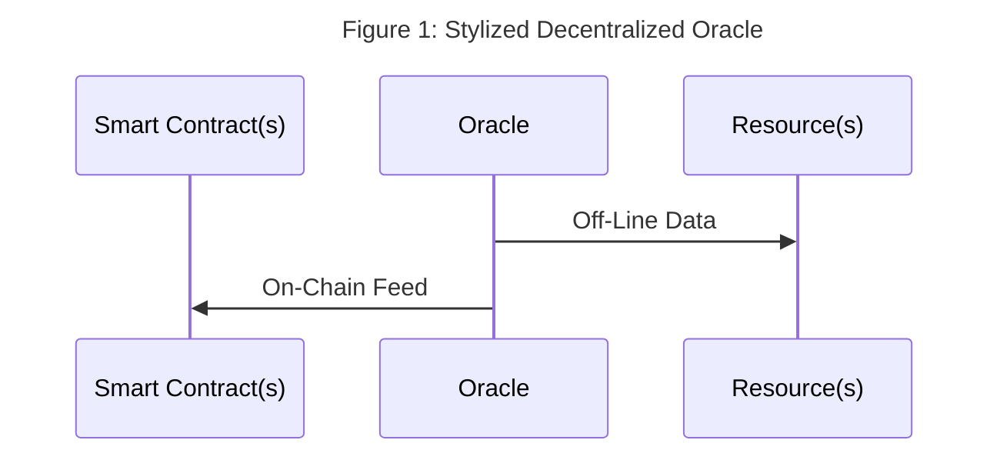
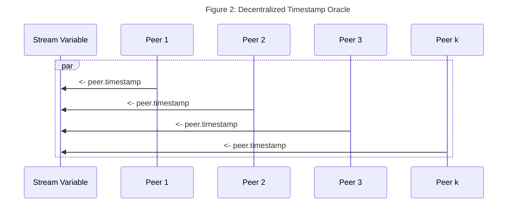

# Quickstart 5 -- Decentralized Oracles With Fluence And Aqua

## Overview

An oracle is some device that provides real-world, off-chain data to a deterministic on-chain consumer such as a smart contract. A decentralized oracle draws from multiple, purportedly equal input sources to minimize or even eliminate single source pitfalls such as man-in-the-middle attacks or provider manipulation. For example, a decentralized price oracle for, say, ETH/USD could poll several DEXs for  ETH/USD prices. Since smart contracts, especially those deployed on EVMs, can't directly call off-chain resources, oracles play a critical "middleware" role in the decentralized, trustless ecosystem. 



Unlike single source oracles, multi-source oracles require some consensus mechanism to convert multiple input sources over the same target parameter into reliable point or range data suitable for third party, e.g., smart contract, consumption. Such "consensus over inputs" may take the form of simple [summary statistics](https://en.wikipedia.org/wiki/Summary_statistics), e.g., mean, or one of many [other methods](https://en.wikipedia.org/wiki/Consensus_(computer_science)).  

Given the importance of oracles to the Web3 ecosystem, it's not surprising to see a variety of third party solutions supporting various blockchain protocols. Fluence does not provide an oracle solution *per se* but provides a peer-to-peer platform, tools and components for developers to quickly and easily program and compose reusable distributed data acquisition, processing and delivery services into decentralized oracle applications.

For the remainder of this section, we work through the process of developing a decentralized, multi-source timestamp oracle application comprised of data acquisition, processing and delivery.

## Creating A Decentralized Timestamp Oracle

Time, often in form of timestamps, plays a critical role in a large number of Web2 and Web3 applications including off-chain (DAO) voting applications and on-chain clocks. Our goal is to provide a timestamp sourced from multiple input sources and implement an acceptable input aggregation and processing service to arrive at either timestamp point or range values.

### Timestamp Acquisition

Each Fluence peer, i.e. node in the Fluence peer-to-peer network, has the ability to provide a timestamp from a [builtin service](https://github.com/fluencelabs/aqua-lib/blob/b90f2dddc335c155995a74d8d97de8dbe6a029d2/builtin.aqua#L127). In Aqua, we call the [timestamp function](https://github.com/fluencelabs/fluence/blob/527e26e08f3905e53208b575792712eeaee5deca/particle-closures/src/host_closures.rs#L124) with the desired granularity, i.e., seconds or milliseconds:

```aqua
    -- aqua timestamp sourcing
    on peer:
        ts_ms_result <- peer.timestamp_ms()
        -- or
        ts_sec_result <- peer.timestamp_sec()
    -- ...
```

In order to decentralize our timestamp oracle, we poll multiple peers in the Fluence network:

```aqua
    -- multi-peer timestamp sourcing
    -- ...
    results: *u64
    for peer <- many_peers_list par:
        on peer:
            results <- peer.timestamp_ms()
    -- ...
```

In the above example, we have a list of peers and retrieve a timestamp value from each one. Note that we are polling nodes for timestamps in [parallel](https://doc.fluence.dev/aqua-book/language/flow/parallel) and collecting responses in the stream variable `results`.




The last thing to pin down concerning timestamp acquisition is which peers to query. One possibility is to specify the peer ids of a set of desired peers to query. Alternatively, we can tap into the [Kademlia neighborhood](https://en.wikipedia.org/wiki/Kademlia), which is a set of peers that are closest to our peer based on the XOR distance of the peer ids, via a [builtin service](https://github.com/fluencelabs/aqua-lib/blob/b90f2dddc335c155995a74d8d97de8dbe6a029d2/builtin.aqua#L140) that returns up to  20, i.e. the default max, Kademlia neighbors:

```aqua
    -- timestamps from Kademlia neighborhood
    results: *u64
    on node:
    k <- Op.string_to_b58(node)
    nodes <- Kademlia.neighborhood(k, nil, nil)
    for node <- nodes par:
      on node:
        try:
          results <- node.timestamp_ms()
    -- ...

```

### Timestamp Processing

Once we have our multiple timestamp values, we need to process them into a point or range value(s) to be useful. Whatever our processing/consensus algorithm is, we can implement it in Marine as reusable, distributed services. 

For example, we can rely on [summary statistics](https://en.wikipedia.org/wiki/Summary_statistics) and implement basic averaging to arrive at a point estimate:

```rust
    // ...

    #[marine]
    pub fn ts_avg(timestamps: Vec<u64>) -> f64 {
        timestamps.iter().sum::<u64>() as f64 / timestamps.len() as f64
}
    // ...
```

Using the average to arrive at a point-estimate is simply a stake in the ground to illustrate what's possible. Actual processing algorithms may vary and, depending on a developers target audience, different algorithms may be used for different delivery targets. And Aqua makes it easy to customize workflows while emphasizing reuse.

### Putting It All Together

Let's put it all together by sourcing timestamps from the Kademlia neighborhood and than process the timestamps into a consensus value. Instead of one of the summary statistics, we employ a simple, consensus algorithm like so:

```rust
// src.main.rs
// 
// simple consensus from timestamps
// params:
//     timestamps, u64, [0, u64_max]
//     tolerance, u32,  [0, u32_max]
//     threshold, f64, [0.0, 1.0]
// 1. Remove a randomly selected timestamp from the array of timestamps, ts
// 2. Count the number of timestamps left in the array that are withn +/- tolerance (where tolerance may be zero)
// 3. compare the suporting number of times stamps divided by th enumber of remaining timestamps to the threshold. if >=, consensus for selected timestamp is true else false

#[marine]
fn ts_frequency(mut timestamps: Vec<u64>, tolerance: u32, threshold: f64) -> Consensus {
    if timestamps.len() == 0 {
        return Consensus {
            // n: 0,
            // support: 0,
            // reference_ts: 0,
            err_str: "Array must have at least one element".to_string(),
            ..<_>::default()
        };
    }
    if timestamps.len() == 1 {
        return Consensus {
            n: 1,
            consensus_ts: timestamps[0],
            consensus: true,
            support: 1,
            ..<_>::default()
        };
    }

    if threshold < 0f64 || threshold > 1f64 {
        return Consensus {
            err_str: "Threshold needs to be between [0.0,1.0]".to_string(),
            ..<_>::default()
        };
    }

    let rnd_seed: u64 = timestamps.iter().sum();
    let mut rng = WyRand::new_seed(rnd_seed);
    let rnd_idx = rng.generate_range(0..timestamps.len());
    let consensus_ts = timestamps.swap_remove(rnd_idx);
    let mut support: u32 = 0;
    for ts in timestamps.iter() {
        if ts <= &(consensus_ts + tolerance as u64) && ts >= &(consensus_ts - tolerance as u64) {
            support += 1;
        }
    }

    let mut consensus = false;
    if (support as f64 / timestamps.len() as f64) >= threshold {
        consensus = true;
    }

    Consensus {
        n: timestamps.len() as u32,
        consensus_ts,
        consensus,
        support,
        err_str: "".to_string(),
    }
}
```

We compile our consensus module with `./scripts/build.sh`, which allows us to run the unit tests using the Wasm module with `cargo +nightly test`:

```bash
# src.main.rs
running 9 tests
test tests::ts_validation_bad_empty ... ok
test tests::ts_validation_good_no_consensus ... ok
test tests::ts_validation_good_no_support ... ok
test tests::ts_validation_good_consensus ... ok
test tests::test_mean_fails ... ok
test tests::ts_validation_good_consensus_false ... ok
test tests::test_mean_good ... ok
test tests::ts_validation_good_one ... ok
test tests::ts_validation_good_consensus_true ... ok

test result: ok. 9 passed; 0 failed; 0 ignored; 0 measured; 0 filtered out; finished in 16.61s
```

Furthermore, we can now interact with our module with the Marine REPL `mrepl configs/Config.toml`:

```bash
Welcome to the Marine REPL (version 0.9.1)
Minimal supported versions
  sdk: 0.6.0
  interface-types: 0.20.0

app service was created with service id = 520a092b-85ef-43c1-9c12-444274ba2cb7
elapsed time 62.893047ms

1> i
Loaded modules interface:
data Consensus:
  n: u32
  reference_ts: u64
  support: u32
  err_str: string
data Oracle:
  n: u32
  avg: f64
  err_str: string

ts_oracle:
  fn ts_avg(timestamps: []u64, min_points: u32) -> Oracle
  fn ts_frequency(timestamps: []u64, tolerance: u32) -> Consensus

2> call ts_oracle ts_frequency [[1637182263,1637182264,1637182265,163718226,1637182266], 0, 0.66]
result: Object({"consensus": Bool(false), "consensus_ts": Number(1637182264), "err_str": String(""), "n": Number(4), "support": Number(0)})
 elapsed time: 891.625µs

3> call ts_oracle ts_frequency [[1637182263,1637182264,1637182265,163718226,1637182266], 5, 0.66]
result: Object({"consensus": Bool(false), "consensus_ts": Number(1637182264), "err_str": String(""), "n": Number(4), "support": Number(3)})
 elapsed time: 75.854µs
```

In our first call at `2>`, we set a tolerance of 0 and, given our array of timestamps, have no support for the chosen timestamps, whereas in call `3>`we increase the tolerance parameter and obtain a consensus result.


Deploying module to a peer of our choice with `./scripts/deploy.sh`, writes to the local file `deployed_service.data`:

```bash
client seed: Ek6bAgs1ymxZhfnH98WNeQ8dEEUuRJ5B8aN7mfgvYSMt
client peerId: 12D3KooWLMsHa9CY5efWkBokbryrpUkE7onTFGK6oTvTuovVUtDp
relay peerId: 12D3KooWFEwNWcHqi9rtsmDhsYcDbRUCDXH84RC4FW6UfsFWaoHi
service id: ec347996-ebd6-4630-8e45-46c2dfcaa3f5
service created successfully
```

With the service deployed, let's have a look at our Aqua script. Recall, we want to poll the Kademlia neighborhood for timestamps and then call the `ts_oracle` method of our service with the array of timestamps and tolerance parameters as well as the (peer id, service id) parameters of our deployed service:
 
```aqua
func ts_oracle(tolerance: u32, threshold: f64, node:string, oracle_service_id:string)-> Consensus:
```

In Aqua, we specify 

```aqua
alias PeerId : string
alias Base58String : string
alias Hash : string

data Contact:
    peer_id: string
    addresses: []string

data Info:
    external_addresses: []string

service Op("op"):
    string_to_b58(s: string) -> Base58String

service MyOp("op"):
    identity(s: u64)

service Kademlia("kad"):
    neighborhood(key: Base58String, already_hashed: ?bool, count: ?u32) -> []PeerId
    merge(target: Base58String, left: []string, right: []string, count: ?u32) -> []string

service Peer("peer"):
    is_connected(peer: PeerId) -> bool
    connect(id: PeerId, multiaddrs: ?[]string) -> bool
    get_contact(peer: PeerId) -> Contact
    identify() -> Info
    timestamp_ms() -> u64
    timestamp_sec() -> u64

data Consensus:
  n: u32
  reference_ts: u64
  support: u32
  err_str: string

service TSOracle("service-id"):
  ts_frequency(timestamps: []u64, tolerance: u32) -> Consensus

func ts_oracle(tolerance: u32, node:string, oracle_service_id:string)-> Consensus:
  timestamps: *u64
  on node:
    k <- Op.string_to_b58(node)
    nodes <- Kademlia.neighborhood(k, nil, nil)
    for n <- nodes par:
      on n:
          timestamps <- Peer.timestamp_ms()

    TSOracle oracle_service_id
    consensus <- TSOracle.ts_frequency(timestamps, tolerance)
  <- consensus
```

We compile our Aqua code:

```aqua
aqua -i aqua -o air -a
```

And now can use `fldist` to call for a consensus timestamp:

```
fldist run_air  -p air/ts_oracle.ts_oracle.air  -d '{"node": "12D3KooWFEwNWcHqi9rtsmDhsYcDbRUCDXH84RC4FW6UfsFWaoHi", "oracle_service_id":"b56ee287-647d-4bf1-bdba-4f7c88488ee0", "tolerance": 500, "threshold": 0.66}' --generated
```

Which generates:

```
[
  {
    "consensus": true,
    "consensus_ts": 1637260110890,
    "err_str": "",
    "n": 19,
    "support": 19
  }
]
```

We can make adjustments to the *tolerance* parameter and not surprisingly get a consensus value relative to the *threshold* parameter.

```
fldist run_air  -p air/ts_oracle.ts_oracle.air  -d '{"node": "12D3KooWFEwNWcHqi9rtsmDhsYcDbRUCDXH84RC4FW6UfsFWaoHi", "oracle_service_id":"b56ee287-647d-4bf1-bdba-4f7c88488ee0", "tolerance": 1000, "threshold": 0.66}' --generated
```


```
[
  {
    "consensus": true,
    "consensus_ts": 1637260146020,
    "err_str": "",
    "n": 19,
    "support": 19
  }
]
```

TBD: seq vs par
but after aqua update:
```
Something went wrong!
Interpreter failed with code=1 message=air can't be parsed:
error:
   ┌─ script.air:18:6
   │
18 │     (new $timestamps
   │      ^^^ expected ap or call or fold or match_ or mismatch or next or null or par or seq or xor
   ·
53 │    )
   │    ^ expected "("
   ·
61 │  (call %init_peer_id% ("errorHandlingSrv" "error") [%last_error% 4])
   │  ^ expected <nothing>

```


## Summary

Fluence and Aqua make it easy to create and implement decentralized oracle and consensus algorithms using Fluence's off-chain peer-to-peer network and tool set.

We encourage to experiment with both the consensus methodology and, of course, the oracle sources, such as crypto price/pairs, election forecast or polling numbers or sports scores.