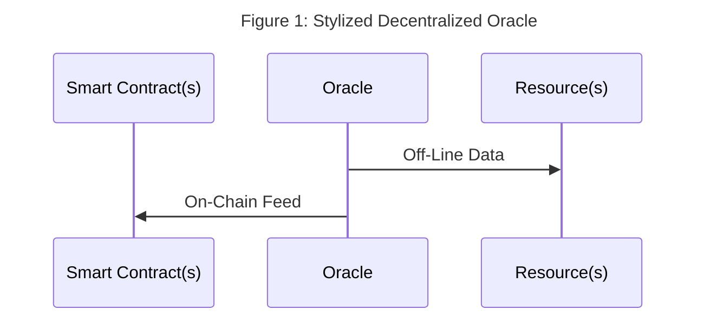
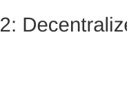

# Quickstart 5 -- Decentralized Oracles With Fluence And Aqua

## Overview

An oracle is some device that provides real-world, off-chain data to a deterministic on-chain consumer such as a smart contract. A decentralized oracle draws from multiple, purportedly equal input sources to minimize or even eliminate single source pitfalls such as man-in-the-middle attacks or provider manipulation. For example, a decentralized price oracle for, say, ETH/USD could poll several DEXs for  ETH/USAD prices. Since smart contracts, especially those deployed on EVMs, can't directly call off-chain resources, oracles play a critical "middleware" role in the decentralized, trustless ecosystem. 



Unlike single source oracles, multi-source oracles require some sort of consensus mechanism to convert multiple input sources over the same target parameter into reliable point or range data suitable for third party, e.g., smart contract, consumption. Such "consensus over inputs" may take the form of simple summary statistics, e.g., mean or medium, or one of many other methods.  

Given the importance of oracles to the the Web3 ecosystem, it's not surprising to see a variety off third party solutions. Fluence provides a peer-to-peer based option for developers to program and compose distributed data acquisition, processing and delivery services into decentralized oracle applications with Aqua. Fluence and Aqua allows developers to inexpensively cover a wide variety of oracles while essentially eliminating a large number of trust gaps.

For the remainder of this section, we work through the process of developing a decentralized, multi-source timestamp oracle application comprised of input/data acquisition, processing, and delivery.

## Creating A Decentralized Timestamp Oracle

Time, often in form of timestamps, plays a critical role in a large number of Web2 and Web3 applications including off-chain (DAO) voting applications and on-chain clocks.

Our problem statement is to provide a timestamp sourced from multiple input sources to eliminate the staple of centralized solutions such as man-in-the-middle (MITM) attacks. This requires us to implement an acceptable input aggregation and processing service to arrive a either timestamp point or range values.

### Timestamp Acquisition

Each Fluence peer, i.e. node in the Fluence peer-to-peer network, has the ability to provide a timestamp from a [builtin services](https://github.com/fluencelabs/aqua-lib/blob/b90f2dddc335c155995a74d8d97de8dbe6a029d2/builtin.aqua#L127) using Aqua.

In Aqua, we call the timestamp function with the desired granularity, i.e., seconds or milliseconds, which [resolves at the peer](https://github.com/fluencelabs/fluence/blob/527e26e08f3905e53208b575792712eeaee5deca/particle-closures/src/host_closures.rs#L124) accordingly:

```aqua
    -- aqua timestamp sourcing
    on peer:
        ts_ms_result <- peer.timestamp_ms()
        -- or
        ts_sec_result <- peer.timestamp_sec()
    -- ...
```

In order to decentralize our timestamp oracle, we want to poll several peers in the Fluence network:

```aqua
    -- multi-peer timestamp sourcing
    -- ...
    results: *u64
    for peer <- many_peers_list par:
        on peer:
            results <- peer.timestamp_ms()
    -- ...
```

In the above example, we have a list of peers and retrieve a timestamp value from each one. Note that we are polling nodes for timestamps in [parallel](https://doc.fluence.dev/aqua-book/language/flow/parallel) and collecting responses in the stream variable `results`.




The last thing to pin down concerning timestamp acquisition is which peers to query. On way is to specify the peer ids of a set of desired peers to query. Alterantively, we can tap into the [Kademlia neighborhood](https://en.wikipedia.org/wiki/Kademlia), which is a set of peers that are closets to our peer based on the XOR distance of the (random) peer ids. In the absence of a predetermined set of source peers, a random set of peers have a very high likelihood to prevent a wide variety of manipulations and attacks. Luckily, there is a builtin service for [that](https://github.com/fluencelabs/aqua-lib/blob/b90f2dddc335c155995a74d8d97de8dbe6a029d2/builtin.aqua#L140) that returns (by default) 20 Kademlia neighbors:

```aqua
    -- timestamps from Kademlia neighborhood
    results: *u64
    on node:
    k <- Op.string_to_b58(node)
    nodes <- Kademlia.neighborhood(k, nil, nil)
    for node <- nodes par:
      on node:
        try:
          results <- node.timestamp_ms()
    -- ...

```

With Aqua we can easily get a st of timestamps from network peers and if we don't have a preconceived st of peers to query, we can utilize Kademlia neighbors to get a random set of peers.

### Timestamp Processing

Once we have our multiple timestamp values, we need to process them into a credible point estimate or possibly range. Whatever our processing/consensus algorithm is, we implement it in Marine to arrive at reusable, distributed services. 

For the purpose of this section, we will rely on [summary statistics](https://en.wikipedia.org/wiki/Summary_statistics) to arrive at a consensus value for a point estimate.

For example, we can implement basic averaging to arrive at a point estimate:

```rust
    // ...

    #[marine]
    pub fn ts_avg(timestamps: Vec<u64>) -> f64 {
        timestamps.iter().sum::<u64>() as f64 / timestamps.len() as f64
}
    // ...
```

Using the average to arrive at a point-estimate is simply a stake in the ground to illustrate what's possible. Actual processing algorithms may vary and,depending on a developers target audience, different algorithms may be used for different delivery targets. And Aqua makes it easy to customize workflows while emphasizing reuse. For examples, with Aqua we can poll our target input sources and then process .... 
 Similarly, we can easily replace the timestamp oracle with a multi-source ... 
 

### Putting It All Together

Let's create and deploy a couple timestamp processing algos: mean and mode.


## Summary